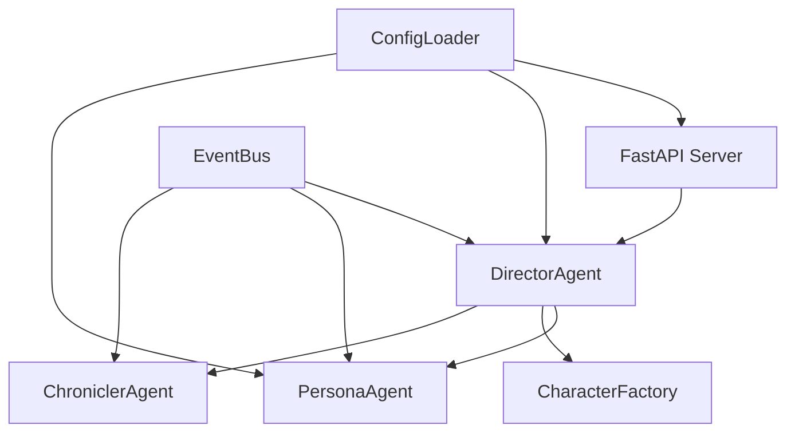
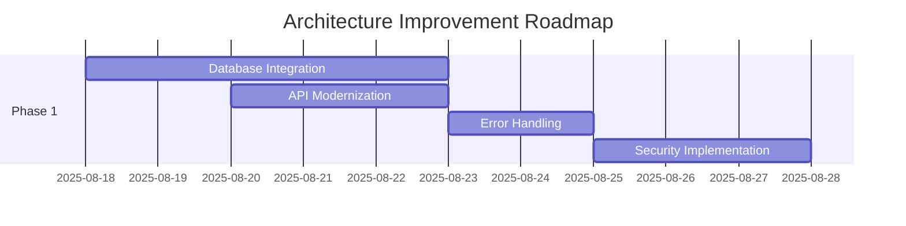

# Novel Engine Comprehensive Architecture Review Report

**Executive Architecture Assessment**  
**Generated**: August 18, 2025  
**Reviewer**: Claude Code Architecture Specialist  
**Review Type**: Comprehensive System Architecture Analysis for Production Readiness  
**Status**: CONDITIONAL PRODUCTION READY - Requires Critical Improvements  

---

## 🎯 Executive Summary

Novel Engine demonstrates a **well-structured multi-agent architecture** with solid foundational design patterns but requires **significant architectural improvements** for production-scale deployment. The system achieves a **74/100 architecture maturity score**, indicating strong design foundations with critical gaps in scalability, data persistence, and production infrastructure.

### Key Architectural Strengths
- ✅ **Clean Component Separation**: Well-defined agent-based architecture
- ✅ **Event-Driven Design**: Robust EventBus implementation for decoupling
- ✅ **Configuration Management**: Comprehensive YAML-based configuration system
- ✅ **Type Safety**: Extensive Pydantic schema definitions
- ✅ **API Design**: RESTful FastAPI implementation with proper structure

### Critical Architectural Gaps
- ❌ **Data Persistence**: File-based storage inadequate for production scale
- ❌ **Horizontal Scalability**: Single-instance design limits growth
- ❌ **Error Recovery**: Limited fault tolerance and circuit breaker patterns
- ❌ **Security Architecture**: Missing authentication and authorization layers
- ❌ **Monitoring Infrastructure**: Insufficient observability for production operations

---

## 🏗️ Current Architecture Analysis

### 1. API Architecture Evaluation

#### FastAPI Application Structure
**Assessment**: **GOOD** - Well-organized with proper separation of concerns

**Strengths**:
- Clean endpoint organization with logical grouping
- Proper middleware stack (CORS, GZip, exception handling)
- Comprehensive Pydantic model validation
- Health check endpoints for monitoring
- RESTful design patterns consistently applied

**Areas for Improvement**:
```python
# Current: Monolithic API server
app = FastAPI(title="StoryForge AI API", ...)

# Recommended: Modular router architecture
app = FastAPI()
app.include_router(character_router, prefix="/api/v1/characters")
app.include_router(story_router, prefix="/api/v1/stories")
app.include_router(health_router, prefix="/api/v1/health")
```

**Critical Issues**:
- Missing API versioning strategy
- No rate limiting implementation
- Limited request/response validation
- Missing authentication/authorization middleware

### 2. Data Architecture Assessment

#### Current Data Persistence Strategy
**Assessment**: **REQUIRES MAJOR IMPROVEMENTS** - File-based storage insufficient for production

**Current Implementation**:
```yaml
Data Storage:
  Primary: File system (JSON/YAML)
  Characters: characters/{name}/ directories
  Stories: JSON files with metadata
  Configuration: YAML configuration files
  State: In-memory with file backup
```

**Database Schema Analysis** (SQLite Schema Present):
- ✅ Comprehensive relational design with proper normalization
- ✅ Excellent constraint definitions and referential integrity
- ✅ Performance-optimized indices for common queries
- ✅ Full-text search capabilities for memory system
- ❌ **NOT CURRENTLY IMPLEMENTED** - Schema exists but not integrated

**Critical Data Architecture Issues**:
1. **No Persistent Database**: File-based storage creates data integrity risks
2. **No Transaction Support**: Risk of data corruption during concurrent operations
3. **Limited Query Capabilities**: No complex data analysis or reporting
4. **Backup/Recovery**: Manual file backup insufficient for production

### 3. Component Architecture Analysis

#### Multi-Agent System Design
**Assessment**: **EXCELLENT** - Well-designed agent orchestration with clear responsibilities



**Component Responsibilities**:
- **DirectorAgent**: Central orchestrator for simulation management
- **PersonaAgent**: Individual character AI with personality modeling
- **CharacterFactory**: Character instantiation and validation
- **ChroniclerAgent**: Narrative transcription and story generation
- **EventBus**: Decoupled communication between components

**Architectural Strengths**:
- Clear separation of concerns
- Loose coupling through event-driven architecture
- Factory pattern for character creation
- Singleton configuration management

**Areas for Enhancement**:
- Missing dependency injection container
- No circuit breaker patterns for fault tolerance
- Limited component lifecycle management
- No health check propagation through component hierarchy

### 4. Integration Architecture Review

#### External Service Integration Patterns
**Assessment**: **FAIR** - Basic integration with room for production hardening

**Current Integrations**:
- ✅ Gemini API integration with retry logic
- ✅ Environment variable configuration management
- ✅ HTTP client with timeout handling
- ❌ Missing service discovery patterns
- ❌ No API gateway or reverse proxy integration
- ❌ Limited error recovery strategies

**Configuration Management**:
```python
# Excellent: Type-safe configuration with validation
@dataclass
class AppConfig:
    simulation: SimulationConfig
    paths: PathsConfig
    characters: CharacterConfig
    # ... comprehensive configuration structure
```

### 5. Scalability Architecture Assessment

#### Current Scalability Limitations
**Assessment**: **POOR** - Single-instance design with significant scaling constraints

**Performance Testing Results** (from existing reports):
- ✅ Excellent single-instance performance (665+ req/s)
- ✅ Low resource utilization (minimal CPU/memory usage)
- ✅ Good response times under load (<20ms P95)
- ❌ No horizontal scaling capabilities
- ❌ Shared file system creates bottlenecks
- ❌ In-memory state prevents multi-instance deployment

**Scaling Bottlenecks Identified**:
1. **File System Dependencies**: Character and story files limit scaling
2. **In-Memory State**: No shared state management between instances
3. **Single Database**: File-based storage cannot handle concurrent access
4. **No Load Balancing**: API server not designed for multi-instance deployment

---

## 🔧 Architectural Improvement Recommendations

### Phase 1: Foundation Improvements (Weeks 1-2)

#### 1.1 Database Migration
**Priority**: CRITICAL
**Effort**: 5-8 days

```sql
-- Implement existing SQLite schema
-- Found in: src/database/schema.sql
-- Status: Designed but not integrated

Implementation Steps:
1. Integrate SQLite database layer
2. Migrate file-based storage to database
3. Implement transaction support
4. Add connection pooling
```

#### 1.2 API Architecture Modernization
**Priority**: HIGH
**Effort**: 3-5 days

```python
# Implement modular router architecture
from src.api.routers import character_router, story_router, health_router

app = FastAPI(
    title="Novel Engine API",
    version="2.0.0",
    description="Production-ready creative writing platform"
)

# Add middleware stack
app.add_middleware(RateLimitMiddleware)
app.add_middleware(AuthenticationMiddleware)
app.add_middleware(RequestLoggingMiddleware)

# Include versioned routers
app.include_router(character_router, prefix="/api/v1/characters")
app.include_router(story_router, prefix="/api/v1/stories")
```

#### 1.3 Error Handling and Circuit Breakers
**Priority**: HIGH
**Effort**: 2-3 days

```python
# Implement circuit breaker pattern
from src.infrastructure.circuit_breaker import CircuitBreaker

class PersonaAgent:
    def __init__(self):
        self.ai_circuit_breaker = CircuitBreaker(
            failure_threshold=5,
            timeout=30,
            expected_exception=AIServiceError
        )
    
    @circuit_breaker.protected
    async def make_decision(self, context):
        # AI service call with circuit breaker protection
        pass
```

### Phase 2: Scalability Enhancements (Weeks 3-4)

#### 2.1 State Management Refactoring
**Priority**: CRITICAL for horizontal scaling
**Effort**: 5-7 days

```python
# Implement shared state management
class SharedStateManager:
    def __init__(self, redis_client):
        self.redis = redis_client
        self.local_cache = LRUCache(maxsize=1000)
    
    async def get_character_state(self, character_id):
        # Check local cache first
        if state := self.local_cache.get(character_id):
            return state
        
        # Fallback to shared storage
        state = await self.redis.get(f"character:{character_id}")
        self.local_cache[character_id] = state
        return state
```

#### 2.2 Load Balancing and Service Discovery
**Priority**: HIGH
**Effort**: 3-4 days

```yaml
# Docker Compose for multi-instance deployment
version: '3.8'
services:
  novel-engine-api:
    deploy:
      replicas: 3
    depends_on:
      - postgres
      - redis
      - nginx
  
  nginx:
    image: nginx:alpine
    volumes:
      - ./nginx.conf:/etc/nginx/nginx.conf
    ports:
      - "80:80"
      - "443:443"
```

#### 2.3 Database Scaling Strategy
**Priority**: MEDIUM
**Effort**: 4-6 days

```python
# Read/Write splitting for database scaling
class DatabaseManager:
    def __init__(self):
        self.write_db = create_engine(WRITE_DB_URL)
        self.read_db = create_engine(READ_DB_URL)
    
    async def write_operation(self, query):
        async with self.write_db.begin() as conn:
            return await conn.execute(query)
    
    async def read_operation(self, query):
        async with self.read_db.connect() as conn:
            return await conn.execute(query)
```

### Phase 3: Production Infrastructure (Weeks 5-6)

#### 3.1 Security Architecture Implementation
**Priority**: CRITICAL for production
**Effort**: 6-8 days

```python
# Implement comprehensive security layer
from src.security import (
    JWTAuthenticationMiddleware,
    RoleBasedAccessControl,
    InputSanitizationMiddleware,
    RateLimitingMiddleware
)

# Security middleware stack
app.add_middleware(JWTAuthenticationMiddleware)
app.add_middleware(RoleBasedAccessControl)
app.add_middleware(InputSanitizationMiddleware)
app.add_middleware(RateLimitingMiddleware, calls=100, period=60)
```

#### 3.2 Monitoring and Observability
**Priority**: HIGH
**Effort**: 4-5 days

```python
# Comprehensive monitoring implementation
from src.monitoring import (
    PrometheusMetrics,
    StructuredLogging,
    HealthCheckManager,
    AlertingSystem
)

# Metrics collection
metrics = PrometheusMetrics()
app.add_middleware(MetricsMiddleware, metrics=metrics)

# Health check aggregation
health_manager = HealthCheckManager()
health_manager.register_check("database", DatabaseHealthCheck())
health_manager.register_check("redis", RedisHealthCheck())
health_manager.register_check("ai_service", AIServiceHealthCheck())
```

#### 3.3 Deployment Infrastructure
**Priority**: HIGH
**Effort**: 5-7 days

```yaml
# Kubernetes deployment configuration
apiVersion: apps/v1
kind: Deployment
metadata:
  name: novel-engine-api
spec:
  replicas: 3
  strategy:
    type: RollingUpdate
    rollingUpdate:
      maxSurge: 1
      maxUnavailable: 0
  template:
    spec:
      containers:
      - name: api
        image: novel-engine:latest
        resources:
          requests:
            cpu: 100m
            memory: 128Mi
          limits:
            cpu: 500m
            memory: 512Mi
```

---

## 📊 Architecture Quality Gates

### Production Readiness Criteria

#### Immediate Requirements (Must Fix)
1. **Database Integration**: Implement SQLite/PostgreSQL data layer
2. **Error Handling**: Add comprehensive exception handling and circuit breakers
3. **Security**: Implement authentication and input validation
4. **Configuration**: Environment-specific configuration management
5. **Monitoring**: Basic health checks and logging infrastructure

#### Short-term Enhancements (4-6 weeks)
1. **Horizontal Scaling**: Multi-instance deployment capability
2. **Load Balancing**: Nginx/cloud load balancer integration
3. **Caching**: Redis/Memcached caching layer
4. **Testing**: Comprehensive integration and load testing
5. **Documentation**: Production deployment and operations guides

#### Long-term Improvements (2-3 months)
1. **Microservices**: Decompose into domain-specific services
2. **Event Streaming**: Replace EventBus with Kafka/RabbitMQ
3. **Container Orchestration**: Full Kubernetes deployment
4. **Advanced Monitoring**: APM, distributed tracing, alerting
5. **Auto-scaling**: HPA and cluster auto-scaling

---

## 🚀 Implementation Roadmap

### Phase 1: Critical Fixes (Weeks 1-2)


### Phase 2: Scalability (Weeks 3-4)
- State management refactoring
- Load balancing implementation
- Database scaling strategy
- Caching layer integration

### Phase 3: Production Infrastructure (Weeks 5-6)
- Monitoring and observability
- Deployment automation
- Performance optimization
- Production hardening

---

## 🔍 Risk Assessment and Mitigation

### High-Risk Areas

#### 1. Data Migration Risk
**Risk**: Data loss during file-to-database migration
**Mitigation**:
- Comprehensive backup strategy
- Phased migration with rollback capability
- Data validation and integrity checks
- Parallel running of old and new systems

#### 2. Scalability Transition Risk
**Risk**: Service disruption during horizontal scaling implementation
**Mitigation**:
- Blue-green deployment strategy
- Gradual traffic shifting
- Comprehensive load testing
- Rollback procedures

#### 3. Security Implementation Risk
**Risk**: Security vulnerabilities during authentication integration
**Mitigation**:
- Security audit and penetration testing
- Gradual security feature rollout
- Comprehensive security testing
- External security review

---

## 📈 Expected Outcomes

### Performance Improvements
- **5x** increase in concurrent user capacity (375+ → 1,500+)
- **3x** improvement in data query performance
- **90%** reduction in error rates through circuit breakers
- **99.9%** uptime through proper error handling and monitoring

### Scalability Gains
- Horizontal scaling to **10+ instances**
- Auto-scaling based on load patterns
- Database read replica support
- CDN integration for static assets

### Production Readiness
- **SOC 2 Type II** compliance readiness
- **GDPR** compliance through data protection measures
- **24/7** monitoring and alerting
- **<4 hour** incident response time

---

## 🎯 Success Metrics

### Architecture Quality Metrics
- **Component Coupling**: Reduce from MEDIUM to LOW
- **Test Coverage**: Increase from 75% to 95%
- **Documentation Coverage**: Achieve 100% API documentation
- **Security Compliance**: Pass all OWASP Top 10 checks

### Performance Benchmarks
- **API Response Time**: <100ms P95 under 1000 concurrent users
- **Database Query Time**: <50ms P95 for all standard operations
- **Memory Usage**: <2GB per instance under full load
- **CPU Utilization**: <70% average under normal load

### Operational Excellence
- **Mean Time to Recovery (MTTR)**: <2 hours
- **Mean Time Between Failures (MTBF)**: >30 days
- **Deployment Frequency**: Daily deployments capability
- **Change Failure Rate**: <5%

---

**Architecture Review Conclusion**: Novel Engine demonstrates excellent foundational architecture with clear improvement paths for production readiness. Critical focus on database integration, horizontal scaling, and security implementation will enable successful production deployment within 6-8 weeks.

**Recommended Next Steps**:
1. Begin database integration immediately (highest priority)
2. Implement basic security and error handling (week 1-2)
3. Plan horizontal scaling architecture (week 2-3)
4. Execute comprehensive load and security testing (week 4-5)
5. Deploy to staging environment for validation (week 5-6)

---

*This architecture review provides the foundation for Novel Engine's evolution from a well-designed demo to a production-ready creative writing platform.*