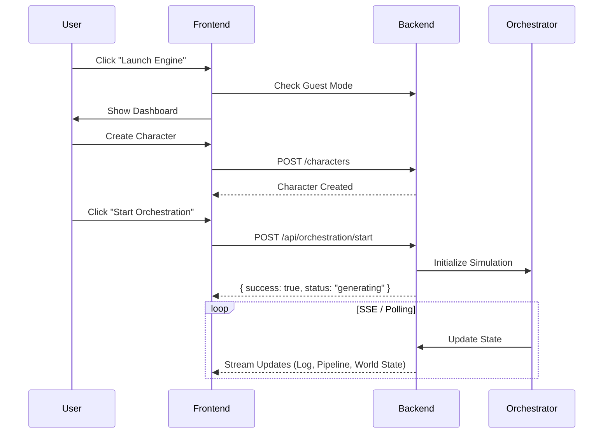

# Project Documentation: Novel-Engine

## 1. Project Overview
**Novel-Engine** is an advanced interactive storytelling platform that leverages AI to orchestrate dynamic narratives. It features a "Guest Mode" for immediate access, a dashboard for simulation control, and a backend orchestration engine that manages story states, character interactions, and world events.

## 2. Project Structure
```mermaid
graph TD
    Root[Novel-Engine Root]
    Frontend[Frontend (React/Vite)]
    Backend[Backend (FastAPI)]
    Docs[Documentation]
    
    Root --> Frontend
    Root --> Backend
    Root --> Docs
    
    Frontend --> Components[Components]
    Frontend --> Services[Services (API Clients)]
    Frontend --> Pages[Pages]
    
    Backend --> APIServer[api_server.py]
    Backend --> Routers[Routers (World, Orchestration)]
    Backend --> Engine[Engine Core]
```

## 3. Core Components & Logic

### Backend (Python/FastAPI)
- **API Server (`api_server.py`)**: Entry point for the REST API. Handles HTTP requests, SSE broadcasting, and orchestrates the agent lifecycle.
- **Director Agent (`src/agents/director_agent_integrated.py`)**: The central orchestrator for the multi-agent simulation. It coordinates:
    - **TurnOrchestrator**: Manages the flow of simulation turns.
    - **WorldStateCoordinator**: Maintains the consistent state of the world.
    - **AgentLifecycleManager**: Handles creation and management of character agents (Personas).
- **Event Bus**: A message passing system that enables real-time communication between agents and the frontend via SSE.

### Frontend (React/Vite)
- **Dashboard (`Dashboard.tsx`)**: The primary command center. Features a **Premium Glassmorphic UI** with:
    - **World State Visualization**: A central panel for observing the simulation.
    - **Tabbed Interface**: Switch between **Map**, **Network** (Character Relationships), **Timeline** (Narrative Arcs), **Analytics** (Story Metrics), and **Signals** (Event Flow).
    - **Command Deck**: Controls for starting/stopping orchestration and managing agents.
    - **Pipeline Status**: Visualizes the backend processing steps.
    - **System Log**: Real-time activity stream.
    - **Performance Metrics**: Footer component monitoring Web Vitals.
- **Design System (`design-system.css`)**: A custom CSS framework implementing a "Futuristic/High-Contrast" aesthetic (Deep Space Blue, Neon Cyan, Electric Purple).
- **Vibe Coding Architecture**: Adheres to strict **Atomic Design** and **Feature-First** directory structure. See `frontend/VIBE_CHECKLIST.md` for strict implementation rules.
- **State Management**: Uses Redux Toolkit for global state and React Query for data fetching.

## 4. Interaction & Data Flow


## 5. Recent Changes (Changelog)
-   **UI Overhaul**: Refactored Dashboard to a "Bento Grid" layout with a premium glassmorphic design system.
-   **Feature Restoration**: Re-integrated MFD features (Character Networks, Timeline, Analytics, Signals) into a unified tabbed interface.
-   **Stability Fixes**: Resolved a "White Screen of Death" caused by MUI/CSS variable incompatibility and fixed CORS issues.
-   **Endpoint Alignment**: Updated frontend to use `/api/orchestration/start` instead of `/api/stories/generate`.
