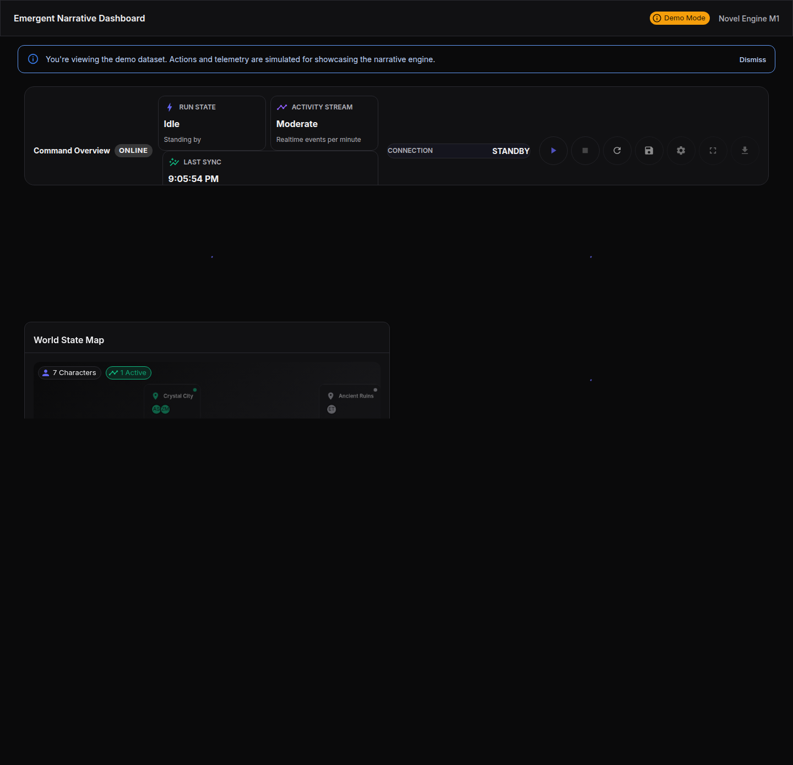

# Novel Engine (AI Narrative Engine)

Languages: English | [简体中文](README.md)

[](https://github.com/Jackela/Novel-Engine/actions/workflows/ci.yml)
[](https://github.com/Jackela/Novel-Engine/actions/workflows/tests.yml)
[](LICENSE)
[](https://www.python.org/downloads/)
[](https://nodejs.org/)
[](https://github.com/pre-commit/pre-commit)

A production-ready AI-driven narrative generation and multi-agent simulation platform. Built on a **Modular Monolith** architecture with a **Functional Core, Imperative Shell** philosophy, ensuring high cohesion and low coupling for complex narrative orchestration.

---

## 🚀 Key Features

- **Multi-Agent Orchestration**: `DirectorAgent`, `PersonaAgent`, and `ChroniclerAgent` collaborate via an event bus, ensuring decoupled logic.
- **Guest-First Architecture**: Powered by **Filesystem Workspaces**, enabling zero-config startup, instant demos, and full persistence without external databases.
- **Real-Time Streaming**: Backend `/api/events/stream` (SSE) paired with frontend `useRealtimeEvents` hooks for millisecond-latency narrative feedback.
- **Unified API Surface**: Consistent `/api/*` routing across the stack, backed by an SSOT frontend client with automatic error normalization.
- **Production-Grade Quality**:
  - Frontend: TypeScript Strict + ESLint (SOLID) + Vitest (80% coverage enforcement).
  - Backend: Mypy type checking + Pytest unit/integration suites.

---

## 🧵 The Weaver

A node-based narrative orchestration interface built with React Flow. Weaver provides a visual, draggable canvas for composing characters, events, and locations, then linking them into a narrative execution graph.

---

## 🌍 World Generation

Novel Engine provides an AI-driven world generation system that creates complete world settings, factions, locations, and historical events with a single request.

### Usage

**Via Weaver UI:**
Click the "Generate World" button in the Weaver canvas. The system will automatically generate world content and visualize it as a force-directed graph.

**Via API:**
```bash
curl -X POST http://localhost:8000/api/world/generation \
  -H "Content-Type: application/json" \
  -d '{
    "genre": "fantasy",
    "era": "medieval",
    "tone": "heroic",
    "themes": ["adventure", "magic"],
    "magic_level": 7,
    "technology_level": 2,
    "num_factions": 3,
    "num_locations": 5,
    "num_events": 3
  }'
```

### Generated Content

| Content Type | Description |
|-------------|-------------|
| **WorldSetting** | Core world configuration (genre, era, tone, magic/tech levels) |
| **Factions** | Organizations (kingdoms, guilds, cults, etc. with alignment, influence, and relationships) |
| **Locations** | Places (cities, fortresses, ruins, etc. with population, danger levels, controlling faction) |
| **HistoryEvents** | Historical events (wars, foundings, disasters, etc. with participants and causal chains) |

### Architecture Documentation

For detailed architecture, see:
- [`docs/architecture/world_engine.mermaid`](docs/architecture/world_engine.mermaid) - World Generation System
- [`docs/architecture/rag_pipeline.mermaid`](docs/architecture/rag_pipeline.mermaid) - RAG Knowledge Retrieval Pipeline (ingestion, retrieval, reranking)

---

## 🧩 Stack

- **UI**: Shadcn UI + Tailwind CSS
- **State**: Zustand
- **Data**: TanStack Query
- **Backend**: FastAPI + Pydantic V2



---

## 🏗️ Architecture Overview

Inspired by **Domain-Driven Design (DDD)** and the **"Death of the Author"** theory.

- **Logical Microservices**: While the codebase resides in a monorepo (`src/`), logic is strictly isolated by domain contexts (`characters`, `narratives`, `orchestration`).
- **File-as-Data**: For maximum portability and local-first UX, all characters, campaign states, and logs are persisted as Markdown, YAML, or JSON on the local filesystem.
- **API-First**: Frontend and backend communicate exclusively via standardized REST APIs, supporting OpenAPI specifications.

---

## 🛠️ Quick Start

### Requirements
- Python 3.11+
- Node.js 18+ & npm

### One-Command Dev Environment (Recommended)

1. **Install Dependencies**:
   ```bash
   # Backend
   python -m venv .venv
   # Windows: .venv\Scripts\activate | Mac/Linux: source .venv/bin/activate
   pip install -r requirements.txt

   # Frontend
   cd frontend
   npm install
   ```

2. **Start Services**:
   ```bash
   # Run from root directory
   npm run dev:daemon
   ```
   - Backend API: `http://127.0.0.1:8000`
   - Frontend UI: `http://127.0.0.1:3000`
   - Logs are streamed to `tmp/dev_env.log`.

3. **Stop Services**:
   ```bash
   npm run dev:stop
   ```

---

## 📂 Project Structure

```
Novel-Engine/
├── src/                  # Backend Core (FastAPI + Agents)
│   ├── api/              # API Routers & App Factory
│   ├── agents/           # Agent Logic (Director, Persona)
│   ├── contexts/         # DDD Context Boundaries (src/contexts/)
│   └── workspaces/       # Filesystem Persistence Layer
├── frontend/             # Frontend App (React + Vite)
│   ├── src/lib/api/      # SSOT API Client
│   ├── src/features/     # Business Feature Modules
│   └── tests/            # Vitest & Playwright Suites
├── docs/                 # Architecture & Guides
├── docs/specs/openspec/             # Architecture Evolution Proposals
└── characters/           # User Data (YAML/MD)
```

---

## 🧪 Testing & Quality

We enforce a strict TDD (Test-Driven Development) workflow.

- **Backend**:
  ```bash
  pytest
  ```
- **Frontend**:
  ```bash
  cd frontend
  npm run test        # Unit Tests (Vitest)
  npm run lint        # Style & Complexity Checks
  npm run type-check  # TypeScript Validation
  ```
- **E2E / UAT**:
  UI changes must be verified via Playwright:
  ```bash
  cd frontend
  npx playwright test
  ```

---

## 🤝 Contributing

1. Follow standards in `CONVENTIONS.md`.
2. Run local validation: `scripts/validate_ci_locally.sh` before pushing.       
3. Propose architectural changes via `openspec`.

---

## 🤖 AI Collaboration

- `AGENTS.md` is the SSOT for AI workflow and repo guardrails.
- Any proposal/spec/architecture change should start with `AGENTS.md`.
- Build and test commands live in `AGENTS.md`.

---

## 💬 Contact & Community

- **Questions & Discussions**: [GitHub Discussions](https://github.com/Jackela/Novel-Engine/discussions)
- **Bug Reports & Features**: [GitHub Issues](https://github.com/Jackela/Novel-Engine/issues)
- **Author**: [@Jackela](https://github.com/Jackela)

---

## 📄 License

MIT License. See [LICENSE](LICENSE).

---

## LEGAL DISCLAIMER

**LEGAL DISCLAIMER**: Novel Engine is a fan-created, educational project and is not affiliated with Games Workshop or any other intellectual property holder. This work is intended for educational and research purposes only, and it operates independently of any commercial publishing efforts. While the project embraces stylistic inspirations from narrative-rich franchises, it does not represent or endorse their official lore.

For compliance, all fan-mode functionality is strictly documented and adheres to non-commercial use, local distribution, and content filtering expectations. If you build upon or share this work, please ensure that any redistribution follows those same principles and credit the original sources where appropriate.
