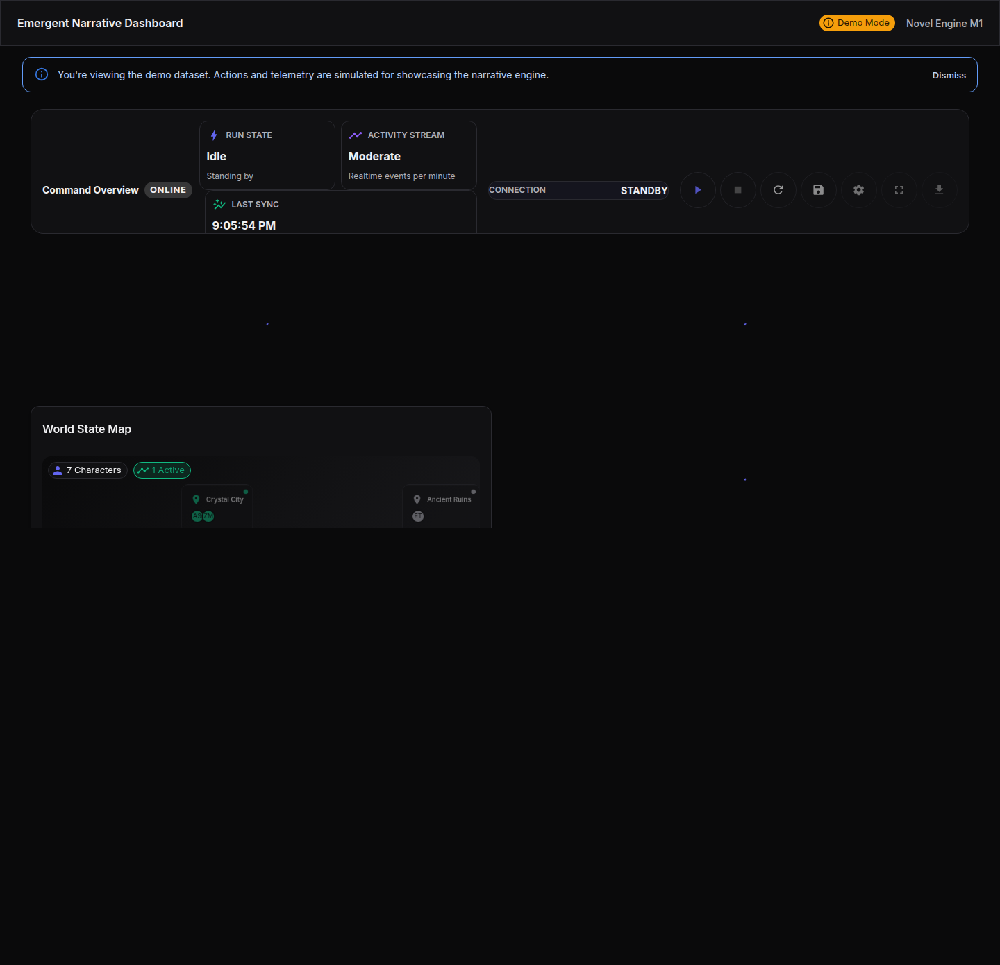

# Novel Engine（AI 叙事引擎）

语言/Languages: [English](README.en.md) | 简体中文

[](LICENSE)
[](https://www.python.org/downloads/)
[](https://react.dev/)
[](https://github.com/psf/black)

面向生产的 AI 驱动叙事生成与多智能体模拟平台。本项目采用**模块化单体 (Modular Monolith)** 架构，结合**函数式核心与命令式外壳**设计原则，提供高内聚、低耦合的叙事编排能力。

---

## 🚀 核心特性

- **多智能体编排**：`DirectorAgent`（导演）、`PersonaAgent`（角色）、`ChroniclerAgent`（记录者）基于事件总线协作，而非硬编码调用。
- **访客优先架构**：无需注册数据库，基于**文件系统的工作空间 (Filesystem Workspaces)** 技术，支持零配置启动和即时演示。
- **实时流式交互**：后端 `/api/events/stream` (SSE) 配合前端 `useRealtimeEvents` 钩子，提供毫秒级叙事反馈。
- **统一 API 规范**：全站统一使用 `/api/*` 路由前缀，前端集成 SSOT（单一事实来源）API 客户端与自动错误处理。
- **生产级质量门禁**：
  - 前端：TypeScript 严格模式 + ESLint (SOLID 原则) + Vitest (80% 覆盖率要求)。
  - 后端：Mypy 类型检查 + Pytest 单元/集成测试。



---

## 🏗️ 架构概览

本项目深受**领域驱动设计 (DDD)** 和 **“作者之死”** 叙事理论影响。

- **逻辑微服务**：虽然代码位于单一仓库 (`src/`)，但业务逻辑按领域严格隔离 (`contexts/characters`, `contexts/narratives`)。
- **文件即数据**：为了极致的可移植性与本地优先体验，所有角色卡、战役状态和会话记录均以 Markdown/YAML/JSON 格式存储在本地文件系统中。
- **API 优先**：前后端通过标准化的 REST API 通信，支持 OpenAPI (Swagger) 自动文档生成。

---

## 🛠️ 快速开始

### 环境要求
- Python 3.11+
- Node.js 18+ & npm

### ⚙️ 配置 LLM API 密钥

Novel Engine 使用 Google Gemini API 进行 AI 叙事生成。首次使用前需要配置 API 密钥：

1. **获取 API 密钥**：
   - 访问 [Google AI Studio](https://aistudio.google.com/app/apikey)
   - 创建或选择项目
   - 生成 API 密钥

2. **配置环境变量**：
   ```bash
   # 复制示例文件
   cp .env.example .env

   # 编辑 .env 文件，添加你的密钥
   # GEMINI_API_KEY=your_actual_api_key_here
   ```

3. **验证配置** (可选)：
   ```bash
   python scripts/verify_llm_api.py
   ```

   预期输出：
   ```
   ✅ GEMINI_API_KEY 已配置
   ✅ Gemini provider 初始化成功
   🎉 所有验证通过！LLM API 已成功配置
   ```

> **注意**: 没有 API 密钥时，系统会使用降级模式运行（生成占位符内容）。配置 API 密钥后，生成质量将显著提升。

### 🛡️ 开发环境硬化 (Fail Fast)

Novel Engine 在开发环境中采用 **Fail Fast** 策略，确保配置错误能够立即暴露，而非被降级机制掩盖:

#### 开发环境 vs 生产环境

| 行为 | 开发环境 | 生产环境 |
|------|---------|---------|
| API 密钥缺失 | **立即崩溃** ❌ | 使用 Fallback ✅ |
| API 调用失败 | **立即崩溃** ❌ | 使用 Fallback ✅ |
| 配置错误 | **立即崩溃** ❌ | 记录错误 + Fallback ✅ |

#### 为什么需要 Fail Fast?

1. **及早发现配置错误** - 不允许错误配置掩盖真实问题
2. **更可靠的测试** - 单元测试不会因为 Fallback 而"虚假通过"
3. **更好的开发体验** - 立即看到完整的错误堆栈
4. **减少生产风险** - 在开发环境就发现并修复问题

#### 环境配置

设置环境变量以选择运行模式:

```bash
# 开发模式 (默认) - 启用 Fail Fast
export NOVEL_ENGINE_ENV=development

# 生产模式 - 启用 Fallback
export NOVEL_ENGINE_ENV=production

# 测试模式 - 启用 Fail Fast
export NOVEL_ENGINE_ENV=testing
```

#### 常见错误和解决方案

如果看到以下错误:

```
RuntimeError: CRITICAL: GEMINI_API_KEY not configured.
```

**解决方案**:
1. 检查 `.env` 文件是否存在
2. 确认文件中有 `GEMINI_API_KEY=<your_key>`
3. 重启应用以重新加载环境变量

### 一键开发环境 (推荐)

我们提供统一的脚本来同时管理前后端进程：

1. **初始化依赖**：
   ```bash
   # 后端
   python -m venv .venv
   # Windows: .venv\Scripts\activate | Mac/Linux: source .venv/bin/activate
   pip install -r requirements.txt

   # 前端
   cd frontend
   npm install
   ```

2. **启动开发服务**：
   ```bash
   # 在根目录运行
   npm run dev:daemon
   ```
   - 后端 API: `http://127.0.0.1:8000`
   - 前端 UI: `http://127.0.0.1:3000`
   - 服务将在后台运行，日志输出至 `tmp/dev_env.log`。

3. **停止服务**：
   ```bash
   npm run dev:stop
   ```

---

## 📂 目录结构

```
Novel-Engine/
├── src/                  # 后端核心代码 (FastAPI + Agents)
│   ├── api/              # API 路由与应用工厂
│   ├── agents/           # 智能体逻辑 (Director, Persona)
│   ├── contexts/         # 领域边界 (DDD Contexts)
│   └── workspaces/       # 文件系统持久化层
├── frontend/             # 前端应用 (React + Vite)
│   ├── src/lib/api/      # SSOT API 客户端
│   ├── src/features/     # 业务功能模块
│   └── tests/            # Vitest & Playwright 测试
├── docs/                 # 架构文档与规范
├── openspec/             # 架构演进提案 (OpenSpec)
└── characters/           # 用户角色数据存储 (YAML/MD)
```

---

## 🧪 测试与质量

本项目强制执行严格的 TDD（测试驱动开发）流程。

- **后端测试**：
  ```bash
  pytest
  ```
- **前端测试**：
  ```bash
  cd frontend
  npm run test        # 单元测试 (Vitest)
  npm run lint        # 代码风格检查
  npm run type-check  # 类型检查
  ```
- **E2E 测试**：
  UI 变更必须通过 Playwright 验证：
  ```bash
  cd frontend
  npx playwright test
  ```

---

## 🤝 贡献指南

1. 遵循 `docs/coding-standards.md` 中的代码规范。
2. 提交前请运行本地验证脚本：`scripts/validate_ci_locally.sh`。
3. 重大架构变更需通过 `openspec` 提出提案。

---

## 📄 许可证

MIT License. See [LICENSE](LICENSE).

---

## LEGAL DISCLAIMER

**LEGAL DISCLAIMER**: Novel Engine is a fan-created, educational project and is not affiliated with Games Workshop or any other intellectual property holder. This work is intended for educational and research purposes only, and it operates independently of any commercial publishing efforts. While the project embraces stylistic inspirations from narrative-rich franchises, it does not represent or endorse their official lore.

For compliance, all fan-mode functionality is strictly documented and adheres to non-commercial use, local distribution, and content filtering expectations. If you build upon or share this work, please ensure that any redistribution follows those same principles and credit the original sources where appropriate.
