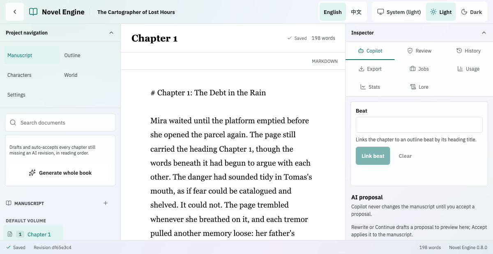
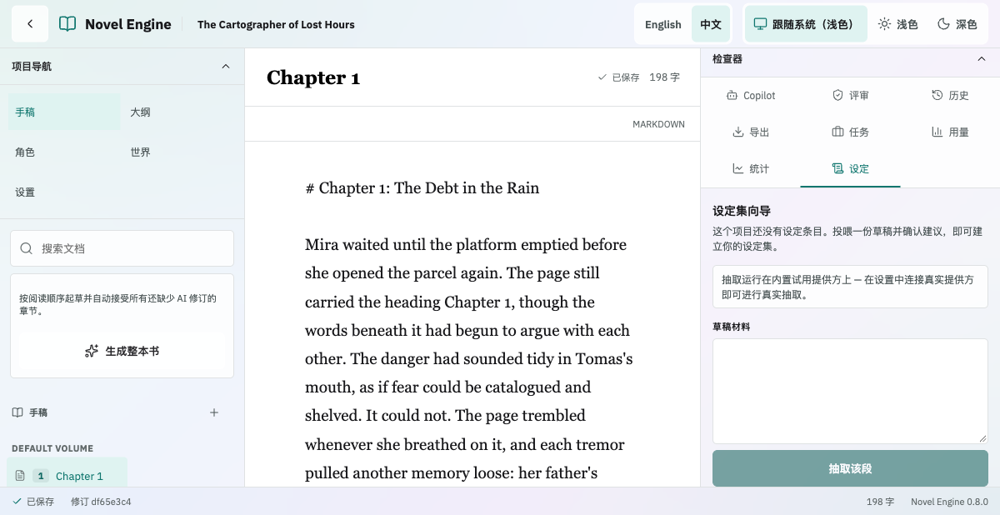
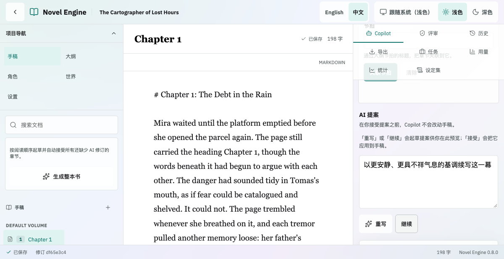
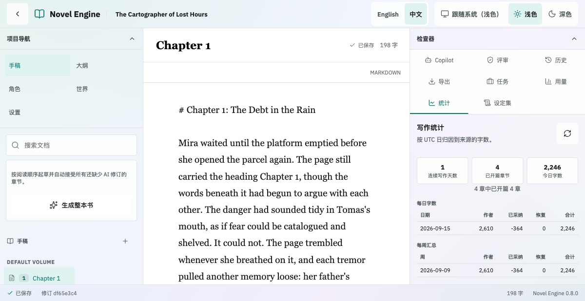

# Novel Engine

Novel Engine `0.8.0` is a self-hosted single-author novel writing IDE. SQLite is
the content authority and Markdown is the document syntax. One Node.js process
serves the Studio SPA and the JSON API.

[Documentation](docs/README.md) · [中文文档](README.zh-CN.md) ·
[Contributing](CONTRIBUTING.md) · [Security](.github/SECURITY.md) ·
[License](LICENSE)

## For Writers

Novel Engine runs on your own machine: the manuscript stays in a local SQLite
database and you choose the model — a hosted API or a local one. It is built
for self-hosting authors, so running it means installing Docker and setting one
environment variable, not writing code; there is no hosted or zero-terminal
edition. [Getting started with Docker](openwiki/guides/getting-started.md)
covers installation to your first AI-assisted chapter, and
[provider setup](openwiki/guides/provider-setup.md) connects a real AI
provider such as DashScope or DeepSeek. The full journey is documented end to
end: [writing](openwiki/guides/writing-guide.md),
[exporting](openwiki/guides/exporting.md),
[backup and restore](openwiki/guides/backup-and-restore.md),
[upgrading](openwiki/guides/upgrading.md),
[troubleshooting](openwiki/guides/troubleshooting.md), and the
[FAQ](openwiki/guides/faq.md).

## Screenshots

Captured from a live `0.8.0` stack with the demo workspace; the UI ships in
Chinese and English with light and dark themes.

| Studio (EN) | Lore wizard (zh) |
| --- | --- |
|  |  |

| Copilot proposal (zh) | Writing stats (zh) |
| --- | --- |
|  |  |

First-run setup, the project library, dark mode, and the diagnostics export
panel are in [docs/screenshots/](docs/screenshots/).

## First-Time Setup

Prerequisites: Node.js 24 and the pnpm version pinned in
[`package.json`](package.json) — get pnpm via `corepack enable` or
`npm install -g pnpm@11`. For Windows setup and development mode, see
the [quickstart](openwiki/quickstart.md).

```bash
cp .env.example .env.local
pnpm install --frozen-lockfile
pnpm --dir frontend build
pnpm --dir server build
pnpm --dir server cli serve
```

Open `http://127.0.0.1:8000`, create the local Owner account on the setup
screen, then log in. For local development the default AI provider is `mock`, so
AI proposal flows work without external credentials.

## Configuration

Start from the minimal template in `.env.example`; copy it to `.env.local`. It
is not the complete variable list — the configuration table below and the
pass-through list in `compose.yaml` are the full reference. Process
environment variables always win over the file. `.env.local` and the
default SQLite `data/` directory resolve against the workspace root (the
checkout directory), not the current working directory, so `pnpm --dir server
cli serve` reads the root `.env.local` and stores data under `<workspace>/data/`.
Under Docker Compose the container instead receives provider settings from a
project-root `.env` file (or the shell environment) through the pass-through
declared in `compose.yaml`; see the [provider setup
guide](openwiki/guides/provider-setup.md).

| Variable | Default | Notes |
|---|---:|---|
| `APP_ENVIRONMENT` | `development` | Use `production` only with explicit secrets and CORS origins. |
| `DB_URL` | `sqlite:///./data/novel-engine.sqlite3` | Only SQLite is supported. |
| `API_HOST` | `0.0.0.0` | Bind address for `serve`. |
| `API_PORT` | `8000` | Listen port. |
| `LOG_LEVEL` | `info` | Structured logger level: `fatal`, `error`, `warn`, `info`, `debug`, `trace`, or `silent`. An unknown value refuses startup. |
| `API_MAX_ACTIVE_WORKFLOWS` | `4` | Global concurrent workflow capacity; integer 1–1024. |
| `API_MAX_ACTIVE_WORKFLOWS_PER_PROJECT` | `2` | Per-project workflow capacity; must not exceed the global limit. |
| `SECURITY_SECRET_KEY` | unset (rotated per start outside production) | Required in production; a missing secret, a value shorter than 16 characters, or a `change-me*` placeholder refuses startup there. Generate a unique random value. Outside production and staging a missing secret is generated once into `data/.secret` (mode `0600`) and reused, so local restarts keep sessions instead of logging everyone out; delete that file to rotate it. |
| `SECURITY_CORS_ORIGINS` | localhost origins | Must be explicit and non-localhost in production; the Compose files intentionally ship no placeholder, so an unset value refuses startup there. |
| `SECURITY_RATE_LIMIT` | `5/minute` | Auth endpoint rate limit. |
| `SECURITY_TRUSTED_PROXIES` | empty | Comma-separated trusted proxy addresses (exact IPs, or host strings for local sockets) whose forwarding chain may be trusted for client identity; the client is the rightmost untrusted hop, never the client-controlled leading segment. Network ranges are refused at startup — a range that covers clients would let them forge identities. Set the exact proxy address(es) behind a reverse proxy, or every client shares one rate-limit bucket. |
| `LLM_PROVIDER` | `mock` | `mock`, `dashscope`, or `openai_compatible`. |
| `LLM_MODEL` | unset | Generic model override applied to every provider, between the per-provider override and the hard default. Left unset, the mock provider resolves to `deterministic-story-v1`; `.env.example` pins it to `studio-copilot-v1` as an example override. |
| `DASHSCOPE_API_KEY` | unset | Required when `LLM_PROVIDER=dashscope`. |
| `DASHSCOPE_TRANSPORT_MODE` | `multimodal_generation` | `text_generation`, `multimodal_generation`, or `responses`. |
| `DASHSCOPE_MODEL` | unset | DashScope generation model; falls back to `LLM_MODEL`, then `qwen3.5-flash`. |
| `DASHSCOPE_REVIEW_MODEL` | unset | DashScope model for AI review runs; falls back to the generation model. |
| `DASHSCOPE_API_BASE` | unset | Custom DashScope API base URL, for gateways mirroring the DashScope API. |
| `LLM_API_KEY` | unset | Required when `LLM_PROVIDER=openai_compatible`. |
| `OPENAI_API_KEY` | unset | Alias of `LLM_API_KEY`; `LLM_API_KEY` takes precedence when both are set. |
| `LLM_API_BASE` | unset | Base URL of the OpenAI-compatible endpoint (e.g. `https://api.openai.com/v1`). |
| `OPENAI_API_BASE` | unset | Alias of `LLM_API_BASE`; `LLM_API_BASE` takes precedence when both are set. |
| `OPENAI_COMPATIBLE_MODEL` | unset | OpenAI-compatible generation model; falls back to `LLM_MODEL`, then `gpt-4o-mini`. |
| `LLM_TIMEOUT` | `30` | Outbound provider request timeout in seconds (5–300). |
| `LLM_STREAM_FIRST_BYTE_TIMEOUT_MS` | `30000` | Streaming silence ceiling (ms) before the first proposal byte (1–300000). |
| `LLM_STREAM_IDLE_TIMEOUT_MS` | `60000` | Streaming silence ceiling (ms) between consecutive frames (1–300000). |
| `LLM_RETRY_ATTEMPTS` | `3` | Provider retry attempts (1–3). |
| `LLM_RETRY_DELAY` | `1` | Base retry delay in seconds (0.1–10). |
| `LLM_LOREBOOK_BUDGET_CHARACTERS` | `4000` | Character budget of the lorebook prompt section. |

Frontend-only variables live in `frontend/.env.example`:
`VITE_API_BASE_URL`, `VITE_API_TIMEOUT`, and `VITE_API_PROXY_TARGET`.

## Docker

Docker is the recommended way to run Novel Engine. The `v0.8.0` tag is pushed
and its prebuilt multi-architecture image is already on GHCR — the GitHub
Release itself is still a draft — so the quickest path needs no clone and no
build: a single command starts the image (see
[deploy/README.md](deploy/README.md) for the walkthrough, upgrades, and the
reverse-proxy hosting checklist):

```bash
curl -fsSL https://raw.githubusercontent.com/Jackela/Novel-Engine/v0.8.0/deploy/compose.yaml | docker compose -f - up -d
```

To build from source instead, use the clone path below. First get the code:
clone this repository, or
download it via the **Code** → **Download ZIP** button on GitHub and unzip
it. Then, from the folder containing `compose.yaml` (the first start builds
the image and can take a few minutes):

```bash
docker compose up -d
```

Before the first start, configure the studio's browser origin: the Compose
files intentionally ship no placeholder, and production refuses the default
localhost origins, so the container will not start until
`SECURITY_CORS_ORIGINS` names an origin (`SECURITY_CORS_ORIGINS=… docker
compose up -d` or a `.env` file next to `compose.yaml` both work; local-only
installs can follow the [getting started
guide](openwiki/guides/getting-started.md), which also shows the
development-mode override for a strictly local setup). Behind a reverse proxy
also set `SECURITY_TRUSTED_PROXIES` to the proxy's exact address — see the
[hosting checklist](deploy/README.md#hosting-on-a-server).

On a fresh volume the first start logs a one-time **first-start setup token**.
Because the published port makes the browser a non-loopback peer, the Owner
setup request must present that token in the `x-setup-token` header. Read it
from the container logs and paste it into the setup screen's **First-start
setup token** field, or complete the setup once through the API (the local
non-Docker flow above connects over loopback and needs no token):

```bash
TOKEN=$(docker compose logs novel-engine | sed -n 's/.*"setup_token":"\([^"]*\)".*/\1/p' | tail -1)
curl -H "content-type: application/json" -H "x-setup-token: $TOKEN" \
  -d '{"username":"author","password":"choose-a-strong-password"}' \
  http://localhost:8000/api/setup
```

Then open `http://localhost:8000` in Chrome or Firefox and log in. Safari works
but has a known rendering limitation in the frosted-glass visual style, so
Chrome or Firefox is recommended. The token file is deleted after setup, and
because the `novel-engine-data` volume persists (the session secret is
generated into it on first start), sessions keep working across restarts. A
healthcheck polls `/health/ready` inside the container.

The container runs with `restart: unless-stopped`, so it comes back on its
own after a crash or a machine reboot (unless you stopped it yourself). To
bring the studio up again after stopping it, run `docker compose up -d` in
the same folder.

If port 8000 is already taken by another application, create a
`compose.override.yaml` next to `compose.yaml` with this content and restart
with `docker compose up -d`; the studio then listens on port 8001 (the
`!override` tag replaces the default port mapping instead of adding to it;
requires Docker Compose v2.24+, which current Docker Desktop ships):

```yaml
services:
  novel-engine:
    ports: !override
      - "8001:8000"
```

Alternatively, edit `compose.yaml` and change `8000:8000` to `8001:8000`.

Your novels live in the `novel-engine-data` named volume: `docker compose
down` keeps it, `docker compose down -v` deletes it (permanently). The
built-in `mock` AI provider works out of the box; to generate real AI
proposals, set `LLM_PROVIDER` and its API key variable — see
[Configuration](#configuration).

The Compose files harden the container (DR-041): it runs as the unprivileged
`node` user, the root filesystem is read-only with only the data volume and a
64 MiB `/tmp` tmpfs writable, all Linux capabilities are dropped with
`no-new-privileges`, and CPU (2.0), memory (1g), and PID counts (512) are
bounded. The writable data volume keeps working unchanged.

For monitoring, the server exposes an internal Prometheus endpoint:

```bash
docker compose exec novel-engine node -e \
  "fetch('http://127.0.0.1:8000/metrics').then(async r => console.log(await r.text()))"
```

`GET /metrics` answers the process gauges (uptime, resident memory, heap),
job counts by status, usage request/token totals, and a product identity
gauge. It is available to the loopback peer or to an authenticated owner
session and answers 401 otherwise — a scrape surface, not a public endpoint.
Set `LOG_LEVEL` (`fatal`…`silent`, default `info`) to change the structured
logger's verbosity.

## Commands

The operational CLI builds and runs through pnpm:

```bash
pnpm --dir server cli serve
pnpm --dir server cli import --source <legacy-workspace> --owner <username>
pnpm --dir server cli backup
pnpm --dir server cli restore --input <backup-file>
pnpm --dir server cli reindex
pnpm --dir server cli doctor
pnpm --dir server cli migrate
pnpm --dir server cli owner reset
```

`backup` writes a consistent online backup beneath `data/backups/` and prints
its path; after each verified write only the newest three backups in the
`novel-engine-*.sqlite3.bak` family are kept. `restore --input <backup-file>`
verifies a backup file, backs up the current database, then replaces it
atomically. Both commands take exclusive ownership of the data directory:
stop the running server first. `reindex` rebuilds the full-text search index
from every document's current revision. `doctor` prints a read-only health
report (identity, integrity check, journal mode, foreign keys, owner,
document-index reconciliation, migration progress) and never migrates, backs
up, or takes the write lock, so it is safe to run while the server is up;
`migrate` is the write path that applies pending migrations, writing the
safety backup first. For the Docker equivalents, see the
[backup and restore guide](openwiki/guides/backup-and-restore.md).

`owner reset` deletes the local Owner and its sessions so a fresh setup can
create a new Owner. It is the recovery path when the Owner password is lost —
there is no email recovery by design. Like `backup` and `restore`, it takes
exclusive ownership of the data directory, so stop the running server first;
book content is never touched.

Legacy import expects a directory containing `story.yaml` and optional chapter
files under `manuscript/chapters/chapter-*.md`:

```text
legacy-workspace/
  story.yaml
  manuscript/
    chapters/
      chapter-001.md
```

Run `pnpm --dir server cli import --source path/to/legacy-workspace --owner <username>`
after the Owner account has been created. Legacy import is a CLI-only path: the
Studio ships no import wizard, and the HTTP surface exposes only a read-only
preview (`POST /api/imports/preview`, confined to `data/imports`). The import
is read-only against the source. Each chapter keeps the title inferred from its
first heading (falling back to its filename), and the workspace identity covers
relative paths plus content — so re-importing unchanged content, wherever the
directory moved to, returns the existing project (`created: false`) instead of
duplicating it, while a changed chapter imports as a new project.

## Validation

```bash
pnpm run test:dependency-security
pnpm --dir server gates
pnpm --dir server type-check
pnpm --dir server lint
pnpm --dir server lint:types
pnpm --dir server arch
pnpm --dir server test
pnpm spec:validate
pnpm --dir frontend lint
pnpm --dir frontend lint:types
pnpm --dir frontend format:check
pnpm --dir frontend type-check
pnpm --dir frontend test:unit
pnpm --dir frontend build
```

`make validate` and `just validate` cover a subset of checks. CI defines the
full automated contract ([workflow](.github/workflows/ci.yml)): it additionally runs
the API-types drift check, React static diagnostics, Playwright workflows
against the TS backend, and a container persistence check.
The development-only OpenSpec and React Doctor glob chains use a controlled
MIT-source braces replacement for [#672](https://github.com/Jackela/Novel-Engine/issues/672).
Its [source manifest and bounds](vendor/braces/SOURCE.md), installed-chain regression
tests, and lockfile make the local fix reviewable; it is not an upstream release.
Production audit and the scheduled full-tree audit retain their existing policies.
See [CI gates](docs/agents/ci-gates.md) for failure runbooks and the
[quickstart](openwiki/quickstart.md#quick-validation) for browser prerequisites.

## Product Specification

[`openspec/specs/novel-engine/spec.md`](openspec/specs/novel-engine/spec.md) is
the product definition. Validate it with:

```bash
pnpm spec:validate
```

## Upgrading from 0.3.x (Python stack)

0.4.0 is the TypeScript rewrite cutover. The database schema is not migrated:
a Python-era database is unsupported and must not be reused as the new
`data/` directory. Back up or keep the old `data/` directory, start 0.4.0 with
a fresh data directory, create the Owner account, then re-import legacy
workspaces with the import command above. The pre-cutover Python stack remains
available at git tag `python-final`.
