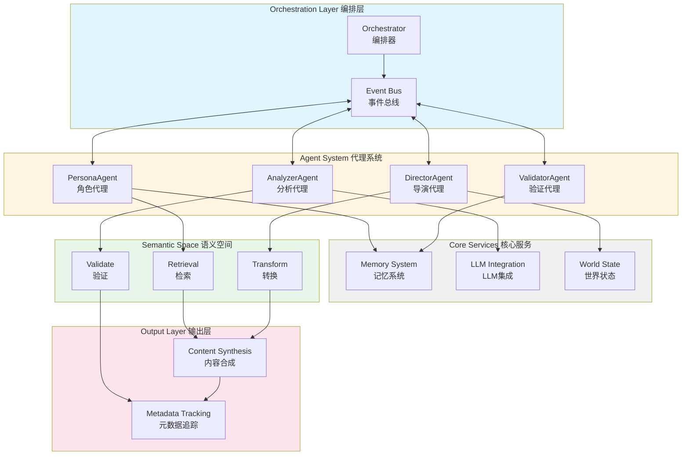

# Novel Engine / 小说引擎

[](LICENSE)
[](https://www.python.org/downloads/)
[](https://reactjs.org/)
[](https://fastapi.tiangolo.com/)

*An experimental narrative generation system exploring semantic retrieval and recombination approaches*

*探索语义检索与重组方法的实验性叙事生成系统*

---

## Philosophy / 设计理念

### Theoretical Inspiration / 理论灵感

This project draws inspiration from Roland Barthes' 1967 essay **"La mort de l'auteur" (The Death of the Author)**. Barthes suggested that textual meaning emerges from the interaction between language systems and readers, rather than solely from authorial intent. Language exists as a shared symbolic structure that precedes individual authors.

本项目受罗兰·巴特1967年的文章**"作者之死"**启发。巴特提出，文本意义来自语言系统与读者的互动，而非仅源于作者意图。语言是先于个体作者存在的共享符号结构。

We explore this idea computationally:

我们从计算角度探索这一想法：

> **Hypothesis**: If texts emerge from shared language systems and cultural memory, then narrative generation might be approached as a process of **semantic retrieval and recombination**, rather than purely generative creation.

> **假设**：如果文本来源于共享的语言系统和文化记忆，那么叙事生成或许可以被视为**语义检索与重组**的过程，而非纯粹的生成式创作。

### Engineering Approach / 工程方法

This philosophical perspective influences our system design, shifting focus from "simulating authors" to **exploring mechanisms for semantic retrieval, recombination, and validation**.

这一哲学视角影响了我们的系统设计，将重点从"模拟作者"转向**探索语义检索、重组与验证的机制**。

| Concept / 概念 | System Component / 系统组件 | Role / 角色 |
|----------------|----------------------------|------------|
| Author / 作者 | Orchestrator / 编排器 | Coordinates processes / 协调流程 |
| Language System / 语言系统 | Knowledge Base / 知识库 | Stores semantic patterns / 存储语义模式 |
| Reader / 读者 | Validation Agent / 验证代理 | Evaluates outputs / 评估输出 |
| Text / 文本 | Output Artifact / 产物 | Traceable results / 可追溯结果 |

**Core Idea**: This system explores generating **paths through semantic networks** rather than creating meaning ex nihilo. The focus is on combinatorial logic, semantic constraints, and traceability.

**核心思路**：本系统探索在**语义网络中生成路径**，而非凭空创造意义。重点在于组合逻辑、语义约束和可追溯性。

### Design Principles / 设计原则

1. **Semantic Composition Within Constraints** / **约束内的语义组合**
   - Compose from existing semantic distributions
   - Track sources and transformations
   - 从现有语义分布中组合，追踪来源与转换

2. **Validation-Driven Generation** / **验证驱动的生成**
   - Ensure logical consistency and coherence
   - Maintain source traceability
   - 确保逻辑一致性与连贯性，保持来源可追溯

3. **Exploratory Path Finding** / **探索性路径寻找**
   - Search for diverse semantic paths
   - Balance between novelty and coherence
   - 搜索多样化的语义路径，平衡新颖性与连贯性

---

## System Overview / 系统总览

### Architecture / 架构



### Key Components / 核心组件

**Agents (代理系统)**: Specialized modules for analysis, planning, and validation  
**代理系统**：专门的分析、规划与验证模块

**Orchestrator (编排器)**: Coordinates task execution and dependencies  
**编排器**：协调任务执行与依赖关系

**Modules (功能模块)**: Retrieval, transformation, and validation processors  
**功能模块**：检索、转换与验证处理器

**Outputs (输出)**: Generated content with metadata and provenance information  
**输出**：生成内容及其元数据与来源信息

For more details, see:
更多详情请见：
- [ARCHITECTURE_OVERVIEW.md](docs/ARCHITECTURE_OVERVIEW.md)
- [NARRATIVE_ENGINE_V2_DESIGN.md](NARRATIVE_ENGINE_V2_DESIGN.md)

---

## Core Components / 核心组件

### 1. Event System / 事件系统
**Location**: `src/events/event_registry.py`

Enables decoupled communication between modules through publish-subscribe patterns.

通过发布-订阅模式实现模块间解耦通信。

**Features**: Type-safe events, retry mechanisms, and delivery guarantees  
**特性**：类型安全的事件、重试机制与投递保证

### 2. Orchestration Layer / 编排层
**Documentation**: `contexts/orchestration/ARCHITECTURE.md`

Manages execution flow, handles failures, and ensures consistency.

管理执行流程，处理失败，确保一致性。

**Capabilities**:
- Dependency resolution / 依赖解析
- State management / 状态管理
- Error recovery / 错误恢复

### 3. Agent System / 代理系统
**Location**: `web-bundles/agents/*.txt`, `src/agents/`

Different agents handle specialized tasks:

不同代理处理专门任务：

- **PersonaAgent**: Character behavior simulation / 角色行为模拟
- **DirectorAgent**: Narrative coordination / 叙事协调
- **AnalyzerAgent**: Content analysis / 内容分析
- **ValidatorAgent**: Quality assurance / 质量保证

### 4. Memory System / 记忆系统
**Location**: `src/memory/`

Multi-layer memory architecture:

多层记忆架构：

- **Working Memory** / 工作记忆: Current context
- **Episodic Memory** / 情景记忆: Event history
- **Semantic Memory** / 语义记忆: Knowledge base
- **Emotional Memory** / 情感记忆: Affective states
- **Relationship Memory** / 关系记忆: Social connections

### 5. Microservices Patterns / 微服务模式
**Location**: `src/architecture/microservices_patterns.py`

Modular architecture supporting:

支持以下特性的模块化架构：

- Component replaceability / 组件可替换性
- Horizontal scaling / 水平扩展
- Observability / 可观测性

---

## Provenance Tracking / 来源追踪

### Metadata System / 元数据系统

Generated content includes tracking information:

生成内容包含追踪信息：

- **Source References** / 来源引用: Original content references
- **Transformation History** / 转换历史: Processing steps
- **Validation Results** / 验证结果: Quality checks

### Example Schema / 示例模式

```json
{
  "output_id": "narrative_20251027_001",
  "metadata": {
    "sources": [
      {"id": "corpus_01", "weight": 0.6},
      {"id": "corpus_02", "weight": 0.4}
    ],
    "transformations": [
      {"step": "retrieval", "timestamp": "2025-10-27T10:30:00Z"},
      {"step": "validation", "passed": true}
    ]
  }
}
```

### Directory Structure / 目录结构

```
provenance/
├── sources/          # Source metadata / 来源元数据
├── transformations/  # Processing logs / 处理日志
└── outputs/          # Final artifacts / 最终产物
```

---

## Technical Stack / 技术栈

### Backend / 后端
**285 Python files | ~78K lines of code**

- **FastAPI**: Async web framework / 异步Web框架
- **Pydantic**: Data validation / 数据验证
- **aiosqlite**: Async database / 异步数据库
- **Jinja2**: Template engine / 模板引擎

### Frontend / 前端

- **React 18 + TypeScript**: UI framework / UI框架
- **Material-UI**: Component library / 组件库
- **Redux Toolkit**: State management / 状态管理
- **Vite**: Build system / 构建系统

### Infrastructure / 基础设施

- **Docker + Kubernetes**: Container orchestration / 容器编排
- **GitHub Actions**: CI/CD / 持续集成
- **Act**: Local workflow testing / 本地工作流测试

---

## Getting Started / 快速开始

### Prerequisites / 前置条件
- Python 3.8+
- Node.js 18+
- Docker (optional / 可选)

### Installation / 安装

```bash
# Clone repository / 克隆仓库
git clone https://github.com/yourusername/Novel-Engine.git
cd Novel-Engine

# Install Python dependencies / 安装Python依赖
pip install -r requirements.txt

# Install frontend dependencies / 安装前端依赖
cd frontend && npm install && cd ..
```

### Configuration / 配置

```bash
# Copy configuration template / 复制配置模板
cp config.yaml.example config.yaml

# Set environment variables / 设置环境变量
export NOVEL_ENGINE_API_KEY=your_api_key
export NOVEL_ENGINE_DB_PATH=./data/novel_engine.db
```

### Running / 运行

```bash
# Development mode / 开发模式
python -m uvicorn src.api.server:app --reload --port 8000
cd frontend && npm run dev

# Production mode / 生产模式
python production_api_server.py
```

Access at / 访问: `http://localhost:5173` (dev) / `http://localhost:8000` (prod)

---

## Testing / 测试

### Backend Tests / 后端测试
```bash
pytest                          # All tests / 所有测试
pytest --cov=src               # With coverage / 含覆盖率
pytest -m unit                 # Unit tests / 单元测试
```

### Frontend Tests / 前端测试
```bash
cd frontend
npm test                       # Unit tests / 单元测试
npm run test:e2e              # E2E tests / 端到端测试
```

### Local CI/CD Testing / 本地CI/CD测试
```bash
act pull_request -W .github/workflows/ci.yml
```

---

## API Documentation / API文档

Interactive API documentation / 交互式API文档:
- Swagger UI: `http://localhost:8000/docs`
- ReDoc: `http://localhost:8000/redoc`

---

## Project Structure / 项目结构

```
Novel-Engine/
├── src/                    # Backend source / 后端源码
│   ├── agents/            # Agent system / 代理系统
│   ├── api/               # API endpoints / API端点
│   ├── core/              # Core systems / 核心系统
│   ├── events/            # Event bus / 事件总线
│   ├── memory/            # Memory system / 记忆系统
│   └── orchestration/     # Orchestration / 编排层
├── frontend/              # React app / React应用
├── tests/                 # Test suite / 测试套件
├── docs/                  # Documentation / 文档
├── provenance/            # Provenance tracking / 来源追踪
└── .github/workflows/     # CI/CD pipelines / CI/CD流水线
```

---

## Contributing / 贡献

Contributions are welcome! Please ensure:

欢迎贡献！请确保：

- All tests pass / 所有测试通过
- Code is formatted (black, isort) / 代码已格式化
- Type checks pass (mypy) / 类型检查通过
- Documentation is updated / 文档已更新

See [CONTRIBUTING.md](CONTRIBUTING.md) for details.

详见 [CONTRIBUTING.md](CONTRIBUTING.md)。

---

## License / 许可证

MIT License - see [LICENSE](LICENSE) for details.

MIT许可证 - 详见 [LICENSE](LICENSE)。

---

## Project Goals / 项目目标

This project explores an alternative approach to narrative generation:

本项目探索叙事生成的另一种方法：

> Instead of treating text generation as pure creation, we investigate it as a process of **semantic retrieval, recombination, and validation** within shared language systems.

> 与其将文本生成视为纯粹的创作，我们将其作为共享语言系统中**语义检索、重组与验证**的过程来研究。

This is an experimental system. We welcome feedback, contributions, and discussions about alternative approaches to narrative generation.

这是一个实验性系统。我们欢迎关于叙事生成替代方法的反馈、贡献和讨论。

---

## Support / 支持

- Documentation / 文档: [docs/](docs/)
- Issues / 问题: [GitHub Issues](https://github.com/yourusername/Novel-Engine/issues)
- Discussions / 讨论: [GitHub Discussions](https://github.com/yourusername/Novel-Engine/discussions)
