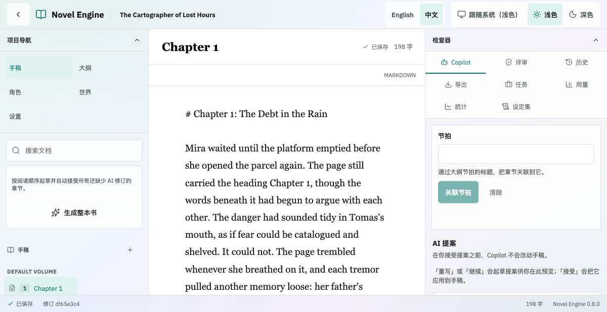
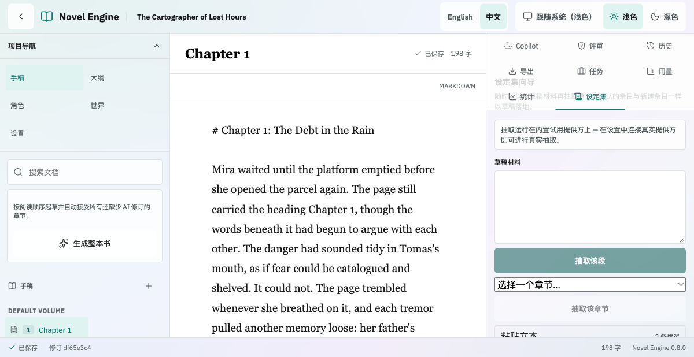

# Novel Engine（中文版）

跑在作者自己电脑上的 AI 小说工作室：稿子留在本地，模型由你选择——云端 API 或本地模型，无订阅、无按字计费。

这是一份精简的中文快速开始。完整说明见 [README.md](README.md)（英文），作者指南的中文版在
[openwiki/guides/zh/](openwiki/guides/zh/)。

## 界面速览

以下截图来自 `0.8.0` 演示工作区的实际运行界面；更多画面（首次初始化、项目库、暗色模式、
诊断导出）在 [docs/screenshots/](docs/screenshots/)。

| 写作视图 | 设定集向导 |
| --- | --- |
|  |  |

## 两条启动路径（Docker）

装好并打开 [Docker Desktop](https://www.docker.com/products/docker-desktop/)，然后二选一：

**路径一：一行命令（无需克隆代码）** —— 待 v0.8.0 发布后，在任意空目录运行：

```bash
curl -fsSL https://raw.githubusercontent.com/Jackela/Novel-Engine/v0.8.0/deploy/compose.yaml | docker compose -f - up -d
```

详见 [deploy/README.md](deploy/README.md)。

**路径二：克隆或下载后运行** —— 克隆仓库，或在 GitHub 页面用 **Code** →
**Download ZIP** 下载解压；在包含 `compose.yaml` 的文件夹里运行：

```bash
git clone https://github.com/Jackela/Novel-Engine.git
cd Novel-Engine
docker compose up -d
```

第一次启动要构建镜像，可能需要几分钟。之后在 Chrome 或 Firefox 打开
`http://localhost:8000`（Safari 有已知渲染缺陷，不建议），在初始化页面创
建本地所有者账户并登录。

## 试用模式：不需要任何 API key

工作室内置一个试用 provider（`mock`），不需要 key、不需要注册、不需要联
网就能写出真实文字——Copilot、整本书生成、评审、导出，每个功能都能先试
用。先写起来，再考虑接正式模型。

## 接入真正的 AI 模型

想用 DashScope（通义千问）或任何 OpenAI 兼容接口（DeepSeek、OpenAI
等）时，在 `compose.yaml` 旁边的 `.env` 文件里写几行环境变量（例如
`LLM_PROVIDER=dashscope` 和 `DASHSCOPE_API_KEY=sk-...`），再跑一次
`docker compose up -d`，然后在项目的设置里选择 provider。按 token 计费，
用多少付多少；完整步骤和各家服务商的精确变量见
[provider-setup.md](openwiki/guides/zh/provider-setup.md)。

## 你的稿子在哪里

所有内容——项目、章节、修订、设置——都在你机器上 Docker volume
`novel-engine-data` 里的一个 SQLite 文件中。`docker compose stop` 或升级
都不会碰它。备份、恢复与搬新电脑见
[backup-and-restore.md](openwiki/guides/zh/backup-and-restore.md)。

## 中文作者指南

- [快速开始（Docker）](openwiki/guides/zh/getting-started.md)
- [Provider 配置](openwiki/guides/zh/provider-setup.md)
- [写作指南](openwiki/guides/zh/writing-guide.md)
- [导出](openwiki/guides/zh/exporting.md)
- [备份与恢复](openwiki/guides/zh/backup-and-restore.md)
- [升级](openwiki/guides/zh/upgrading.md)
- [故障排除](openwiki/guides/zh/troubleshooting.md)
- [常见问题](openwiki/guides/zh/faq.md)
