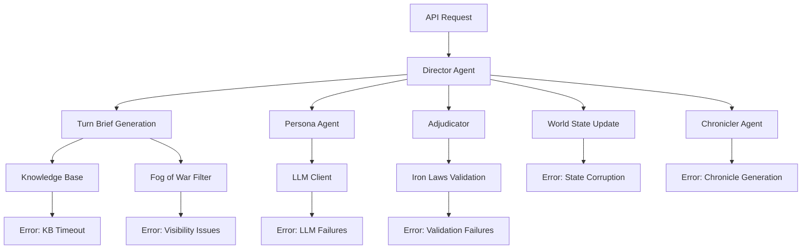

# Novel Engine Debugging Guide

*Document Version: 1.0*  
*Last Updated: 2025-08-11*  
*Purpose: Comprehensive debugging methodology for multi-agent systems*

## Overview

The Novel Engine's multi-agent architecture presents unique debugging challenges due to the complex interactions between Director, Persona, Chronicler, and Knowledge Base components. This guide provides systematic approaches to identify, isolate, and resolve issues across all system layers.

## 🔍 Debugging Philosophy

### Core Principles
- **Evidence-Based**: Always work from observable symptoms to root causes
- **Systematic**: Follow structured debugging workflows to avoid missing issues
- **Layer-Aware**: Understand which layer (Agent, System, Infrastructure) is involved
- **Context-Preserving**: Maintain full context when investigating issues

### Debugging Hierarchy
1. **Symptom Identification**: What is the observable problem?
2. **Layer Isolation**: Which component layer is affected?
3. **Root Cause Analysis**: What is the underlying cause?
4. **Fix Implementation**: How to resolve without introducing new issues?
5. **Validation**: How to confirm the fix works and doesn't break other functionality?

## 🏗️ System Architecture for Debugging

### Component Interaction Map


### Debug Information Flow
- **Request Layer**: HTTP requests, validation, routing
- **Agent Layer**: Director, Persona, Chronicler decision-making
- **Logic Layer**: Turn brief generation, adjudication, world state management
- **Infrastructure Layer**: Knowledge base, LLM communication, caching

---

## 🔧 Debugging Tools & Setup

### Essential Debug Configuration

#### 1. Logging Configuration
```python
# logging_config.py
import logging
import sys
from pathlib import Path

def setup_debug_logging():
    """Configure comprehensive debug logging."""
    
    # Create logs directory
    log_dir = Path("logs")
    log_dir.mkdir(exist_ok=True)
    
    # Configure root logger
    logging.basicConfig(
        level=logging.DEBUG,
        format='%(asctime)s - %(name)s - %(levelname)s - %(funcName)s:%(lineno)d - %(message)s',
        handlers=[
            # File handler for all logs
            logging.FileHandler(log_dir / "debug.log"),
            # Console handler for errors only
            logging.StreamHandler(sys.stdout)
        ]
    )
    
    # Component-specific loggers
    loggers = {
        "src.engine.director": logging.DEBUG,
        "src.engine.persona": logging.DEBUG, 
        "src.engine.chronicler": logging.DEBUG,
        "src.engine.kb": logging.DEBUG,
        "src.llm.client": logging.INFO,  # Reduce LLM noise
        "src.shared_types": logging.WARNING  # Reduce schema noise
    }
    
    for logger_name, level in loggers.items():
        logger = logging.getLogger(logger_name)
        logger.setLevel(level)
    
    logging.info("Debug logging configured")

# Usage in main application
if __name__ == "__main__":
    setup_debug_logging()
```

#### 2. Debug Environment Variables
```bash
# .env.debug
LOG_LEVEL=DEBUG
DEBUG_MODE=true
VALIDATE_SCHEMAS=true
CACHE_DISABLED=true
MOCK_LLM=true  # Use deterministic responses
TRACE_ENABLED=true
PERFORMANCE_LOGGING=true
```

#### 3. Development Test Fixtures
```python
# tests/conftest.py - Enhanced debug fixtures
import pytest
from pathlib import Path
import tempfile
from src.engine.director import DirectorAgent
from src.engine.kb import MockKnowledgeBase
from src.shared_types import WorldState, PersonaCardV2

@pytest.fixture
def debug_world_state():
    """Minimal world state for debugging."""
    return WorldState(
        turn=1,
        entities=[
            {"id": "debug_agent", "type": "character", "pos": "0,0", "name": "Debug Agent"},
            {"id": "test_target", "type": "object", "pos": "1,1", "name": "Test Target"},
            {"id": "distant_entity", "type": "character", "pos": "10,10", "name": "Far Entity"}
        ],
        facts=[
            {"id": "fact_1", "text": "debug_agent is in debug mode", "confidence": 1.0, "source_id": "test"}
        ],
        rules=[
            {"name": "debug_rule", "expr": "debug entities always succeed"}
        ]
    )

@pytest.fixture  
def debug_persona():
    """Test persona with known characteristics."""
    return PersonaCardV2(
        id="debug_agent",
        faction="testers",
        beliefs=[{"proposition": "Debugging is essential", "weight": 1.0}],
        knowledge_scope=[{"channel": "visual", "range": 5}],
        traits=[{"name": "methodical", "weight": 0.9}]
    )

@pytest.fixture
def debug_director(debug_world_state, debug_persona):
    """Director configured for debugging."""
    kb = MockKnowledgeBase()
    kb.set_response([
        {"text": "Debug protocol active", "source_id": "debug_manual"}
    ])
    return DirectorAgent(kb)

@pytest.fixture(autouse=True)
def debug_logging_setup():
    """Automatically setup debug logging for tests."""
    setup_debug_logging()
    yield
    # Cleanup if needed
```

---

## 🐛 Common Issue Patterns & Solutions

### Category 1: Agent Decision-Making Issues

#### Symptom: Agent produces nonsensical actions
```bash
# Debug command
poetry run python -c "
from tests.conftest import debug_director, debug_world_state, debug_persona
director = debug_director()
brief = director._build_turn_brief(debug_world_state(), debug_persona())
print(f'Visible entities: {brief.visible_slice}')
print(f'Doctrine snippets: {len(brief.doctrine_snippets)}')
"
```

**Diagnostic Steps**:
1. **Check Turn Brief Content**: Verify the agent received correct information
2. **Validate Knowledge Retrieval**: Confirm relevant doctrine was retrieved
3. **Inspect Visibility Rules**: Ensure Fog of War is working correctly
4. **Review LLM Prompts**: Check if prompt formatting is correct

**Common Causes & Fixes**:
- **Empty Turn Brief**: Knowledge Base not loading → Check KB configuration
- **Incorrect Visibility**: Fog of War misconfigured → Review `_apply_fog_of_war()`
- **Missing Doctrine**: KB retrieval failing → Test KB connection
- **Malformed Prompts**: Prompt template issues → Validate prompt structure

#### Symptom: Actions consistently rejected by Adjudicator
```python
# Debug script: debug_adjudication.py
import logging
from src.engine.director import DirectorAgent, AdjudicationError
from src.shared_types import CharacterAction

def debug_adjudication_failure():
    """Debug why actions are being rejected."""
    
    # Test action that should work
    valid_action = CharacterAction(
        action_type="observe",
        intent="Look around",
        justification="Need to assess situation",
        confidence=0.8
    )
    
    try:
        director = DirectorAgent(mock_kb())
        result = director._adjudicate_action(valid_action, debug_world_state(), debug_persona())
        print(f"Action result: {result}")
    except AdjudicationError as e:
        print(f"Adjudication failed: {e.code} - {e.message}")
        # Check each Iron Law individually
        _debug_iron_laws(valid_action)

def _debug_iron_laws(action):
    """Test each Iron Law individually."""
    director = DirectorAgent(mock_kb())
    
    laws = [
        "resource_conservation",
        "information_limit", 
        "state_consistency",
        "rule_adherence",
        "canon_preservation"
    ]
    
    for law in laws:
        try:
            method = getattr(director, f"_validate_{law}")
            method(action, debug_world_state(), debug_persona())
            print(f"✅ {law}: PASSED")
        except AdjudicationError as e:
            print(f"❌ {law}: FAILED - {e}")

if __name__ == "__main__":
    debug_adjudication_failure()
```

### Category 2: Knowledge Base Issues

#### Symptom: Empty or irrelevant doctrine snippets
```python
# Debug KB retrieval
def debug_kb_retrieval():
    """Debug knowledge base retrieval issues."""
    from src.engine.kb import KnowledgeBase
    
    kb = KnowledgeBase()
    
    # Test basic connectivity
    try:
        test_query = "combat tactics"
        results = kb.retrieve(test_query, top_k=3)
        print(f"Query: '{test_query}' returned {len(results)} results")
        
        for i, result in enumerate(results):
            print(f"Result {i+1}: {result.text[:100]}...")
            print(f"Source: {result.source_id}")
        
    except Exception as e:
        print(f"KB retrieval failed: {e}")
        _diagnose_kb_failure(kb)

def _diagnose_kb_failure(kb):
    """Diagnose KB connection issues."""
    # Check if KB files exist
    if not hasattr(kb, 'sources') or not kb.sources:
        print("❌ No sources loaded in KB")
        return
    
    # Check if indices are built
    if not hasattr(kb, '_index') or not kb._index:
        print("❌ KB index not built")
        return
    
    # Test simple queries
    simple_queries = ["test", "character", "action"]
    for query in simple_queries:
        try:
            results = kb.retrieve(query, top_k=1)
            print(f"✅ Query '{query}' returned {len(results)} results")
        except Exception as e:
            print(f"❌ Query '{query}' failed: {e}")
```

#### Symptom: KB retrieval timeout or slow performance
```python
# Performance debugging
import time
from functools import wraps

def time_kb_operations(func):
    """Decorator to time KB operations."""
    @wraps(func)
    def wrapper(*args, **kwargs):
        start_time = time.time()
        result = func(*args, **kwargs)
        end_time = time.time()
        
        print(f"KB operation {func.__name__} took {end_time - start_time:.2f}s")
        if end_time - start_time > 2.0:
            print(f"⚠️  Slow KB operation detected!")
        
        return result
    return wrapper

# Apply to KB methods
KnowledgeBase.retrieve = time_kb_operations(KnowledgeBase.retrieve)
```

### Category 3: World State Issues

#### Symptom: State corruption or inconsistency
```python
# State validation utility
def validate_world_state(world_state: WorldState):
    """Comprehensive world state validation."""
    issues = []
    
    # Check entity ID uniqueness
    entity_ids = [e.id for e in world_state.entities]
    if len(entity_ids) != len(set(entity_ids)):
        duplicates = [id for id in set(entity_ids) if entity_ids.count(id) > 1]
        issues.append(f"Duplicate entity IDs: {duplicates}")
    
    # Check relation validity
    for relation in world_state.relations:
        if relation.src not in entity_ids:
            issues.append(f"Relation references non-existent src: {relation.src}")
        if relation.dst not in entity_ids:
            issues.append(f"Relation references non-existent dst: {relation.dst}")
    
    # Check fact references
    for fact in world_state.facts:
        # Simple check - fact text mentions entities
        mentioned_entities = [id for id in entity_ids if id in fact.text]
        if not mentioned_entities:
            issues.append(f"Fact {fact.id} doesn't mention any known entities")
    
    # Check turn progression
    if world_state.turn < 0:
        issues.append(f"Invalid turn number: {world_state.turn}")
    
    return issues

# Usage in debugging
def debug_world_state_corruption():
    """Debug world state corruption issues."""
    world_state = get_current_world_state()  # From your system
    
    issues = validate_world_state(world_state)
    
    if issues:
        print("❌ World State Issues Found:")
        for issue in issues:
            print(f"  - {issue}")
    else:
        print("✅ World State validation passed")
    
    # Additional deep checks
    _deep_validate_entities(world_state.entities)
    _validate_state_transitions(world_state)

def _deep_validate_entities(entities):
    """Deep validation of entity data."""
    for entity in entities:
        # Check required fields
        if not entity.id:
            print(f"❌ Entity missing ID: {entity}")
        if not entity.type:
            print(f"❌ Entity {entity.id} missing type")
        
        # Check asset consistency
        if entity.assets:
            for key, value in entity.assets.items():
                if key == "energy" and (not isinstance(value, (int, float)) or value < 0):
                    print(f"❌ Entity {entity.id} has invalid energy: {value}")
```

### Category 4: Performance Issues

#### Symptom: Response times >5 seconds (violating P95 requirement)
```python
# Performance profiler
import cProfile
import pstats
from contextlib import contextmanager
import time

@contextmanager
def profile_operation(operation_name):
    """Context manager for profiling operations."""
    print(f"Starting profiling: {operation_name}")
    
    profiler = cProfile.Profile()
    start_time = time.time()
    
    profiler.enable()
    try:
        yield profiler
    finally:
        profiler.disable()
        end_time = time.time()
        
        # Print timing info
        total_time = end_time - start_time
        print(f"Operation '{operation_name}' took {total_time:.2f}s")
        
        if total_time > 5.0:
            print(f"⚠️  Performance violation! Target: <5s, Actual: {total_time:.2f}s")
        
        # Save detailed profile
        stats = pstats.Stats(profiler)
        stats.sort_stats('cumulative')
        
        profile_file = f"profiles/{operation_name}_{int(time.time())}.prof"
        stats.dump_stats(profile_file)
        print(f"Profile saved to: {profile_file}")
        
        # Print top 10 functions
        print("Top 10 time-consuming functions:")
        stats.print_stats(10)

# Usage example
def debug_slow_turn_brief():
    """Debug slow turn brief generation."""
    with profile_operation("turn_brief_generation"):
        director = DirectorAgent(kb)
        brief = director._build_turn_brief(world_state, persona)
        
    # Additional timing breakdown
    _time_individual_components()

def _time_individual_components():
    """Time each component of turn brief generation."""
    components = [
        ("fog_of_war", lambda: director._apply_fog_of_war(world_state, persona)),
        ("threat_assessment", lambda: director._assess_threats(world_state, persona, visible)),
        ("kb_retrieval", lambda: director._retrieve_knowledge(world_state, persona))
    ]
    
    for name, func in components:
        start_time = time.time()
        result = func()
        end_time = time.time()
        
        duration = end_time - start_time
        print(f"{name}: {duration:.2f}s")
        
        if duration > 1.0:  # Component taking >1s is concerning
            print(f"⚠️  Slow component: {name}")
```

---

## 🔄 Debugging Workflows

### Workflow 1: New Issue Investigation

```bash
# Step 1: Reproduce the issue
poetry run python scripts/reproduce_issue.py --issue-id 12345

# Step 2: Enable debug logging
export LOG_LEVEL=DEBUG
export DEBUG_MODE=true

# Step 3: Run with minimal test case
poetry run pytest tests/debug/test_issue_12345.py -v -s

# Step 4: Analyze logs
tail -f logs/debug.log | grep -E "(ERROR|WARNING|debug_agent)"

# Step 5: Use replay system for complex issues
poetry run python scripts/debug_replay.py --run-id run_12345 --turn 5
```

### Workflow 2: Performance Regression Investigation

```bash
# Step 1: Run performance baseline
poetry run python evaluation/benchmark_current.py > baseline.txt

# Step 2: Compare with previous performance  
poetry run python evaluation/compare_performance.py baseline.txt historical.txt

# Step 3: Profile slow operations
poetry run python -m cProfile -o profile.stats scripts/run_slow_operation.py

# Step 4: Analyze profile
poetry run python -c "
import pstats
p = pstats.Stats('profile.stats')
p.sort_stats('cumulative').print_stats(20)
"

# Step 5: Check for memory leaks
poetry run python scripts/memory_profile.py --duration 300  # 5 minute test
```

### Workflow 3: Multi-Agent Coordination Issues

```python
# Debug multi-agent interactions
def debug_multi_agent_coordination():
    """Debug issues with multiple agents interacting."""
    
    # Setup scenario with multiple agents
    agents = ["agent_1", "agent_2", "agent_3"]
    coordination_issues = []
    
    for turn in range(5):
        print(f"\n=== Turn {turn + 1} ===")
        
        for agent_id in agents:
            try:
                # Generate turn brief for each agent
                agent_persona = get_persona_by_id(agent_id)
                brief = director._build_turn_brief(world_state, agent_persona)
                
                # Check for coordination issues
                if _detect_coordination_issues(brief, agent_id, turn):
                    coordination_issues.append((agent_id, turn, brief))
                
                print(f"Agent {agent_id}: {len(brief.visible_slice)} visible entities")
                
            except Exception as e:
                print(f"❌ Agent {agent_id} failed: {e}")
                coordination_issues.append((agent_id, turn, str(e)))
        
        # Update world state for next turn
        world_state = simulate_turn(world_state, agents)
    
    # Analyze coordination issues
    if coordination_issues:
        print(f"\n❌ Found {len(coordination_issues)} coordination issues")
        for agent_id, turn, issue in coordination_issues:
            print(f"  Turn {turn}, Agent {agent_id}: {issue}")
    else:
        print("\n✅ No coordination issues detected")

def _detect_coordination_issues(brief, agent_id, turn):
    """Detect common coordination issues."""
    issues = []
    
    # Check for information consistency
    if len(brief.visible_slice) == 0:
        issues.append("Empty visibility - agent blind")
    
    # Check for doctrine consistency
    if len(brief.doctrine_snippets) == 0:
        issues.append("No doctrine retrieved - agent without guidance")
    
    # Check for threat awareness
    if len(brief.threats) > 0 and not brief.last_actions_summary:
        issues.append("Threats present but no context from previous actions")
    
    return issues
```

---

## 🔍 Replay System Usage for Debugging

The Novel Engine's replay system is invaluable for debugging complex issues.

### Basic Replay Analysis
```python
# Analyze replay data
def analyze_replay_data(run_id: str, turn: int):
    """Analyze specific replay data for debugging."""
    
    replay_file = Path(f"runs/{run_id}/turn_{turn}.json")
    
    if not replay_file.exists():
        print(f"❌ Replay file not found: {replay_file}")
        return
    
    with open(replay_file) as f:
        replay_data = json.load(f)
    
    # Analyze turn brief
    brief = replay_data["brief"]
    print(f"Turn Brief Analysis:")
    print(f"  Persona: {brief['for_persona']}")
    print(f"  Visible entities: {len(brief['visible_slice'])}")
    print(f"  Threats: {len(brief['threats'])}")
    print(f"  Doctrine snippets: {len(brief['doctrine_snippets'])}")
    
    # Analyze action
    action = replay_data["action"]
    print(f"\nAction Analysis:")
    print(f"  Type: {action['action_type']}")
    print(f"  Target: {action.get('target', 'None')}")
    print(f"  Confidence: {action['confidence']}")
    
    # Analyze adjudication
    adjudication = replay_data["adjudication"]
    print(f"\nAdjudication Analysis:")
    print(f"  Outcome: {adjudication['outcome']}")
    if adjudication['outcome'] == 'fail':
        print(f"  Error: {adjudication['code']}")
    
    # Performance analysis
    costs = replay_data["costs"]
    print(f"\nPerformance Analysis:")
    print(f"  Tokens used: {costs['tokens']}")
    print(f"  Latency: {costs['latency_ms']}ms")
    
    if costs['latency_ms'] > 5000:
        print("  ⚠️  Performance issue: >5s latency")
    
    return replay_data

# Usage
replay_data = analyze_replay_data("run_12345", 3)
```

### Replay Comparison for Regression Analysis
```python
def compare_replays(baseline_run: str, current_run: str, turn: int):
    """Compare replay data to identify regressions."""
    
    baseline_data = analyze_replay_data(baseline_run, turn)
    current_data = analyze_replay_data(current_run, turn)
    
    if not baseline_data or not current_data:
        print("❌ Cannot compare - missing replay data")
        return
    
    # Compare performance
    baseline_latency = baseline_data["costs"]["latency_ms"] 
    current_latency = current_data["costs"]["latency_ms"]
    
    latency_change = ((current_latency - baseline_latency) / baseline_latency) * 100
    
    print(f"\nPerformance Comparison:")
    print(f"Baseline latency: {baseline_latency}ms")
    print(f"Current latency: {current_latency}ms")
    print(f"Change: {latency_change:+.1f}%")
    
    if latency_change > 20:
        print("⚠️  Performance regression detected!")
    
    # Compare decision quality
    baseline_confidence = baseline_data["action"]["confidence"]
    current_confidence = current_data["action"]["confidence"]
    
    confidence_change = current_confidence - baseline_confidence
    print(f"\nDecision Quality Comparison:")
    print(f"Baseline confidence: {baseline_confidence:.2f}")
    print(f"Current confidence: {current_confidence:.2f}")
    print(f"Change: {confidence_change:+.2f}")
    
    if confidence_change < -0.2:
        print("⚠️  Decision quality regression detected!")
```

---

## 🚨 Emergency Debugging Procedures

### System Completely Down
```bash
# Emergency checklist
echo "1. Check basic connectivity"
curl -f http://localhost:8000/meta/policy || echo "❌ API server down"

echo "2. Check configuration"
python -c "
import yaml
with open('settings.yaml') as f:
    settings = yaml.safe_load(f)
    print(f'Mode: {settings.get(\"mode\", \"unknown\")}')
    print(f'KB enabled: {settings.get(\"kb\", {}).get(\"enabled\", False)}')
"

echo "3. Check core dependencies" 
poetry run python -c "
try:
    from src.shared_types import WorldState
    from src.engine.director import DirectorAgent
    print('✅ Core imports working')
except Exception as e:
    print(f'❌ Import error: {e}')
"

echo "4. Check database/KB connectivity"
poetry run python scripts/health_check.py

echo "5. Check recent logs"
tail -n 50 logs/app.log | grep -E "(ERROR|CRITICAL)"
```

### Memory Leak Detection
```python
# Memory leak debugging
import psutil
import os
import time

def debug_memory_leak():
    """Monitor memory usage to detect leaks."""
    
    process = psutil.Process(os.getpid())
    initial_memory = process.memory_info().rss
    
    print(f"Initial memory: {initial_memory / 1024 / 1024:.1f} MB")
    
    # Run operation multiple times
    for i in range(100):
        # Your operation here
        director = DirectorAgent(kb)
        brief = director._build_turn_brief(world_state, persona)
        
        # Check memory every 10 iterations
        if i % 10 == 0:
            current_memory = process.memory_info().rss
            memory_diff = current_memory - initial_memory
            
            print(f"Iteration {i}: {current_memory / 1024 / 1024:.1f} MB "
                  f"(+{memory_diff / 1024 / 1024:.1f} MB)")
            
            # Alert if memory growth is excessive
            if memory_diff > 100 * 1024 * 1024:  # 100MB growth
                print("⚠️  Potential memory leak detected!")
                break
        
        # Force garbage collection
        import gc
        gc.collect()
        time.sleep(0.1)

if __name__ == "__main__":
    debug_memory_leak()
```

## 📊 Debug Reporting

### Automated Issue Reports
```python
def generate_debug_report(issue_id: str, reproduction_steps: list):
    """Generate comprehensive debug report."""
    
    report = {
        "issue_id": issue_id,
        "timestamp": time.time(),
        "system_info": {
            "python_version": sys.version,
            "platform": platform.platform(),
            "memory_available": psutil.virtual_memory().available
        },
        "reproduction_steps": reproduction_steps,
        "environment": {
            "debug_mode": os.getenv("DEBUG_MODE", "false"),
            "log_level": os.getenv("LOG_LEVEL", "INFO"),
            "settings": _load_settings_summary()
        },
        "symptoms": [],
        "analysis": [],
        "recommendations": []
    }
    
    # Add system diagnostics
    report["diagnostics"] = _run_system_diagnostics()
    
    # Save report
    report_file = f"debug_reports/issue_{issue_id}_{int(time.time())}.json"
    with open(report_file, 'w') as f:
        json.dump(report, f, indent=2)
    
    print(f"Debug report saved: {report_file}")
    return report

def _run_system_diagnostics():
    """Run basic system diagnostics."""
    diagnostics = {}
    
    # Test core components
    try:
        kb = KnowledgeBase()
        diagnostics["kb_status"] = "operational"
    except Exception as e:
        diagnostics["kb_status"] = f"error: {e}"
    
    try:
        director = DirectorAgent(kb)
        diagnostics["director_status"] = "operational"
    except Exception as e:
        diagnostics["director_status"] = f"error: {e}"
    
    # Test API endpoints
    try:
        import requests
        response = requests.get("http://localhost:8000/meta/policy", timeout=5)
        diagnostics["api_status"] = "operational" if response.status_code == 200 else f"error: {response.status_code}"
    except Exception as e:
        diagnostics["api_status"] = f"error: {e}"
    
    return diagnostics
```

## 🎯 Best Practices Summary

### Do's
- **Always reproduce issues** in a controlled environment before investigating
- **Use structured logging** with appropriate context and log levels
- **Test individual components** in isolation before testing integration
- **Document debugging steps** for future reference
- **Use replay system** for complex multi-turn debugging
- **Monitor performance metrics** during debugging sessions

### Don'ts
- **Don't debug in production** without proper safeguards
- **Don't modify multiple components** simultaneously when debugging
- **Don't ignore warning messages** - they often indicate root causes
- **Don't skip validation steps** when implementing fixes
- **Don't forget to test fixes** across different scenarios

### Quick Reference Commands
```bash
# Enable debug mode
export DEBUG_MODE=true LOG_LEVEL=DEBUG

# Run specific debug test
poetry run pytest tests/debug/test_specific_issue.py -v -s

# Profile performance
poetry run python -m cProfile -s cumulative script.py

# Analyze replay data
poetry run python scripts/analyze_replay.py --run-id run_123 --turn 5

# Generate health check report
poetry run python scripts/health_check.py --full-report

# Monitor real-time logs
tail -f logs/debug.log | grep -E "(ERROR|WARNING|CRITICAL)"
```

This debugging guide provides comprehensive coverage of the Novel Engine's debugging needs, with practical tools and systematic approaches for resolving issues across all system layers.