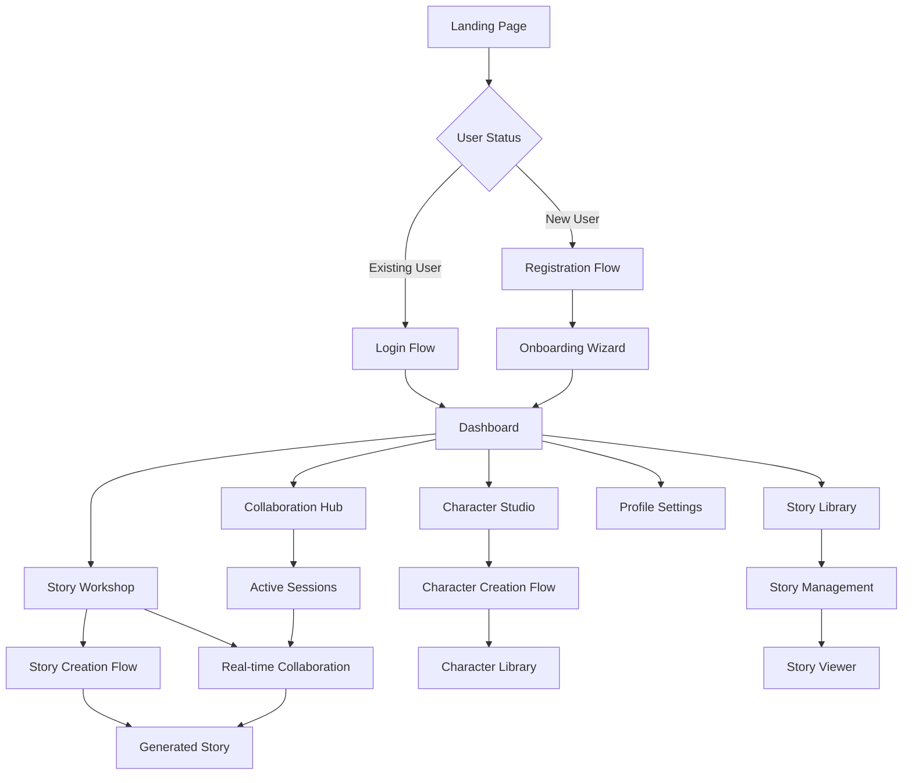
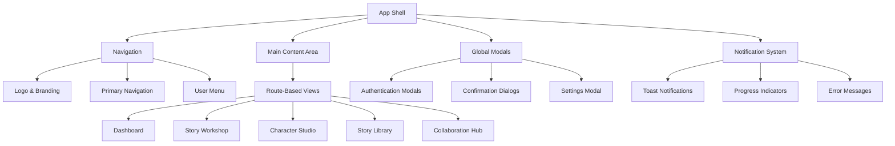

# Complete Frontend User Experience Design

**Document Version**: 1.0  
**Last Updated**: 2025-08-15  
**Purpose**: Design comprehensive frontend user experience flow

## 🎯 Design Overview

The Novel Engine frontend needs a complete user experience redesign to leverage the powerful backend architecture. This design creates an intuitive, modern interface that guides users through story creation, collaboration, and content management.

## 🏗️ User Experience Architecture

### User Journey Flow



### Component Architecture



## 🎨 Visual Design System

### Design Tokens (`frontend/src/theme/tokens.ts`)

```typescript
export const designTokens = {
  colors: {
    // Primary palette - Warhammer 40K inspired dark theme
    primary: {
      50: '#1a1a2e',
      100: '#16213e', 
      200: '#0f3460',
      300: '#0f4c75',
      400: '#3282b8',
      500: '#bbe1fa',
      600: '#e3f2fd',
      700: '#f5f5f5',
      800: '#ffffff',
      900: '#ffffff'
    },
    secondary: {
      50: '#2d1b0e',
      100: '#4a2c17',
      200: '#8b4513',
      300: '#cd853f',
      400: '#daa520',
      500: '#ffd700',
      600: '#ffed4e',
      700: '#fff59d',
      800: '#fffde7',
      900: '#ffffff'
    },
    success: '#4caf50',
    warning: '#ff9800',
    error: '#f44336',
    info: '#2196f3',
    
    // Semantic colors
    background: {
      primary: '#0a0a0a',
      secondary: '#1a1a2e',
      elevated: '#16213e',
      paper: '#0f3460'
    },
    text: {
      primary: '#ffffff',
      secondary: '#bbe1fa',
      disabled: '#64748b',
      hint: '#94a3b8'
    }
  },
  
  typography: {
    fontFamily: {
      primary: '"Inter", "Segoe UI", system-ui, sans-serif',
      mono: '"JetBrains Mono", "Fira Code", monospace',
      heading: '"Orbitron", "Inter", sans-serif' // Sci-fi feel for headings
    },
    fontSize: {
      xs: '0.75rem',
      sm: '0.875rem',
      base: '1rem',
      lg: '1.125rem',
      xl: '1.25rem',
      '2xl': '1.5rem',
      '3xl': '1.875rem',
      '4xl': '2.25rem'
    },
    fontWeight: {
      light: 300,
      normal: 400,
      medium: 500,
      semibold: 600,
      bold: 700
    }
  },
  
  spacing: {
    xs: '0.25rem',
    sm: '0.5rem',
    md: '1rem',
    lg: '1.5rem',
    xl: '2rem',
    '2xl': '3rem',
    '3xl': '4rem'
  },
  
  shadows: {
    sm: '0 1px 2px 0 rgb(0 0 0 / 0.05)',
    base: '0 1px 3px 0 rgb(0 0 0 / 0.1), 0 1px 2px -1px rgb(0 0 0 / 0.1)',
    md: '0 4px 6px -1px rgb(0 0 0 / 0.1), 0 2px 4px -2px rgb(0 0 0 / 0.1)',
    lg: '0 10px 15px -3px rgb(0 0 0 / 0.1), 0 4px 6px -4px rgb(0 0 0 / 0.1)',
    xl: '0 20px 25px -5px rgb(0 0 0 / 0.1), 0 8px 10px -6px rgb(0 0 0 / 0.1)',
    glow: '0 0 20px rgb(59 130 246 / 0.5)' // Blue glow effect
  },
  
  borderRadius: {
    none: '0',
    sm: '0.125rem',
    base: '0.25rem',
    md: '0.375rem',
    lg: '0.5rem',
    xl: '0.75rem',
    '2xl': '1rem',
    full: '9999px'
  }
};
```

### UI Components Library

#### 1. Navigation Component (`frontend/src/components/Navigation/AppNavigation.tsx`)

```typescript
import React, { useState } from 'react';
import { 
  AppBar, 
  Toolbar, 
  Typography, 
  IconButton, 
  Avatar, 
  Menu, 
  MenuItem,
  Badge,
  Tooltip
} from '@mui/material';
import {
  Create as CreateIcon,
  People as PeopleIcon,
  LibraryBooks as LibraryIcon,
  Person as PersonIcon,
  Notifications as NotificationsIcon,
  Settings as SettingsIcon,
  Logout as LogoutIcon
} from '@mui/icons-material';
import { useAuth } from '../../hooks/useAuth';
import { useNotifications } from '../../hooks/useNotifications';

export const AppNavigation: React.FC = () => {
  const { user, logout } = useAuth();
  const { unreadCount } = useNotifications();
  const [anchorEl, setAnchorEl] = useState<null | HTMLElement>(null);
  
  const navigationItems = [
    { 
      label: 'Story Workshop', 
      icon: <CreateIcon />, 
      path: '/workshop',
      description: 'Create and edit stories with AI assistance'
    },
    { 
      label: 'Character Studio', 
      icon: <PersonIcon />, 
      path: '/characters',
      description: 'Design and manage your characters'
    },
    { 
      label: 'Story Library', 
      icon: <LibraryIcon />, 
      path: '/library',
      description: 'Browse and organize your stories'
    },
    { 
      label: 'Collaboration Hub', 
      icon: <PeopleIcon />, 
      path: '/collaborate',
      description: 'Join or create collaborative sessions'
    }
  ];
  
  return (
    <AppBar 
      position="sticky" 
      sx={{ 
        background: 'linear-gradient(135deg, #0f3460 0%, #16213e 100%)',
        backdropFilter: 'blur(10px)',
        borderBottom: '1px solid rgba(255, 255, 255, 0.1)'
      }}
    >
      <Toolbar sx={{ justifyContent: 'space-between' }}>
        {/* Logo and Brand */}
        <Box sx={{ display: 'flex', alignItems: 'center', gap: 2 }}>
          <Box sx={{ 
            display: 'flex', 
            alignItems: 'center', 
            gap: 1,
            background: 'linear-gradient(45deg, #3282b8, #bbe1fa)',
            WebkitBackgroundClip: 'text',
            WebkitTextFillColor: 'transparent'
          }}>
            <CreateIcon sx={{ color: '#3282b8' }} />
            <Typography variant="h6" sx={{ fontFamily: 'Orbitron', fontWeight: 'bold' }}>
              Novel Engine
            </Typography>
          </Box>
        </Box>
        
        {/* Navigation Items */}
        <Box sx={{ display: 'flex', gap: 1 }}>
          {navigationItems.map((item) => (
            <Tooltip key={item.path} title={item.description}>
              <IconButton
                color="inherit"
                component={Link}
                to={item.path}
                sx={{
                  display: 'flex',
                  flexDirection: 'column',
                  gap: 0.5,
                  px: 2,
                  py: 1,
                  borderRadius: 2,
                  transition: 'all 0.2s',
                  '&:hover': {
                    background: 'rgba(255, 255, 255, 0.1)',
                    transform: 'translateY(-1px)'
                  }
                }}
              >
                {item.icon}
                <Typography variant="caption" sx={{ fontSize: '0.6rem' }}>
                  {item.label}
                </Typography>
              </IconButton>
            </Tooltip>
          ))}
        </Box>
        
        {/* User Actions */}
        <Box sx={{ display: 'flex', alignItems: 'center', gap: 1 }}>
          <Tooltip title="Notifications">
            <IconButton color="inherit">
              <Badge badgeContent={unreadCount} color="error">
                <NotificationsIcon />
              </Badge>
            </IconButton>
          </Tooltip>
          
          <Tooltip title="User Menu">
            <IconButton
              onClick={(e) => setAnchorEl(e.currentTarget)}
              sx={{ p: 0.5 }}
            >
              <Avatar 
                src={user?.avatar_url} 
                alt={user?.display_name}
                sx={{ 
                  width: 32, 
                  height: 32,
                  border: '2px solid rgba(255, 255, 255, 0.2)'
                }}
              >
                {user?.display_name?.[0]?.toUpperCase() || 'U'}
              </Avatar>
            </IconButton>
          </Tooltip>
          
          <Menu
            anchorEl={anchorEl}
            open={Boolean(anchorEl)}
            onClose={() => setAnchorEl(null)}
            sx={{ mt: 1 }}
          >
            <MenuItem onClick={() => setAnchorEl(null)}>
              <SettingsIcon sx={{ mr: 1 }} />
              Settings
            </MenuItem>
            <MenuItem onClick={logout}>
              <LogoutIcon sx={{ mr: 1 }} />
              Logout
            </MenuItem>
          </Menu>
        </Box>
      </Toolbar>
    </AppBar>
  );
};
```

#### 2. Dashboard Component (`frontend/src/components/Dashboard/Dashboard.tsx`)

```typescript
import React, { useState, useEffect } from 'react';
import {
  Container,
  Grid,
  Card,
  CardContent,
  Typography,
  Box,
  Button,
  Avatar,
  LinearProgress,
  Chip,
  IconButton
} from '@mui/material';
import {
  Add as AddIcon,
  TrendingUp as TrendingUpIcon,
  Group as GroupIcon,
  AutoStories as StoriesIcon,
  Schedule as ScheduleIcon
} from '@mui/icons-material';
import { useAuth } from '../../hooks/useAuth';
import { useStories } from '../../hooks/useStories';
import { useCollaboration } from '../../hooks/useCollaboration';

interface DashboardStats {
  totalStories: number;
  activeCollaborations: number;
  wordsWritten: number;
  charactersCreated: number;
}

export const Dashboard: React.FC = () => {
  const { user } = useAuth();
  const { stories, isLoading: storiesLoading } = useStories();
  const { activeSessions } = useCollaboration();
  const [stats, setStats] = useState<DashboardStats>({
    totalStories: 0,
    activeCollaborations: 0,
    wordsWritten: 0,
    charactersCreated: 0
  });
  
  const recentStories = stories?.slice(0, 5) || [];
  
  return (
    <Container maxWidth="xl" sx={{ py: 4 }}>
      {/* Welcome Section */}
      <Box sx={{ mb: 4 }}>
        <Typography 
          variant="h3" 
          sx={{ 
            fontFamily: 'Orbitron',
            background: 'linear-gradient(45deg, #3282b8, #bbe1fa)',
            WebkitBackgroundClip: 'text',
            WebkitTextFillColor: 'transparent',
            mb: 1
          }}
        >
          Welcome back, {user?.display_name || user?.username}
        </Typography>
        <Typography variant="body1" color="text.secondary">
          Ready to craft your next epic tale?
        </Typography>
      </Box>
      
      {/* Quick Actions */}
      <Grid container spacing={3} sx={{ mb: 4 }}>
        <Grid item xs={12} md={6}>
          <Card sx={{ 
            background: 'linear-gradient(135deg, #0f3460 0%, #16213e 100%)',
            border: '1px solid rgba(255, 255, 255, 0.1)',
            height: '100%'
          }}>
            <CardContent>
              <Box sx={{ display: 'flex', alignItems: 'center', gap: 2, mb: 2 }}>
                <Avatar sx={{ bgcolor: '#3282b8' }}>
                  <StoriesIcon />
                </Avatar>
                <Box>
                  <Typography variant="h6">Create New Story</Typography>
                  <Typography variant="body2" color="text.secondary">
                    Start a new narrative adventure
                  </Typography>
                </Box>
              </Box>
              <Button
                variant="contained"
                startIcon={<AddIcon />}
                fullWidth
                sx={{ 
                  background: 'linear-gradient(45deg, #3282b8, #bbe1fa)',
                  color: '#0a0a0a',
                  fontWeight: 'bold'
                }}
              >
                New Story
              </Button>
            </CardContent>
          </Card>
        </Grid>
        
        <Grid item xs={12} md={6}>
          <Card sx={{ 
            background: 'linear-gradient(135deg, #0f3460 0%, #16213e 100%)',
            border: '1px solid rgba(255, 255, 255, 0.1)',
            height: '100%'
          }}>
            <CardContent>
              <Box sx={{ display: 'flex', alignItems: 'center', gap: 2, mb: 2 }}>
                <Avatar sx={{ bgcolor: '#ffd700' }}>
                  <GroupIcon />
                </Avatar>
                <Box>
                  <Typography variant="h6">Join Collaboration</Typography>
                  <Typography variant="body2" color="text.secondary">
                    Work together with other creators
                  </Typography>
                </Box>
              </Box>
              <Button
                variant="outlined"
                startIcon={<GroupIcon />}
                fullWidth
                sx={{ 
                  borderColor: '#ffd700',
                  color: '#ffd700',
                  '&:hover': {
                    borderColor: '#fff59d',
                    color: '#fff59d',
                    background: 'rgba(255, 215, 0, 0.1)'
                  }
                }}
              >
                Browse Sessions
              </Button>
            </CardContent>
          </Card>
        </Grid>
      </Grid>
      
      {/* Statistics Grid */}
      <Grid container spacing={3} sx={{ mb: 4 }}>
        <Grid item xs={6} md={3}>
          <Card sx={{ textAlign: 'center', p: 2 }}>
            <TrendingUpIcon sx={{ fontSize: 40, color: '#3282b8', mb: 1 }} />
            <Typography variant="h4" sx={{ fontWeight: 'bold' }}>
              {stats.totalStories}
            </Typography>
            <Typography variant="body2" color="text.secondary">
              Stories Created
            </Typography>
          </Card>
        </Grid>
        
        <Grid item xs={6} md={3}>
          <Card sx={{ textAlign: 'center', p: 2 }}>
            <GroupIcon sx={{ fontSize: 40, color: '#ffd700', mb: 1 }} />
            <Typography variant="h4" sx={{ fontWeight: 'bold' }}>
              {stats.activeCollaborations}
            </Typography>
            <Typography variant="body2" color="text.secondary">
              Active Sessions
            </Typography>
          </Card>
        </Grid>
        
        <Grid item xs={6} md={3}>
          <Card sx={{ textAlign: 'center', p: 2 }}>
            <StoriesIcon sx={{ fontSize: 40, color: '#4caf50', mb: 1 }} />
            <Typography variant="h4" sx={{ fontWeight: 'bold' }}>
              {stats.wordsWritten.toLocaleString()}
            </Typography>
            <Typography variant="body2" color="text.secondary">
              Words Written
            </Typography>
          </Card>
        </Grid>
        
        <Grid item xs={6} md={3}>
          <Card sx={{ textAlign: 'center', p: 2 }}>
            <PersonIcon sx={{ fontSize: 40, color: '#ff9800', mb: 1 }} />
            <Typography variant="h4" sx={{ fontWeight: 'bold' }}>
              {stats.charactersCreated}
            </Typography>
            <Typography variant="body2" color="text.secondary">
              Characters Created
            </Typography>
          </Card>
        </Grid>
      </Grid>
      
      {/* Recent Activity */}
      <Grid container spacing={3}>
        <Grid item xs={12} md={8}>
          <Card>
            <CardContent>
              <Typography variant="h6" sx={{ mb: 2 }}>
                Recent Stories
              </Typography>
              {storiesLoading ? (
                <LinearProgress />
              ) : recentStories.length > 0 ? (
                <Box sx={{ display: 'flex', flexDirection: 'column', gap: 2 }}>
                  {recentStories.map((story) => (
                    <Box
                      key={story.id}
                      sx={{
                        display: 'flex',
                        justifyContent: 'space-between',
                        alignItems: 'center',
                        p: 2,
                        border: '1px solid rgba(255, 255, 255, 0.1)',
                        borderRadius: 1,
                        '&:hover': {
                          background: 'rgba(255, 255, 255, 0.05)'
                        }
                      }}
                    >
                      <Box>
                        <Typography variant="subtitle1">{story.title}</Typography>
                        <Typography variant="body2" color="text.secondary">
                          {story.word_count} words • Last edited {story.updated_at}
                        </Typography>
                      </Box>
                      <Chip 
                        label={story.status} 
                        size="small"
                        color={story.status === 'published' ? 'success' : 'default'}
                      />
                    </Box>
                  ))}
                </Box>
              ) : (
                <Typography color="text.secondary">
                  No stories yet. Create your first story to get started!
                </Typography>
              )}
            </CardContent>
          </Card>
        </Grid>
        
        <Grid item xs={12} md={4}>
          <Card>
            <CardContent>
              <Typography variant="h6" sx={{ mb: 2 }}>
                Active Collaborations
              </Typography>
              {activeSessions.length > 0 ? (
                <Box sx={{ display: 'flex', flexDirection: 'column', gap: 2 }}>
                  {activeSessions.map((session) => (
                    <Box
                      key={session.id}
                      sx={{
                        p: 2,
                        border: '1px solid rgba(255, 255, 255, 0.1)',
                        borderRadius: 1
                      }}
                    >
                      <Typography variant="subtitle2">{session.title}</Typography>
                      <Typography variant="body2" color="text.secondary">
                        {session.participants} participants
                      </Typography>
                      <Box sx={{ display: 'flex', alignItems: 'center', mt: 1 }}>
                        <ScheduleIcon sx={{ fontSize: 16, mr: 0.5 }} />
                        <Typography variant="caption">
                          Started {session.started_at}
                        </Typography>
                      </Box>
                    </Box>
                  ))}
                </Box>
              ) : (
                <Typography color="text.secondary">
                  No active collaborations
                </Typography>
              )}
            </CardContent>
          </Card>
        </Grid>
      </Grid>
    </Container>
  );
};
```

#### 3. Story Workshop Component (`frontend/src/components/StoryWorkshop/StoryWorkshop.tsx`)

```typescript
import React, { useState, useEffect } from 'react';
import {
  Container,
  Grid,
  Card,
  CardContent,
  Typography,
  TextField,
  Button,
  Box,
  Chip,
  Stepper,
  Step,
  StepLabel,
  Paper,
  Divider
} from '@mui/material';
import {
  AutoAwesome as AIIcon,
  Group as CollaborateIcon,
  Save as SaveIcon,
  PlayArrow as GenerateIcon
} from '@mui/icons-material';
import { CharacterSelector } from './CharacterSelector';
import { StoryParameters } from './StoryParameters';
import { GenerationProgress } from './GenerationProgress';
import { StoryViewer } from './StoryViewer';

const workshopSteps = [
  'Setup Characters',
  'Configure Parameters', 
  'Generate Story',
  'Review & Refine'
];

export const StoryWorkshop: React.FC = () => {
  const [activeStep, setActiveStep] = useState(0);
  const [storyTitle, setStoryTitle] = useState('');
  const [selectedCharacters, setSelectedCharacters] = useState([]);
  const [storyParameters, setStoryParameters] = useState({});
  const [isGenerating, setIsGenerating] = useState(false);
  const [generatedStory, setGeneratedStory] = useState(null);
  
  const handleNext = () => {
    setActiveStep((prev) => prev + 1);
  };
  
  const handleBack = () => {
    setActiveStep((prev) => prev - 1);
  };
  
  const handleGenerateStory = async () => {
    setIsGenerating(true);
    try {
      // Call story generation API
      const response = await storyAPI.generateStory({
        title: storyTitle,
        characters: selectedCharacters,
        parameters: storyParameters
      });
      setGeneratedStory(response.data);
      setActiveStep(3);
    } catch (error) {
      console.error('Story generation failed:', error);
    } finally {
      setIsGenerating(false);
    }
  };
  
  return (
    <Container maxWidth="xl" sx={{ py: 4 }}>
      {/* Header */}
      <Box sx={{ mb: 4 }}>
        <Typography variant="h4" sx={{ fontFamily: 'Orbitron', mb: 1 }}>
          Story Workshop
        </Typography>
        <Typography variant="body1" color="text.secondary">
          Craft your narrative with AI-powered assistance
        </Typography>
      </Box>
      
      {/* Progress Stepper */}
      <Paper sx={{ p: 3, mb: 4 }}>
        <Stepper activeStep={activeStep} alternativeLabel>
          {workshopSteps.map((label) => (
            <Step key={label}>
              <StepLabel>{label}</StepLabel>
            </Step>
          ))}
        </Stepper>
      </Paper>
      
      {/* Story Title */}
      <Card sx={{ mb: 4 }}>
        <CardContent>
          <TextField
            fullWidth
            label="Story Title"
            value={storyTitle}
            onChange={(e) => setStoryTitle(e.target.value)}
            placeholder="Enter your story title..."
            sx={{ mb: 2 }}
          />
          <Box sx={{ display: 'flex', gap: 1, flexWrap: 'wrap' }}>
            <Chip 
              icon={<AIIcon />} 
              label="AI Enhanced" 
              color="primary" 
              variant="outlined" 
            />
            <Chip 
              icon={<CollaborateIcon />} 
              label="Collaboration Ready" 
              color="secondary" 
              variant="outlined" 
            />
          </Box>
        </CardContent>
      </Card>
      
      {/* Step Content */}
      <Grid container spacing={3}>
        <Grid item xs={12}>
          {activeStep === 0 && (
            <CharacterSelector
              selected={selectedCharacters}
              onSelectionChange={setSelectedCharacters}
            />
          )}
          
          {activeStep === 1 && (
            <StoryParameters
              parameters={storyParameters}
              onParametersChange={setStoryParameters}
            />
          )}
          
          {activeStep === 2 && (
            <Card>
              <CardContent sx={{ textAlign: 'center', py: 6 }}>
                <Typography variant="h5" sx={{ mb: 3 }}>
                  Ready to Generate Your Story
                </Typography>
                <Typography variant="body1" color="text.secondary" sx={{ mb: 4 }}>
                  Characters: {selectedCharacters.length} • 
                  Estimated length: {storyParameters.length || 'Medium'}
                </Typography>
                <Button
                  variant="contained"
                  size="large"
                  startIcon={<GenerateIcon />}
                  onClick={handleGenerateStory}
                  disabled={isGenerating || selectedCharacters.length === 0}
                  sx={{
                    background: 'linear-gradient(45deg, #3282b8, #bbe1fa)',
                    color: '#0a0a0a',
                    fontWeight: 'bold',
                    px: 4,
                    py: 1.5
                  }}
                >
                  {isGenerating ? 'Generating...' : 'Generate Story'}
                </Button>
              </CardContent>
            </Card>
          )}
          
          {activeStep === 3 && generatedStory && (
            <StoryViewer story={generatedStory} />
          )}
        </Grid>
      </Grid>
      
      {/* Navigation */}
      <Box sx={{ display: 'flex', justifyContent: 'space-between', mt: 4 }}>
        <Button
          onClick={handleBack}
          disabled={activeStep === 0}
          variant="outlined"
        >
          Back
        </Button>
        
        <Box sx={{ display: 'flex', gap: 2 }}>
          <Button
            startIcon={<SaveIcon />}
            variant="outlined"
            disabled={!storyTitle}
          >
            Save Draft
          </Button>
          
          {activeStep < 2 && (
            <Button
              onClick={handleNext}
              variant="contained"
              disabled={
                (activeStep === 0 && selectedCharacters.length === 0) ||
                (activeStep === 1 && Object.keys(storyParameters).length === 0)
              }
            >
              Next
            </Button>
          )}
        </Box>
      </Box>
      
      {/* Generation Progress Modal */}
      {isGenerating && (
        <GenerationProgress 
          open={isGenerating}
          characters={selectedCharacters}
          parameters={storyParameters}
        />
      )}
    </Container>
  );
};
```

## 🔧 Implementation Strategy

### Phase 1: Core UI Components (Week 1)
1. Implement design system and theme
2. Create navigation and layout components
3. Build dashboard with basic functionality
4. Add authentication UI flows

### Phase 2: Story Workshop (Week 2)
1. Create character selection interface
2. Build story parameter configuration
3. Implement generation progress tracking
4. Add story viewing and editing

### Phase 3: Advanced Features (Week 3)
1. Add real-time collaboration UI
2. Implement story library management
3. Create character studio interface
4. Add settings and profile management

### Phase 4: Polish & Optimization (Week 4)
1. Implement responsive design improvements
2. Add animations and micro-interactions
3. Optimize performance and loading states
4. Comprehensive testing and bug fixes

## 📱 Responsive Design Strategy

### Breakpoint System
- **Mobile**: 0-599px (xs)
- **Tablet**: 600-959px (sm, md)
- **Desktop**: 960px+ (lg, xl)

### Mobile-First Approach
- Progressive enhancement from mobile to desktop
- Touch-friendly interface elements
- Optimized navigation for small screens
- Simplified workflows on mobile devices

This comprehensive frontend design creates an intuitive, modern interface that showcases the Novel Engine's powerful capabilities while providing an excellent user experience across all devices.