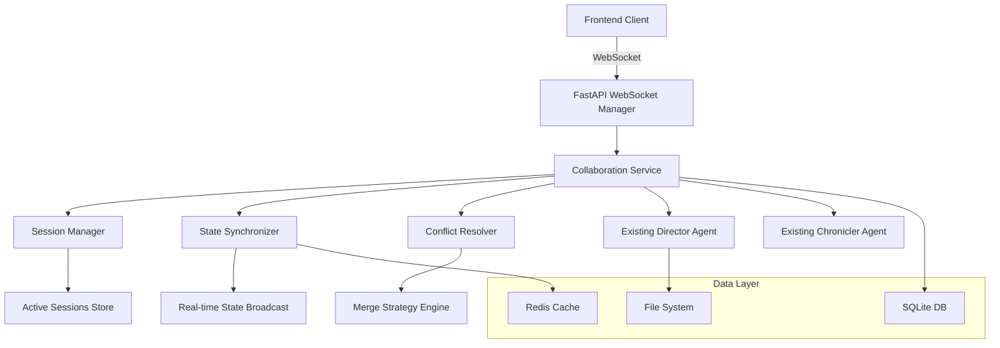

# Real-Time Collaboration Architecture Design

**Document Version**: 1.0  
**Last Updated**: 2025-08-15  
**Purpose**: Design WebSocket-based real-time collaboration system

## 🎯 Design Overview

The Novel Engine requires real-time collaboration capabilities to enable multiple users to participate in story creation simultaneously. This design integrates WebSocket communication with the existing multi-agent architecture.

## 🏗️ Architecture Design

### WebSocket Integration Architecture



### Component Specifications

#### 1. WebSocket Manager (`src/realtime/websocket_manager.py`)

```python
from fastapi import WebSocket, WebSocketDisconnect
from typing import Dict, List, Set
import asyncio
import json
import uuid
from enum import Enum

class MessageType(Enum):
    JOIN_SESSION = "join_session"
    LEAVE_SESSION = "leave_session"
    STORY_UPDATE = "story_update"
    AGENT_ACTION = "agent_action"
    USER_CURSOR = "user_cursor"
    SYSTEM_MESSAGE = "system_message"
    STATE_SYNC = "state_sync"

class CollaborationMessage:
    message_type: MessageType
    session_id: str
    user_id: str
    timestamp: datetime
    data: Dict[str, Any]
    sequence_id: int

class WebSocketManager:
    def __init__(self):
        self.active_connections: Dict[str, Set[WebSocket]] = {}
        self.user_sessions: Dict[str, str] = {}
        self.session_metadata: Dict[str, Dict] = {}
    
    async def connect(self, websocket: WebSocket, session_id: str, user_id: str):
        """Handle new WebSocket connection"""
        await websocket.accept()
        
        if session_id not in self.active_connections:
            self.active_connections[session_id] = set()
        
        self.active_connections[session_id].add(websocket)
        self.user_sessions[user_id] = session_id
        
        # Notify other users
        await self.broadcast_to_session(session_id, {
            "type": MessageType.JOIN_SESSION,
            "user_id": user_id,
            "timestamp": datetime.utcnow().isoformat()
        }, exclude_user=user_id)
        
        # Send current state to new user
        await self.send_initial_state(websocket, session_id)
    
    async def disconnect(self, websocket: WebSocket, user_id: str):
        """Handle WebSocket disconnection"""
        session_id = self.user_sessions.get(user_id)
        if session_id and session_id in self.active_connections:
            self.active_connections[session_id].discard(websocket)
            
            # Notify other users
            await self.broadcast_to_session(session_id, {
                "type": MessageType.LEAVE_SESSION,
                "user_id": user_id,
                "timestamp": datetime.utcnow().isoformat()
            })
            
            # Clean up empty sessions
            if not self.active_connections[session_id]:
                del self.active_connections[session_id]
        
        if user_id in self.user_sessions:
            del self.user_sessions[user_id]
    
    async def broadcast_to_session(self, session_id: str, message: Dict, exclude_user: str = None):
        """Broadcast message to all users in a session"""
        if session_id not in self.active_connections:
            return
        
        message_json = json.dumps(message)
        disconnected = set()
        
        for websocket in self.active_connections[session_id]:
            try:
                await websocket.send_text(message_json)
            except:
                disconnected.add(websocket)
        
        # Clean up disconnected sockets
        for websocket in disconnected:
            self.active_connections[session_id].discard(websocket)
```

#### 2. Collaboration Service (`src/realtime/collaboration_service.py`)

```python
from typing import Dict, List, Optional
from dataclasses import dataclass
import asyncio
from datetime import datetime

@dataclass
class CollaborationSession:
    session_id: str
    story_id: str
    participants: List[str]
    created_at: datetime
    last_activity: datetime
    current_turn: int
    state: Dict[str, Any]

class CollaborationService:
    def __init__(self, websocket_manager: WebSocketManager, director_agent, chronicler_agent):
        self.websocket_manager = websocket_manager
        self.director_agent = director_agent
        self.chronicler_agent = chronicler_agent
        self.active_sessions: Dict[str, CollaborationSession] = {}
        self.state_synchronizer = StateSynchronizer()
        self.conflict_resolver = ConflictResolver()
    
    async def create_session(self, story_id: str, creator_id: str) -> str:
        """Create new collaboration session"""
        session_id = str(uuid.uuid4())
        session = CollaborationSession(
            session_id=session_id,
            story_id=story_id,
            participants=[creator_id],
            created_at=datetime.utcnow(),
            last_activity=datetime.utcnow(),
            current_turn=0,
            state=await self._load_story_state(story_id)
        )
        
        self.active_sessions[session_id] = session
        return session_id
    
    async def handle_agent_action(self, session_id: str, user_id: str, action_data: Dict):
        """Process agent action from user"""
        session = self.active_sessions.get(session_id)
        if not session:
            raise ValueError(f"Session {session_id} not found")
        
        # Process action through existing director agent
        try:
            result = await self.director_agent.process_user_action(
                session.story_id, 
                action_data
            )
            
            # Update session state
            session.state.update(result.get('state_updates', {}))
            session.last_activity = datetime.utcnow()
            
            # Broadcast update to all participants
            await self.websocket_manager.broadcast_to_session(session_id, {
                "type": MessageType.AGENT_ACTION,
                "user_id": user_id,
                "action": action_data,
                "result": result,
                "state_updates": result.get('state_updates', {}),
                "timestamp": datetime.utcnow().isoformat()
            })
            
            # Check if turn is complete
            if result.get('turn_complete'):
                await self._advance_turn(session_id)
                
        except Exception as e:
            # Send error to user
            await self.websocket_manager.send_to_user(user_id, {
                "type": MessageType.SYSTEM_MESSAGE,
                "level": "error",
                "message": f"Action failed: {str(e)}"
            })
    
    async def _advance_turn(self, session_id: str):
        """Advance story to next turn"""
        session = self.active_sessions[session_id]
        session.current_turn += 1
        
        # Generate narrative for completed turn
        narrative = await self.chronicler_agent.generate_turn_narrative(
            session.story_id,
            session.current_turn - 1
        )
        
        # Broadcast turn completion
        await self.websocket_manager.broadcast_to_session(session_id, {
            "type": MessageType.STORY_UPDATE,
            "turn": session.current_turn - 1,
            "narrative": narrative,
            "timestamp": datetime.utcnow().isoformat()
        })
```

#### 3. State Synchronizer (`src/realtime/state_synchronizer.py`)

```python
class StateSynchronizer:
    def __init__(self):
        self.state_cache = {}
        self.version_tracker = {}
    
    async def sync_state(self, session_id: str, client_state: Dict, client_version: int):
        """Synchronize client state with server state"""
        server_state = self.state_cache.get(session_id, {})
        server_version = self.version_tracker.get(session_id, 0)
        
        if client_version < server_version:
            # Client is behind, send full state update
            return {
                "type": "full_sync",
                "state": server_state,
                "version": server_version
            }
        elif client_version == server_version:
            # Client is up to date
            return {"type": "up_to_date"}
        else:
            # Client is ahead (shouldn't happen in normal operation)
            logger.warning(f"Client version {client_version} ahead of server {server_version}")
            return {
                "type": "conflict",
                "server_state": server_state,
                "server_version": server_version
            }
    
    async def update_state(self, session_id: str, state_delta: Dict, source_user: str):
        """Update server state and increment version"""
        if session_id not in self.state_cache:
            self.state_cache[session_id] = {}
        
        # Apply state delta
        self._apply_delta(self.state_cache[session_id], state_delta)
        
        # Increment version
        self.version_tracker[session_id] = self.version_tracker.get(session_id, 0) + 1
        
        return {
            "state_delta": state_delta,
            "version": self.version_tracker[session_id],
            "source_user": source_user
        }
```

#### 4. FastAPI WebSocket Endpoints (`api_server.py` additions)

```python
from fastapi import WebSocket, WebSocketDisconnect
from src.realtime.websocket_manager import WebSocketManager, CollaborationService

# Global instances
websocket_manager = WebSocketManager()
collaboration_service = None

@app.websocket("/ws/{session_id}/{user_id}")
async def websocket_endpoint(websocket: WebSocket, session_id: str, user_id: str):
    """WebSocket endpoint for real-time collaboration"""
    await websocket_manager.connect(websocket, session_id, user_id)
    
    try:
        while True:
            # Receive message from client
            data = await websocket.receive_text()
            message = json.loads(data)
            
            # Route message to appropriate handler
            await handle_websocket_message(session_id, user_id, message)
            
    except WebSocketDisconnect:
        await websocket_manager.disconnect(websocket, user_id)
    except Exception as e:
        logger.error(f"WebSocket error for user {user_id}: {e}")
        await websocket_manager.disconnect(websocket, user_id)

async def handle_websocket_message(session_id: str, user_id: str, message: Dict):
    """Route WebSocket messages to appropriate handlers"""
    message_type = message.get("type")
    
    if message_type == "agent_action":
        await collaboration_service.handle_agent_action(
            session_id, user_id, message.get("data", {})
        )
    elif message_type == "state_sync":
        result = await collaboration_service.state_synchronizer.sync_state(
            session_id, 
            message.get("client_state", {}),
            message.get("client_version", 0)
        )
        await websocket_manager.send_to_user(user_id, result)
    elif message_type == "user_cursor":
        # Broadcast cursor position to other users
        await websocket_manager.broadcast_to_session(session_id, {
            "type": "user_cursor",
            "user_id": user_id,
            "position": message.get("position"),
            "timestamp": datetime.utcnow().isoformat()
        }, exclude_user=user_id)
```

### Frontend Integration

#### WebSocket Client (`frontend/src/services/websocket.ts`)

```typescript
export class CollaborationClient {
    private ws: WebSocket | null = null;
    private sessionId: string;
    private userId: string;
    private messageHandlers: Map<string, Function[]> = new Map();
    private reconnectAttempts = 0;
    private maxReconnectAttempts = 5;
    
    constructor(sessionId: string, userId: string) {
        this.sessionId = sessionId;
        this.userId = userId;
    }
    
    connect(): Promise<void> {
        return new Promise((resolve, reject) => {
            const wsUrl = `ws://localhost:8000/ws/${this.sessionId}/${this.userId}`;
            this.ws = new WebSocket(wsUrl);
            
            this.ws.onopen = () => {
                console.log('WebSocket connected');
                this.reconnectAttempts = 0;
                resolve();
            };
            
            this.ws.onmessage = (event) => {
                const message = JSON.parse(event.data);
                this.handleMessage(message);
            };
            
            this.ws.onclose = () => {
                console.log('WebSocket disconnected');
                this.attemptReconnect();
            };
            
            this.ws.onerror = (error) => {
                console.error('WebSocket error:', error);
                reject(error);
            };
        });
    }
    
    sendAgentAction(actionData: any): void {
        this.send({
            type: 'agent_action',
            data: actionData
        });
    }
    
    sendStateSync(clientState: any, clientVersion: number): void {
        this.send({
            type: 'state_sync',
            client_state: clientState,
            client_version: clientVersion
        });
    }
    
    onMessage(type: string, handler: Function): void {
        if (!this.messageHandlers.has(type)) {
            this.messageHandlers.set(type, []);
        }
        this.messageHandlers.get(type)!.push(handler);
    }
    
    private send(message: any): void {
        if (this.ws && this.ws.readyState === WebSocket.OPEN) {
            this.ws.send(JSON.stringify(message));
        }
    }
    
    private handleMessage(message: any): void {
        const handlers = this.messageHandlers.get(message.type) || [];
        handlers.forEach(handler => handler(message));
    }
    
    private attemptReconnect(): void {
        if (this.reconnectAttempts < this.maxReconnectAttempts) {
            this.reconnectAttempts++;
            setTimeout(() => {
                console.log(`Reconnection attempt ${this.reconnectAttempts}`);
                this.connect();
            }, 1000 * this.reconnectAttempts);
        }
    }
}
```

## 🔧 Implementation Strategy

### Phase 1: Basic WebSocket Infrastructure (Week 1)
1. Implement WebSocketManager and basic connection handling
2. Add WebSocket endpoints to FastAPI
3. Create basic frontend WebSocket client
4. Test connection and disconnection flows

### Phase 2: State Synchronization (Week 2)
1. Implement StateSynchronizer for real-time state management
2. Add conflict resolution mechanisms
3. Integrate with existing Director Agent
4. Test multi-user scenarios

### Phase 3: Advanced Features (Week 3)
1. Add user presence indicators
2. Implement cursor/selection sharing
3. Add typing indicators for story editing
4. Optimize performance for large sessions

### Phase 4: Production Readiness (Week 4)
1. Add Redis for session persistence
2. Implement horizontal scaling support
3. Add comprehensive error handling
4. Performance testing and optimization

## 📊 Performance Considerations

### Scalability Targets
- **Concurrent Users per Session**: 5-10 users
- **Active Sessions**: 100+ concurrent sessions
- **Message Latency**: <100ms for local deployments
- **Memory Usage**: <50MB per active session

### Optimization Strategies
- Message batching for high-frequency updates
- State delta compression
- Redis clustering for session persistence
- WebSocket connection pooling

## 🔒 Security Considerations

### Authentication Integration
- JWT token validation for WebSocket connections
- Session-based access control
- Rate limiting per user and session

### Data Protection
- Message encryption for sensitive content
- Audit logging for all collaborative actions
- GDPR compliance for user data

This design integrates seamlessly with the existing Novel Engine architecture while adding robust real-time collaboration capabilities. The modular approach allows for incremental implementation and testing.