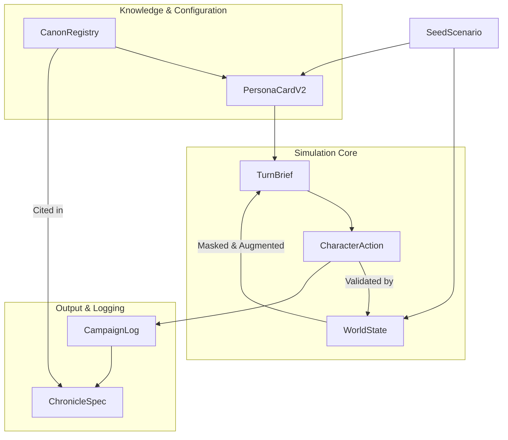

# Codex: Data Schemas (SCHEMAS.md)
*Document Version: 1.2*
*Last Updated: 2025-08-11*

This document is the single source of truth for all major data structures used within the Novel Engine. These schemas are enforced by Pydantic models in `src/core/types/shared_types.py`.

## 1. Schema Overview Diagram



## 2. Core Data Models

### 2.1 `PersonaCardV2`
The digital soul of an agent. Defines its identity, beliefs, and operational parameters.
-   **`id` (string, required):** Unique identifier. Pattern: `^[a-zA-Z0-9_-]{1,64}$`.
-   **`faction` (string, required):** The agent's primary allegiance.
-   **`doctrine` (List[Doctrine]):** Injected rules from the KB.
-   **`beliefs` (List[Belief], required):** Core propositions and their weights (0.0-1.0).
-   **`traits` (List[Trait]):** Personality traits and their weights (0.0-1.0).
-   **`knowledge_scope` (List[KnowledgeScope], required):** Defines the agent's perception channels (`visual`, `radio`, `intel`) and range.
-   **`taboos` (List[string]):** A list of explicitly forbidden actions or targets.

### 2.2 `WorldState`
The objective reality of the simulation at a given turn.
-   **`turn` (integer, required):** The current turn number (>=0).
-   **`entities` (List[Entity], required):** All objects, characters, and locations in the world.
-   **`relations` (List[Relation]):** Relationships between entities (e.g., `hostile_to`).
-   **`facts` (List[Fact], required):** Propositions about the world, with confidence scores and provenance.
-   **`rules` (List[WorldRule]):** The physical or canonical laws governing the world.

### 2.3 `TurnBrief`
The subjective, "Fog of War" reality presented to an agent.
-   **`for_persona` (string, required):** The ID of the recipient agent.
-   **`visible_slice` (List[string], required):** A list of entity and fact IDs that are visible to the agent.
-   **`threats` (List[Threat]):** A list of perceived threats and their distance.
-   **`doctrine_snippets` (List[DoctrineSnippet], max 8):** Relevant knowledge retrieved from the KB, with provenance.

### 2.4 `CharacterAction`
The structured output of an agent's deliberation.
-   **`action_type` (Literal, required):** One of `"move"`, `"attack"`, `"parley"`, `"regroup"`, `"scan"`, `"observe"`.
-   **`target` (string, optional):** The ID of the entity being acted upon.
-   **`intent` (constr, required):** A short, high-level description of the goal. Min length: 1, Max length: 256.
-   **`justification` (constr, required):** The agent's reasoning, used for persona consistency checks. Min length: 1, Max length: 512.
-   **`expected_effects` (List[ExpectedEffect]):** Anticipated outcomes of this action.
-   **`doctrine_check` (DoctrineCheck, optional):** Validation against agent's doctrine.
-   **`confidence` (float, required):** The agent's confidence in its chosen action. Range: 0.0-1.0.

### 2.5 `ChronicleSpec`
The structured narrative output from the Chronicler.
-   **`sections` (List[ChronicleSection], required):** The document is composed of sections.
-   **`paragraphs` (List[Paragraph], required):** Each section has paragraphs.
-   **`citations` (List[string], required):** Each paragraph must cite the `source_id@version` tags of the facts or events from the `CampaignLog` that it is based on. This enforces the "no new facts" rule.

### 2.6 `CanonRegistry`
The manifest for a Knowledge Base.
-   **`sources` (List[CanonSource], required):** A list of all documents in the KB.
-   **`compliance` (CanonCompliance, optional):** Required for `fan` mode, containing `non_commercial` and `distribution` flags.

### 2.7 Supporting Models

#### 2.7.1 `Doctrine`
-   **`rule` (constr, required):** The doctrinal rule text. Min length: 1.
-   **`source_id` (string, required):** Reference to the source document.

#### 2.7.2 `Belief`  
-   **`proposition` (string, required):** The belief statement.
-   **`weight` (float, required):** Belief strength. Range: 0.0-1.0.

#### 2.7.3 `Trait`
-   **`name` (string, required):** The trait identifier.
-   **`weight` (float, required):** Trait intensity. Range: 0.0-1.0.

#### 2.7.4 `KnowledgeScope`
-   **`channel` (Literal, required):** One of `"visual"`, `"radio"`, `"intel"`.
-   **`range` (int, required):** Perception range. Min: 0.

#### 2.7.5 `Entity`
-   **`id` (string, required):** Unique entity identifier.
-   **`type` (string, required):** Entity classification.
-   **`name` (string, optional):** Human-readable name.
-   **`pos` (string, optional):** Position coordinates.
-   **`tags` (List[string]):** Classification tags.
-   **`assets` (Dict[str, Any], optional):** Entity-specific data.

#### 2.7.6 `Relation`
-   **`src` (string, required):** Source entity ID.
-   **`rel` (string, required):** Relationship type.
-   **`dst` (string, required):** Destination entity ID.

#### 2.7.7 `Fact`
-   **`id` (string, required):** Unique fact identifier.
-   **`text` (string, required):** Fact description.
-   **`confidence` (float, required):** Fact reliability. Range: 0.0-1.0.
-   **`source_id` (string, required):** Provenance reference.

#### 2.7.8 `WorldRule`
-   **`name` (string, required):** Rule identifier.
-   **`expr` (string, required):** Rule expression.

#### 2.7.9 `Threat`
-   **`id` (string, required):** Threat identifier.
-   **`distance` (Literal, required):** One of `"close"`, `"medium"`, `"far"`.

#### 2.7.10 `DoctrineSnippet`
-   **`text` (string, required):** Retrieved knowledge text.
-   **`source_id` (string, required):** Source document reference.

#### 2.7.11 `ExpectedEffect`
-   **`fact` (string, required):** Expected fact change.
-   **`delta` (float, required):** Expected magnitude of change.

#### 2.7.12 `DoctrineCheck`
-   **`violations` (List[string]):** List of doctrine violations.
-   **`notes` (string, optional):** Additional validation notes.

#### 2.7.13 `Paragraph`
-   **`text` (string, required):** Paragraph content.
-   **`citations` (List[string], required):** Source references.

#### 2.7.14 `ChronicleSection`
-   **`heading` (string, optional):** Section title.
-   **`paragraphs` (List[Paragraph], required):** Section content. Min length: 1.

#### 2.7.15 `CanonSource`
-   **`id` (string, required):** Source identifier.
-   **`title` (string, required):** Source title.
-   **`version` (string, required):** Source version.
-   **`license` (string, required):** License information.
-   **`kind` (Literal, required):** One of `"text"`, `"pdf"`, `"image"`.
-   **`path` (string, required):** File path.
-   **`chunks` (Literal, required):** One of `"auto"`, `"fixed"`.
-   **`hash` (string, required):** Content hash.

#### 2.7.16 `CanonCompliance`
-   **`non_commercial` (bool, required):** Commercial use restriction.
-   **`distribution` (Literal, required):** One of `"local_only"`, `"restricted"`.

## 3. Validation and Error Semantics

### 3.1 Pydantic Validation Rules

All models are enforced by Pydantic with the following validation patterns:

#### String Constraints
-   **`constr(min_length=1)`:** Non-empty strings
-   **`constr(pattern=r"^[a-zA-Z0-9_-]{1,64}$")`:** Alphanumeric IDs with underscores/hyphens
-   **`constr(min_length=1, max_length=256)`:** Intent fields (1-256 characters)
-   **`constr(min_length=1, max_length=512)`:** Justification fields (1-512 characters)

#### Numeric Constraints
-   **`Field(..., ge=0, le=1)`:** Probability/confidence values (0.0-1.0 range)
-   **`Field(..., ge=0)`:** Non-negative integers (turn numbers, ranges)
-   **`Field(..., min_length=1)`:** Required lists with at least one item
-   **`Field(..., max_length=8)`:** Limited lists (doctrine snippets max 8)

#### Type Constraints
-   **`Literal["value1", "value2"]`:** Enumerated string values
-   **`Optional[Type]`:** Nullable fields
-   **`List[Type]`:** Array fields with type checking
-   **`Dict[str, Any]`:** Flexible object fields

### 3.2 Cross-Field Validation

The following validations are performed by business logic, not schemas:

-   **Entity References:** Ensuring `target` IDs exist in current `WorldState`
-   **Knowledge Scope:** Validating entities are visible per agent's scope
-   **Resource Conservation:** Checking action effects don't violate conservation laws
-   **Canon Compliance:** Validating actions against source material constraints

### 3.3 Error Response Format

API requests with bodies that fail validation will receive an **HTTP 422 Unprocessable Entity** response:

```json
{
  "detail": [
    {
      "loc": ["field_name"],
      "msg": "ensure this value has at least 1 characters",
      "type": "value_error.any_str.min_length",
      "ctx": {"limit_value": 1}
    }
  ]
}
```

## 4. Versioning

All schemas are currently at version 1.2. Any change that is not backward-compatible will require incrementing the minor version number. The API version will be updated if multiple schema changes result in a breaking change to an endpoint contract.


