# Content Management and Sharing System Design

**Document Version**: 1.0  
**Last Updated**: 2025-08-15  
**Purpose**: Design comprehensive content management, versioning, and sharing system

## 🎯 Design Overview

The Novel Engine needs a robust content management system to handle story creation, versioning, sharing, and community features. This design creates a comprehensive system for managing all user-generated content with advanced features like version control, collaboration, and social sharing.

## 🏗️ Architecture Design

### Content Management Architecture

```mermaid
graph TD
    A[Content Management Service] --> B[Story Management]
    A --> C[Character Management]
    A --> D[Campaign Management]
    A --> E[Version Control]
    A --> F[Sharing System]
    A --> G[Community Features]
    
    B --> H[Story CRUD]
    B --> I[Story Metadata]
    B --> J[Story Templates]
    
    C --> K[Character CRUD]
    C --> L[Character Relationships]
    C --> M[Character Templates]
    
    D --> N[Campaign CRUD]
    D --> O[Campaign Collections]
    D --> P[Campaign Analytics]
    
    E --> Q[Git-like Versioning]
    E --> R[Diff Engine]
    E --> S[Merge System]
    
    F --> T[Public/Private Sharing]
    F --> U[Link Sharing]
    F --> V[Embed System]
    
    G --> W[Community Library]
    G --> X[Rating System]
    G --> Y[Comment System]
    
    subgraph "Data Layer"
        Z[(Content Database)]
        AA[(File Storage)]
        BB[(Search Index)]
    end
    
    A --> Z
    A --> AA
    A --> BB
```



### Database Schema Design

#### Content Tables (`src/database/content_schema.sql`)

```sql
-- Stories table - Core story information
CREATE TABLE stories (
    id INTEGER PRIMARY KEY AUTOINCREMENT,
    title VARCHAR(255) NOT NULL,
    description TEXT,
    content TEXT,
    content_format VARCHAR(20) DEFAULT 'markdown',
    word_count INTEGER DEFAULT 0,
    character_count INTEGER DEFAULT 0,
    
    -- Ownership and permissions
    owner_id INTEGER NOT NULL,
    is_public BOOLEAN DEFAULT 0,
    is_featured BOOLEAN DEFAULT 0,
    visibility VARCHAR(20) DEFAULT 'private', -- private, unlisted, public
    
    -- Metadata
    genre VARCHAR(100),
    tags JSON,
    language VARCHAR(10) DEFAULT 'en',
    content_rating VARCHAR(20) DEFAULT 'general', -- general, teen, mature, adult
    
    -- Status tracking
    status VARCHAR(20) DEFAULT 'draft', -- draft, published, archived
    published_at DATETIME,
    
    -- AI generation metadata
    generation_params JSON,
    ai_enhanced BOOLEAN DEFAULT 0,
    model_version VARCHAR(50),
    
    -- Statistics
    view_count INTEGER DEFAULT 0,
    like_count INTEGER DEFAULT 0,
    comment_count INTEGER DEFAULT 0,
    download_count INTEGER DEFAULT 0,
    
    -- Timestamps
    created_at DATETIME DEFAULT CURRENT_TIMESTAMP,
    updated_at DATETIME DEFAULT CURRENT_TIMESTAMP,
    last_viewed_at DATETIME,
    
    FOREIGN KEY (owner_id) REFERENCES users(id) ON DELETE CASCADE
);

-- Story versions for version control
CREATE TABLE story_versions (
    id INTEGER PRIMARY KEY AUTOINCREMENT,
    story_id INTEGER NOT NULL,
    version_number VARCHAR(20) NOT NULL, -- v1.0, v1.1, etc.
    commit_message TEXT,
    content TEXT NOT NULL,
    content_hash VARCHAR(64), -- SHA256 hash of content
    
    -- Version metadata
    word_count INTEGER DEFAULT 0,
    character_count INTEGER DEFAULT 0,
    changes_summary JSON, -- Summary of changes from previous version
    
    -- Author information
    author_id INTEGER NOT NULL,
    created_at DATETIME DEFAULT CURRENT_TIMESTAMP,
    
    FOREIGN KEY (story_id) REFERENCES stories(id) ON DELETE CASCADE,
    FOREIGN KEY (author_id) REFERENCES users(id) ON DELETE CASCADE,
    UNIQUE(story_id, version_number)
);

-- Characters table
CREATE TABLE characters (
    id INTEGER PRIMARY KEY AUTOINCREMENT,
    name VARCHAR(255) NOT NULL,
    description TEXT,
    personality_traits JSON,
    background_story TEXT,
    appearance_description TEXT,
    
    -- Ownership
    owner_id INTEGER NOT NULL,
    is_public BOOLEAN DEFAULT 0,
    is_template BOOLEAN DEFAULT 0,
    
    -- Character data
    stats JSON, -- strength, intelligence, etc.
    equipment JSON,
    relationships JSON,
    
    -- Metadata
    faction VARCHAR(100),
    species VARCHAR(100),
    occupation VARCHAR(100),
    tags JSON,
    
    -- AI generation
    generation_params JSON,
    ai_enhanced BOOLEAN DEFAULT 0,
    
    -- Statistics
    usage_count INTEGER DEFAULT 0,
    like_count INTEGER DEFAULT 0,
    
    created_at DATETIME DEFAULT CURRENT_TIMESTAMP,
    updated_at DATETIME DEFAULT CURRENT_TIMESTAMP,
    
    FOREIGN KEY (owner_id) REFERENCES users(id) ON DELETE CASCADE
);

-- Story-Character relationships
CREATE TABLE story_characters (
    story_id INTEGER,
    character_id INTEGER,
    role VARCHAR(50), -- protagonist, antagonist, supporting, etc.
    importance INTEGER DEFAULT 50, -- 1-100 scale
    added_at DATETIME DEFAULT CURRENT_TIMESTAMP,
    added_by INTEGER,
    
    PRIMARY KEY (story_id, character_id),
    FOREIGN KEY (story_id) REFERENCES stories(id) ON DELETE CASCADE,
    FOREIGN KEY (character_id) REFERENCES characters(id) ON DELETE CASCADE,
    FOREIGN KEY (added_by) REFERENCES users(id) ON DELETE SET NULL
);

-- Campaigns - collections of related stories
CREATE TABLE campaigns (
    id INTEGER PRIMARY KEY AUTOINCREMENT,
    name VARCHAR(255) NOT NULL,
    description TEXT,
    
    -- Ownership
    owner_id INTEGER NOT NULL,
    is_public BOOLEAN DEFAULT 0,
    
    -- Campaign data
    setting_description TEXT,
    rules JSON,
    timeline JSON,
    
    -- Metadata
    genre VARCHAR(100),
    tags JSON,
    
    -- Statistics
    story_count INTEGER DEFAULT 0,
    total_word_count INTEGER DEFAULT 0,
    
    created_at DATETIME DEFAULT CURRENT_TIMESTAMP,
    updated_at DATETIME DEFAULT CURRENT_TIMESTAMP,
    
    FOREIGN KEY (owner_id) REFERENCES users(id) ON DELETE CASCADE
);

-- Campaign-Story relationships
CREATE TABLE campaign_stories (
    campaign_id INTEGER,
    story_id INTEGER,
    sequence_order INTEGER DEFAULT 0,
    added_at DATETIME DEFAULT CURRENT_TIMESTAMP,
    
    PRIMARY KEY (campaign_id, story_id),
    FOREIGN KEY (campaign_id) REFERENCES campaigns(id) ON DELETE CASCADE,
    FOREIGN KEY (story_id) REFERENCES stories(id) ON DELETE CASCADE
);

-- Content sharing and permissions
CREATE TABLE content_shares (
    id INTEGER PRIMARY KEY AUTOINCREMENT,
    content_type VARCHAR(20) NOT NULL, -- story, character, campaign
    content_id INTEGER NOT NULL,
    share_token VARCHAR(255) UNIQUE,
    
    -- Sharing settings
    share_type VARCHAR(20) DEFAULT 'view', -- view, edit, comment
    expires_at DATETIME,
    password_protected BOOLEAN DEFAULT 0,
    password_hash VARCHAR(255),
    
    -- Access tracking
    access_count INTEGER DEFAULT 0,
    last_accessed_at DATETIME,
    
    -- Creator info
    shared_by INTEGER NOT NULL,
    created_at DATETIME DEFAULT CURRENT_TIMESTAMP,
    
    FOREIGN KEY (shared_by) REFERENCES users(id) ON DELETE CASCADE
);

-- Content likes/favorites
CREATE TABLE content_likes (
    id INTEGER PRIMARY KEY AUTOINCREMENT,
    content_type VARCHAR(20) NOT NULL,
    content_id INTEGER NOT NULL,
    user_id INTEGER NOT NULL,
    created_at DATETIME DEFAULT CURRENT_TIMESTAMP,
    
    UNIQUE(content_type, content_id, user_id),
    FOREIGN KEY (user_id) REFERENCES users(id) ON DELETE CASCADE
);

-- Content comments
CREATE TABLE content_comments (
    id INTEGER PRIMARY KEY AUTOINCREMENT,
    content_type VARCHAR(20) NOT NULL,
    content_id INTEGER NOT NULL,
    user_id INTEGER NOT NULL,
    
    comment_text TEXT NOT NULL,
    parent_comment_id INTEGER, -- For nested comments
    
    -- Moderation
    is_hidden BOOLEAN DEFAULT 0,
    is_flagged BOOLEAN DEFAULT 0,
    
    created_at DATETIME DEFAULT CURRENT_TIMESTAMP,
    updated_at DATETIME DEFAULT CURRENT_TIMESTAMP,
    
    FOREIGN KEY (user_id) REFERENCES users(id) ON DELETE CASCADE,
    FOREIGN KEY (parent_comment_id) REFERENCES content_comments(id) ON DELETE CASCADE
);

-- Content tags for better organization
CREATE TABLE content_tags (
    id INTEGER PRIMARY KEY AUTOINCREMENT,
    name VARCHAR(100) UNIQUE NOT NULL,
    description TEXT,
    category VARCHAR(50), -- genre, theme, style, etc.
    usage_count INTEGER DEFAULT 0,
    created_at DATETIME DEFAULT CURRENT_TIMESTAMP
);

-- Content-Tag relationships
CREATE TABLE content_tag_assignments (
    content_type VARCHAR(20) NOT NULL,
    content_id INTEGER NOT NULL,
    tag_id INTEGER NOT NULL,
    assigned_by INTEGER,
    assigned_at DATETIME DEFAULT CURRENT_TIMESTAMP,
    
    PRIMARY KEY (content_type, content_id, tag_id),
    FOREIGN KEY (tag_id) REFERENCES content_tags(id) ON DELETE CASCADE,
    FOREIGN KEY (assigned_by) REFERENCES users(id) ON DELETE SET NULL
);

-- Indexes for performance
CREATE INDEX idx_stories_owner ON stories(owner_id);
CREATE INDEX idx_stories_status ON stories(status);
CREATE INDEX idx_stories_public ON stories(is_public, visibility);
CREATE INDEX idx_stories_created ON stories(created_at);
CREATE INDEX idx_story_versions_story ON story_versions(story_id);
CREATE INDEX idx_characters_owner ON characters(owner_id);
CREATE INDEX idx_characters_public ON characters(is_public);
CREATE INDEX idx_content_shares_token ON content_shares(share_token);
CREATE INDEX idx_content_likes_content ON content_likes(content_type, content_id);
CREATE INDEX idx_content_comments_content ON content_comments(content_type, content_id);
```

### Core Content Management Components

#### 1. Content Models (`src/content/models.py`)

```python
from pydantic import BaseModel, Field, validator
from typing import Optional, List, Dict, Any, Union
from datetime import datetime
from enum import Enum

class ContentStatus(str, Enum):
    DRAFT = "draft"
    PUBLISHED = "published"
    ARCHIVED = "archived"

class ContentVisibility(str, Enum):
    PRIVATE = "private"
    UNLISTED = "unlisted"
    PUBLIC = "public"

class ContentRating(str, Enum):
    GENERAL = "general"
    TEEN = "teen"
    MATURE = "mature"
    ADULT = "adult"

class ShareType(str, Enum):
    VIEW = "view"
    EDIT = "edit"
    COMMENT = "comment"

class StoryCreate(BaseModel):
    title: str = Field(..., min_length=1, max_length=255)
    description: Optional[str] = None
    content: str = ""
    genre: Optional[str] = None
    tags: List[str] = []
    content_rating: ContentRating = ContentRating.GENERAL
    visibility: ContentVisibility = ContentVisibility.PRIVATE
    character_ids: List[int] = []
    generation_params: Optional[Dict[str, Any]] = None

class StoryUpdate(BaseModel):
    title: Optional[str] = Field(None, min_length=1, max_length=255)
    description: Optional[str] = None
    content: Optional[str] = None
    genre: Optional[str] = None
    tags: Optional[List[str]] = None
    content_rating: Optional[ContentRating] = None
    visibility: Optional[ContentVisibility] = None
    status: Optional[ContentStatus] = None

class StoryResponse(BaseModel):
    id: int
    title: str
    description: Optional[str]
    content: str
    word_count: int
    character_count: int
    
    owner_id: int
    owner_username: str
    is_public: bool
    visibility: ContentVisibility
    status: ContentStatus
    
    genre: Optional[str]
    tags: List[str]
    content_rating: ContentRating
    
    ai_enhanced: bool
    generation_params: Optional[Dict[str, Any]]
    
    view_count: int
    like_count: int
    comment_count: int
    is_liked_by_user: bool = False
    
    characters: List[Dict[str, Any]] = []
    versions: List[Dict[str, Any]] = []
    
    created_at: datetime
    updated_at: datetime
    published_at: Optional[datetime]
    
    class Config:
        from_attributes = True

class VersionCreate(BaseModel):
    version_number: str = Field(..., regex=r'^v\d+\.\d+(\.\d+)?$')
    commit_message: str = Field(..., min_length=1, max_length=500)
    content: str

class ShareCreate(BaseModel):
    content_type: str
    content_id: int
    share_type: ShareType = ShareType.VIEW
    expires_at: Optional[datetime] = None
    password: Optional[str] = None

class CommentCreate(BaseModel):
    content_type: str
    content_id: int
    comment_text: str = Field(..., min_length=1, max_length=1000)
    parent_comment_id: Optional[int] = None
```

#### 2. Content Service (`src/content/content_service.py`)

```python
from typing import List, Optional, Dict, Any
from sqlalchemy.orm import Session
from fastapi import HTTPException, status

from .models import StoryCreate, StoryUpdate, StoryResponse, VersionCreate
from .content_repository import ContentRepository
from .version_service import VersionService
from .search_service import SearchService

class ContentService:
    def __init__(self, db: Session):
        self.db = db
        self.content_repo = ContentRepository(db)
        self.version_service = VersionService(db)
        self.search_service = SearchService()
    
    async def create_story(self, story_data: StoryCreate, owner_id: int) -> StoryResponse:
        """Create a new story"""
        # Calculate content statistics
        word_count = len(story_data.content.split())
        character_count = len(story_data.content)
        
        # Create story record
        story = await self.content_repo.create_story({
            **story_data.dict(),
            'owner_id': owner_id,
            'word_count': word_count,
            'character_count': character_count
        })
        
        # Create initial version
        if story_data.content:
            await self.version_service.create_version(
                story.id,
                VersionCreate(
                    version_number="v1.0",
                    commit_message="Initial version",
                    content=story_data.content
                ),
                owner_id
            )
        
        # Associate characters
        if story_data.character_ids:
            await self.content_repo.associate_characters(
                story.id, story_data.character_ids, owner_id
            )
        
        # Index for search
        await self.search_service.index_story(story)
        
        return await self.get_story(story.id, owner_id)
    
    async def update_story(self, story_id: int, story_data: StoryUpdate, 
                          user_id: int, create_version: bool = False) -> StoryResponse:
        """Update an existing story"""
        story = await self.content_repo.get_story_by_id(story_id)
        if not story:
            raise HTTPException(status_code=404, detail="Story not found")
        
        # Check permissions
        if not await self._can_edit_story(story, user_id):
            raise HTTPException(status_code=403, detail="Permission denied")
        
        # Create version if content changed and requested
        if create_version and story_data.content and story_data.content != story.content:
            # Auto-generate version number
            latest_version = await self.version_service.get_latest_version(story_id)
            next_version = self._increment_version(latest_version.version_number if latest_version else "v0.0")
            
            await self.version_service.create_version(
                story_id,
                VersionCreate(
                    version_number=next_version,
                    commit_message=f"Auto-save version {next_version}",
                    content=story_data.content
                ),
                user_id
            )
        
        # Update story
        update_data = story_data.dict(exclude_unset=True)
        if story_data.content:
            update_data['word_count'] = len(story_data.content.split())
            update_data['character_count'] = len(story_data.content)
        
        updated_story = await self.content_repo.update_story(story_id, update_data)
        
        # Update search index
        await self.search_service.update_story_index(updated_story)
        
        return await self.get_story(story_id, user_id)
    
    async def get_story(self, story_id: int, user_id: Optional[int] = None) -> StoryResponse:
        """Get story with full details"""
        story = await self.content_repo.get_story_with_details(story_id)
        if not story:
            raise HTTPException(status_code=404, detail="Story not found")
        
        # Check permissions
        if not await self._can_view_story(story, user_id):
            raise HTTPException(status_code=403, detail="Permission denied")
        
        # Increment view count (if not owner)
        if user_id != story.owner_id:
            await self.content_repo.increment_view_count(story_id)
        
        # Check if user has liked the story
        is_liked = False
        if user_id:
            is_liked = await self.content_repo.has_user_liked(
                "story", story_id, user_id
            )
        
        # Convert to response model
        return StoryResponse(
            **story.__dict__,
            is_liked_by_user=is_liked,
            characters=await self.content_repo.get_story_characters(story_id),
            versions=await self.version_service.get_story_versions(story_id)
        )
    
    async def search_stories(self, query: str, filters: Dict[str, Any] = None,
                           user_id: Optional[int] = None) -> List[StoryResponse]:
        """Search stories with filters"""
        # Perform search
        search_results = await self.search_service.search_stories(query, filters)
        
        # Filter by permissions and get full story data
        stories = []
        for result in search_results:
            try:
                story = await self.get_story(result['id'], user_id)
                stories.append(story)
            except HTTPException:
                # Skip stories user can't access
                continue
        
        return stories
    
    async def like_content(self, content_type: str, content_id: int, user_id: int) -> bool:
        """Like/unlike content"""
        is_liked = await self.content_repo.has_user_liked(content_type, content_id, user_id)
        
        if is_liked:
            await self.content_repo.remove_like(content_type, content_id, user_id)
            return False
        else:
            await self.content_repo.add_like(content_type, content_id, user_id)
            return True
    
    async def create_share_link(self, content_type: str, content_id: int,
                              share_data: ShareCreate, user_id: int) -> str:
        """Create shareable link for content"""
        # Verify user owns the content
        if content_type == "story":
            story = await self.content_repo.get_story_by_id(content_id)
            if not story or story.owner_id != user_id:
                raise HTTPException(status_code=403, detail="Permission denied")
        
        # Generate share token
        share_token = self._generate_share_token()
        
        # Create share record
        await self.content_repo.create_share({
            **share_data.dict(),
            'share_token': share_token,
            'shared_by': user_id
        })
        
        return f"/shared/{share_token}"
    
    async def _can_view_story(self, story, user_id: Optional[int]) -> bool:
        """Check if user can view story"""
        # Public stories can be viewed by anyone
        if story.visibility == ContentVisibility.PUBLIC:
            return True
        
        # Owner can always view
        if user_id and story.owner_id == user_id:
            return True
        
        # Private stories require ownership
        if story.visibility == ContentVisibility.PRIVATE:
            return False
        
        # Unlisted stories can be viewed if user has link
        return True
    
    async def _can_edit_story(self, story, user_id: int) -> bool:
        """Check if user can edit story"""
        # Only owner can edit for now
        # TODO: Add collaboration permissions
        return story.owner_id == user_id
    
    def _increment_version(self, version: str) -> str:
        """Increment version number"""
        parts = version.replace('v', '').split('.')
        parts[-1] = str(int(parts[-1]) + 1)
        return f"v{'.'.join(parts)}"
    
    def _generate_share_token(self) -> str:
        """Generate secure share token"""
        import secrets
        return secrets.token_urlsafe(32)
```

#### 3. Version Control Service (`src/content/version_service.py`)

```python
import hashlib
import json
from typing import List, Optional, Dict, Any
from sqlalchemy.orm import Session
from fastapi import HTTPException

class VersionService:
    def __init__(self, db: Session):
        self.db = db
        self.diff_engine = DiffEngine()
    
    async def create_version(self, story_id: int, version_data: VersionCreate, 
                           author_id: int) -> Dict[str, Any]:
        """Create a new version of a story"""
        # Get previous version for diff
        previous_version = await self.get_latest_version(story_id)
        changes_summary = None
        
        if previous_version:
            changes_summary = self.diff_engine.generate_summary(
                previous_version.content, version_data.content
            )
        
        # Calculate content hash
        content_hash = hashlib.sha256(version_data.content.encode()).hexdigest()
        
        # Create version record
        version = await self.content_repo.create_version({
            'story_id': story_id,
            'version_number': version_data.version_number,
            'commit_message': version_data.commit_message,
            'content': version_data.content,
            'content_hash': content_hash,
            'word_count': len(version_data.content.split()),
            'character_count': len(version_data.content),
            'changes_summary': changes_summary,
            'author_id': author_id
        })
        
        return version
    
    async def get_story_versions(self, story_id: int) -> List[Dict[str, Any]]:
        """Get all versions of a story"""
        return await self.content_repo.get_story_versions(story_id)
    
    async def get_version_diff(self, story_id: int, version1: str, version2: str) -> Dict[str, Any]:
        """Get diff between two versions"""
        v1 = await self.content_repo.get_version(story_id, version1)
        v2 = await self.content_repo.get_version(story_id, version2)
        
        if not v1 or not v2:
            raise HTTPException(status_code=404, detail="Version not found")
        
        return self.diff_engine.generate_diff(v1.content, v2.content)
    
    async def restore_version(self, story_id: int, version_number: str, 
                            user_id: int) -> Dict[str, Any]:
        """Restore story to a specific version"""
        version = await self.content_repo.get_version(story_id, version_number)
        if not version:
            raise HTTPException(status_code=404, detail="Version not found")
        
        # Create new version with restored content
        latest_version = await self.get_latest_version(story_id)
        next_version = self._increment_version(latest_version.version_number)
        
        return await self.create_version(
            story_id,
            VersionCreate(
                version_number=next_version,
                commit_message=f"Restored from {version_number}",
                content=version.content
            ),
            user_id
        )

class DiffEngine:
    def generate_diff(self, content1: str, content2: str) -> Dict[str, Any]:
        """Generate detailed diff between two content versions"""
        import difflib
        
        lines1 = content1.splitlines()
        lines2 = content2.splitlines()
        
        diff = list(difflib.unified_diff(
            lines1, lines2,
            fromfile='version1',
            tofile='version2',
            lineterm=''
        ))
        
        # Calculate statistics
        added_lines = sum(1 for line in diff if line.startswith('+') and not line.startswith('+++'))
        removed_lines = sum(1 for line in diff if line.startswith('-') and not line.startswith('---'))
        
        return {
            'diff': diff,
            'stats': {
                'added_lines': added_lines,
                'removed_lines': removed_lines,
                'total_changes': added_lines + removed_lines
            }
        }
    
    def generate_summary(self, old_content: str, new_content: str) -> Dict[str, Any]:
        """Generate human-readable summary of changes"""
        old_words = len(old_content.split())
        new_words = len(new_content.split())
        
        word_diff = new_words - old_words
        
        return {
            'word_count_change': word_diff,
            'change_type': 'addition' if word_diff > 0 else 'deletion' if word_diff < 0 else 'modification',
            'magnitude': abs(word_diff),
            'percentage_change': (word_diff / old_words * 100) if old_words > 0 else 0
        }
```

## 🔧 Implementation Strategy

### Phase 1: Core Content Management (Week 1-2)
1. Implement database schema and basic CRUD operations
2. Create content models and validation
3. Build story creation and editing functionality
4. Add basic version control system

### Phase 2: Sharing and Permissions (Week 3)
1. Implement sharing system with tokens
2. Add privacy controls and permissions
3. Create public content discovery
4. Build basic community features

### Phase 3: Advanced Features (Week 4-5)
1. Add full version control with diffs
2. Implement advanced search and filtering
3. Create content analytics and statistics
4. Add export and backup functionality

### Phase 4: Community and Social (Week 6)
1. Build rating and review system
2. Add content recommendations
3. Create user profiles and portfolios
4. Implement content moderation tools

## 📊 Performance Considerations

### Scalability Targets
- **Content Storage**: Support for millions of stories and characters
- **Search Performance**: <200ms for complex queries
- **Version Storage**: Efficient delta compression for large content
- **Concurrent Users**: 1000+ simultaneous content operations

### Optimization Strategies
- Full-text search indexing with Elasticsearch integration
- Content compression for large stories
- CDN integration for public content
- Database sharding for user content

This comprehensive content management system provides robust functionality for creating, versioning, sharing, and discovering content while maintaining performance and scalability.