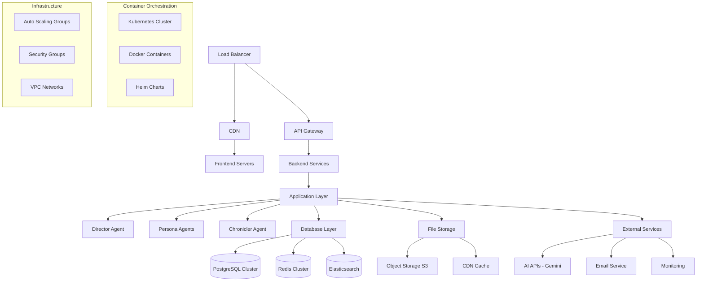

# Production Deployment Architecture Design

**Document Version**: 1.0  
**Last Updated**: 2025-08-15  
**Purpose**: Design comprehensive production deployment and infrastructure architecture

## 🎯 Design Overview

The Novel Engine requires a robust, scalable, and secure production deployment architecture to support multiple users, high availability, and efficient resource utilization. This design provides a comprehensive deployment strategy using modern containerization, orchestration, and cloud-native technologies.

## 🏗️ Deployment Architecture

### High-Level Production Architecture



### Container Architecture

#### 1. Docker Configuration

**Backend Dockerfile** (`Dockerfile.backend`)

```dockerfile
# Multi-stage build for Python backend
FROM python:3.11-slim as builder

# Set environment variables
ENV PYTHONDONTWRITEBYTECODE=1
ENV PYTHONUNBUFFERED=1
ENV PIP_NO_CACHE_DIR=1
ENV PIP_DISABLE_PIP_VERSION_CHECK=1

# Install system dependencies
RUN apt-get update && apt-get install -y \
    build-essential \
    curl \
    && rm -rf /var/lib/apt/lists/*

# Create non-root user
RUN useradd --create-home --shell /bin/bash novelengine

# Set working directory
WORKDIR /app

# Install Python dependencies
COPY requirements.txt .
RUN pip install --user --no-cache-dir -r requirements.txt

# Production stage
FROM python:3.11-slim as production

# Set environment variables
ENV PYTHONDONTWRITEBYTECODE=1
ENV PYTHONUNBUFFERED=1
ENV PATH="/home/novelengine/.local/bin:$PATH"

# Install runtime dependencies
RUN apt-get update && apt-get install -y \
    curl \
    && rm -rf /var/lib/apt/lists/*

# Create non-root user
RUN useradd --create-home --shell /bin/bash novelengine

# Copy Python dependencies from builder
COPY --from=builder /home/novelengine/.local /home/novelengine/.local

# Set working directory and ownership
WORKDIR /app
RUN chown novelengine:novelengine /app

# Switch to non-root user
USER novelengine

# Copy application code
COPY --chown=novelengine:novelengine . .

# Health check
HEALTHCHECK --interval=30s --timeout=10s --start-period=5s --retries=3 \
    CMD curl -f http://localhost:8000/health || exit 1

# Expose port
EXPOSE 8000

# Run application
CMD ["uvicorn", "api_server:app", "--host", "0.0.0.0", "--port", "8000", "--workers", "4"]
```

**Frontend Dockerfile** (`frontend/Dockerfile.frontend`)

```dockerfile
# Multi-stage build for React frontend
FROM node:18-alpine as builder

# Set working directory
WORKDIR /app

# Copy package files
COPY package*.json ./
RUN npm ci --only=production

# Copy source code
COPY . .

# Build application
RUN npm run build

# Production stage with Nginx
FROM nginx:alpine as production

# Install security updates
RUN apk update && apk upgrade

# Copy custom Nginx configuration
COPY nginx.conf /etc/nginx/nginx.conf

# Copy built application
COPY --from=builder /app/dist /usr/share/nginx/html

# Create non-root user for Nginx
RUN addgroup -g 1001 -S nginx && \
    adduser -S -D -H -u 1001 -h /var/cache/nginx -s /sbin/nologin -G nginx -g nginx nginx

# Set ownership
RUN chown -R nginx:nginx /usr/share/nginx/html && \
    chown -R nginx:nginx /var/cache/nginx

# Health check
HEALTHCHECK --interval=30s --timeout=10s --start-period=5s --retries=3 \
    CMD curl -f http://localhost:80/health || exit 1

# Expose port
EXPOSE 80

# Run as non-root user
USER nginx

# Start Nginx
CMD ["nginx", "-g", "daemon off;"]
```

#### 2. Kubernetes Deployment

**Backend Deployment** (`k8s/backend-deployment.yaml`)

```yaml
apiVersion: apps/v1
kind: Deployment
metadata:
  name: novel-engine-backend
  labels:
    app: novel-engine-backend
    version: v1.0.0
spec:
  replicas: 3
  strategy:
    type: RollingUpdate
    rollingUpdate:
      maxSurge: 1
      maxUnavailable: 0
  selector:
    matchLabels:
      app: novel-engine-backend
  template:
    metadata:
      labels:
        app: novel-engine-backend
        version: v1.0.0
    spec:
      serviceAccountName: novel-engine-backend
      securityContext:
        runAsNonRoot: true
        runAsUser: 1001
        fsGroup: 1001
      containers:
      - name: backend
        image: novelengine/backend:latest
        imagePullPolicy: Always
        ports:
        - containerPort: 8000
          name: http
          protocol: TCP
        env:
        - name: DATABASE_URL
          valueFrom:
            secretKeyRef:
              name: novel-engine-secrets
              key: database-url
        - name: REDIS_URL
          valueFrom:
            secretKeyRef:
              name: novel-engine-secrets
              key: redis-url
        - name: GEMINI_API_KEY
          valueFrom:
            secretKeyRef:
              name: novel-engine-secrets
              key: gemini-api-key
        - name: JWT_SECRET_KEY
          valueFrom:
            secretKeyRef:
              name: novel-engine-secrets
              key: jwt-secret
        resources:
          requests:
            memory: "512Mi"
            cpu: "250m"
          limits:
            memory: "1Gi"
            cpu: "1000m"
        livenessProbe:
          httpGet:
            path: /health
            port: 8000
          initialDelaySeconds: 30
          periodSeconds: 10
          timeoutSeconds: 5
          failureThreshold: 3
        readinessProbe:
          httpGet:
            path: /ready
            port: 8000
          initialDelaySeconds: 5
          periodSeconds: 5
          timeoutSeconds: 3
          failureThreshold: 3
        securityContext:
          allowPrivilegeEscalation: false
          readOnlyRootFilesystem: true
          capabilities:
            drop:
            - ALL
        volumeMounts:
        - name: temp-storage
          mountPath: /tmp
        - name: app-storage
          mountPath: /app/data
      volumes:
      - name: temp-storage
        emptyDir: {}
      - name: app-storage
        persistentVolumeClaim:
          claimName: novel-engine-storage
---
apiVersion: v1
kind: Service
metadata:
  name: novel-engine-backend-service
  labels:
    app: novel-engine-backend
spec:
  type: ClusterIP
  ports:
  - port: 80
    targetPort: 8000
    protocol: TCP
    name: http
  selector:
    app: novel-engine-backend
```

**Frontend Deployment** (`k8s/frontend-deployment.yaml`)

```yaml
apiVersion: apps/v1
kind: Deployment
metadata:
  name: novel-engine-frontend
  labels:
    app: novel-engine-frontend
    version: v1.0.0
spec:
  replicas: 2
  strategy:
    type: RollingUpdate
    rollingUpdate:
      maxSurge: 1
      maxUnavailable: 0
  selector:
    matchLabels:
      app: novel-engine-frontend
  template:
    metadata:
      labels:
        app: novel-engine-frontend
        version: v1.0.0
    spec:
      securityContext:
        runAsNonRoot: true
        runAsUser: 101
        fsGroup: 101
      containers:
      - name: frontend
        image: novelengine/frontend:latest
        imagePullPolicy: Always
        ports:
        - containerPort: 80
          name: http
          protocol: TCP
        env:
        - name: REACT_APP_API_URL
          value: "https://api.novelengine.com"
        - name: REACT_APP_WS_URL
          value: "wss://api.novelengine.com/ws"
        resources:
          requests:
            memory: "128Mi"
            cpu: "100m"
          limits:
            memory: "256Mi"
            cpu: "500m"
        livenessProbe:
          httpGet:
            path: /health
            port: 80
          initialDelaySeconds: 30
          periodSeconds: 10
        readinessProbe:
          httpGet:
            path: /health
            port: 80
          initialDelaySeconds: 5
          periodSeconds: 5
        securityContext:
          allowPrivilegeEscalation: false
          readOnlyRootFilesystem: true
          capabilities:
            drop:
            - ALL
---
apiVersion: v1
kind: Service
metadata:
  name: novel-engine-frontend-service
  labels:
    app: novel-engine-frontend
spec:
  type: ClusterIP
  ports:
  - port: 80
    targetPort: 80
    protocol: TCP
    name: http
  selector:
    app: novel-engine-frontend
```

#### 3. Database Configuration

**PostgreSQL Cluster** (`k8s/postgresql-cluster.yaml`)

```yaml
apiVersion: postgresql.cnpg.io/v1
kind: Cluster
metadata:
  name: novel-engine-postgres
spec:
  instances: 3
  
  postgresql:
    parameters:
      max_connections: "200"
      shared_buffers: "256MB"
      effective_cache_size: "1GB"
      work_mem: "4MB"
      maintenance_work_mem: "64MB"
      
  bootstrap:
    initdb:
      database: novel_engine
      owner: novel_engine
      secret:
        name: postgres-credentials
        
  storage:
    size: 100Gi
    storageClass: ssd-storage
    
  monitoring:
    enabled: true
    
  backup:
    retentionPolicy: "30d"
    barmanObjectStore:
      destinationPath: "s3://novel-engine-backups/postgres"
      s3Credentials:
        accessKeyId:
          name: backup-credentials
          key: access-key-id
        secretAccessKey:
          name: backup-credentials
          key: secret-access-key
      wal:
        retention: "7d"
      data:
        retention: "30d"
```

**Redis Cluster** (`k8s/redis-cluster.yaml`)

```yaml
apiVersion: redis.redis.opstreelabs.in/v1beta1
kind: RedisCluster
metadata:
  name: novel-engine-redis
spec:
  clusterSize: 6
  clusterVersion: v7
  persistenceEnabled: true
  redisExporter:
    enabled: true
    image: oliver006/redis_exporter
  storage:
    volumeClaimTemplate:
      spec:
        accessModes:
        - ReadWriteOnce
        resources:
          requests:
            storage: 20Gi
        storageClassName: ssd-storage
  resources:
    requests:
      cpu: 100m
      memory: 128Mi
    limits:
      cpu: 500m
      memory: 512Mi
  securityContext:
    runAsUser: 1000
    fsGroup: 1000
```

### Infrastructure as Code

#### 1. Terraform Configuration (`terraform/main.tf`)

```hcl
terraform {
  required_version = ">= 1.0"
  required_providers {
    aws = {
      source  = "hashicorp/aws"
      version = "~> 5.0"
    }
    kubernetes = {
      source  = "hashicorp/kubernetes"
      version = "~> 2.0"
    }
  }
}

provider "aws" {
  region = var.aws_region
}

# VPC Configuration
module "vpc" {
  source = "terraform-aws-modules/vpc/aws"

  name = "novel-engine-vpc"
  cidr = "10.0.0.0/16"

  azs             = data.aws_availability_zones.available.names
  private_subnets = ["10.0.1.0/24", "10.0.2.0/24", "10.0.3.0/24"]
  public_subnets  = ["10.0.101.0/24", "10.0.102.0/24", "10.0.103.0/24"]

  enable_nat_gateway = true
  enable_vpn_gateway = false
  enable_dns_hostnames = true
  enable_dns_support = true

  tags = {
    Environment = var.environment
    Project     = "novel-engine"
  }
}

# EKS Cluster
module "eks" {
  source = "terraform-aws-modules/eks/aws"

  cluster_name    = "novel-engine-cluster"
  cluster_version = "1.28"

  vpc_id     = module.vpc.vpc_id
  subnet_ids = module.vpc.private_subnets

  # Cluster access
  cluster_endpoint_private_access = true
  cluster_endpoint_public_access  = true
  cluster_endpoint_public_access_cidrs = ["0.0.0.0/0"]

  # Node groups
  eks_managed_node_groups = {
    general = {
      name = "general"
      
      instance_types = ["t3.medium"]
      
      min_size     = 2
      max_size     = 10
      desired_size = 3
      
      capacity_type = "ON_DEMAND"
      
      labels = {
        role = "general"
      }
      
      taints = []
      
      tags = {
        Environment = var.environment
      }
    }
    
    compute_intensive = {
      name = "compute-intensive"
      
      instance_types = ["c5.large"]
      
      min_size     = 0
      max_size     = 5
      desired_size = 1
      
      capacity_type = "SPOT"
      
      labels = {
        role = "compute-intensive"
        workload = "ai-processing"
      }
      
      taints = [
        {
          key    = "workload"
          value  = "ai-processing"
          effect = "NO_SCHEDULE"
        }
      ]
    }
  }

  tags = {
    Environment = var.environment
    Project     = "novel-engine"
  }
}

# RDS PostgreSQL
resource "aws_db_subnet_group" "novel_engine" {
  name       = "novel-engine-db-subnet-group"
  subnet_ids = module.vpc.private_subnets

  tags = {
    Name = "Novel Engine DB subnet group"
  }
}

resource "aws_db_instance" "novel_engine" {
  identifier = "novel-engine-postgres"
  
  engine         = "postgres"
  engine_version = "15.4"
  instance_class = "db.t3.micro"
  
  allocated_storage     = 100
  max_allocated_storage = 1000
  storage_encrypted     = true
  
  db_name  = "novel_engine"
  username = "novel_engine"
  password = var.db_password
  
  vpc_security_group_ids = [aws_security_group.rds.id]
  db_subnet_group_name   = aws_db_subnet_group.novel_engine.name
  
  backup_retention_period = 30
  backup_window          = "03:00-04:00"
  maintenance_window     = "sun:04:00-sun:05:00"
  
  deletion_protection = true
  skip_final_snapshot = false
  final_snapshot_identifier = "novel-engine-final-snapshot"
  
  performance_insights_enabled = true
  monitoring_interval = 60
  monitoring_role_arn = aws_iam_role.rds_monitoring.arn
  
  tags = {
    Name        = "novel-engine-postgres"
    Environment = var.environment
  }
}

# ElastiCache Redis
resource "aws_elasticache_subnet_group" "novel_engine" {
  name       = "novel-engine-cache-subnet"
  subnet_ids = module.vpc.private_subnets
}

resource "aws_elasticache_replication_group" "novel_engine" {
  replication_group_id       = "novel-engine-redis"
  description                = "Redis cluster for Novel Engine"
  
  node_type                  = "cache.t3.micro"
  port                       = 6379
  parameter_group_name       = "default.redis7"
  
  num_cache_clusters         = 2
  automatic_failover_enabled = true
  multi_az_enabled          = true
  
  subnet_group_name = aws_elasticache_subnet_group.novel_engine.name
  security_group_ids = [aws_security_group.redis.id]
  
  at_rest_encryption_enabled = true
  transit_encryption_enabled = true
  
  tags = {
    Name        = "novel-engine-redis"
    Environment = var.environment
  }
}

# S3 Bucket for file storage
resource "aws_s3_bucket" "novel_engine_storage" {
  bucket = "novel-engine-storage-${var.environment}"

  tags = {
    Name        = "Novel Engine Storage"
    Environment = var.environment
  }
}

resource "aws_s3_bucket_versioning" "novel_engine_storage" {
  bucket = aws_s3_bucket.novel_engine_storage.id
  versioning_configuration {
    status = "Enabled"
  }
}

resource "aws_s3_bucket_server_side_encryption_configuration" "novel_engine_storage" {
  bucket = aws_s3_bucket.novel_engine_storage.id

  rule {
    apply_server_side_encryption_by_default {
      sse_algorithm = "AES256"
    }
  }
}

# CloudFront CDN
resource "aws_cloudfront_distribution" "novel_engine" {
  origin {
    domain_name = aws_s3_bucket.novel_engine_storage.bucket_regional_domain_name
    origin_id   = "S3-${aws_s3_bucket.novel_engine_storage.id}"

    s3_origin_config {
      origin_access_identity = aws_cloudfront_origin_access_identity.novel_engine.cloudfront_access_identity_path
    }
  }

  enabled             = true
  is_ipv6_enabled     = true
  default_root_object = "index.html"

  default_cache_behavior {
    allowed_methods  = ["DELETE", "GET", "HEAD", "OPTIONS", "PATCH", "POST", "PUT"]
    cached_methods   = ["GET", "HEAD"]
    target_origin_id = "S3-${aws_s3_bucket.novel_engine_storage.id}"

    forwarded_values {
      query_string = false
      cookies {
        forward = "none"
      }
    }

    viewer_protocol_policy = "redirect-to-https"
    min_ttl                = 0
    default_ttl            = 3600
    max_ttl                = 86400
    compress               = true
  }

  restrictions {
    geo_restriction {
      restriction_type = "none"
    }
  }

  viewer_certificate {
    cloudfront_default_certificate = true
  }

  tags = {
    Name        = "novel-engine-cdn"
    Environment = var.environment
  }
}
```

### Monitoring and Observability

#### 1. Prometheus Configuration (`k8s/monitoring.yaml`)

```yaml
apiVersion: v1
kind: ConfigMap
metadata:
  name: prometheus-config
data:
  prometheus.yml: |
    global:
      scrape_interval: 15s
      evaluation_interval: 15s
    
    rule_files:
      - "novel_engine_rules.yml"
    
    scrape_configs:
      - job_name: 'novel-engine-backend'
        kubernetes_sd_configs:
          - role: endpoints
        relabel_configs:
          - source_labels: [__meta_kubernetes_service_name]
            action: keep
            regex: novel-engine-backend-service
      
      - job_name: 'novel-engine-frontend'
        kubernetes_sd_configs:
          - role: endpoints
        relabel_configs:
          - source_labels: [__meta_kubernetes_service_name]
            action: keep
            regex: novel-engine-frontend-service
      
      - job_name: 'postgres-exporter'
        static_configs:
          - targets: ['postgres-exporter:9187']
      
      - job_name: 'redis-exporter'
        static_configs:
          - targets: ['redis-exporter:9121']
    
    alerting:
      alertmanagers:
        - static_configs:
            - targets:
              - alertmanager:9093

  novel_engine_rules.yml: |
    groups:
      - name: novel_engine_alerts
        rules:
          - alert: HighErrorRate
            expr: rate(http_requests_total{status=~"5.."}[5m]) > 0.1
            for: 2m
            labels:
              severity: critical
            annotations:
              summary: "High error rate detected"
              description: "Error rate is {{ $value }} errors per second"
          
          - alert: HighLatency
            expr: histogram_quantile(0.95, rate(http_request_duration_seconds_bucket[5m])) > 2
            for: 5m
            labels:
              severity: warning
            annotations:
              summary: "High latency detected"
              description: "95th percentile latency is {{ $value }} seconds"
          
          - alert: DatabaseConnectionHigh
            expr: pg_stat_activity_count > 80
            for: 2m
            labels:
              severity: warning
            annotations:
              summary: "High database connection count"
              description: "Database has {{ $value }} active connections"
```

#### 2. Grafana Dashboard (`k8s/grafana-dashboard.json`)

```json
{
  "dashboard": {
    "id": null,
    "title": "Novel Engine Monitoring",
    "tags": ["novel-engine"],
    "timezone": "UTC",
    "panels": [
      {
        "id": 1,
        "title": "Request Rate",
        "type": "graph",
        "targets": [
          {
            "expr": "sum(rate(http_requests_total[5m])) by (service)",
            "legendFormat": "{{service}}"
          }
        ],
        "yAxes": [
          {
            "label": "Requests/sec"
          }
        ]
      },
      {
        "id": 2,
        "title": "Response Time",
        "type": "graph",
        "targets": [
          {
            "expr": "histogram_quantile(0.95, sum(rate(http_request_duration_seconds_bucket[5m])) by (le, service))",
            "legendFormat": "95th percentile - {{service}}"
          }
        ]
      },
      {
        "id": 3,
        "title": "Error Rate",
        "type": "graph",
        "targets": [
          {
            "expr": "sum(rate(http_requests_total{status=~\"5..\"}[5m])) by (service)",
            "legendFormat": "Errors - {{service}}"
          }
        ]
      },
      {
        "id": 4,
        "title": "Database Performance",
        "type": "graph",
        "targets": [
          {
            "expr": "pg_stat_activity_count",
            "legendFormat": "Active Connections"
          },
          {
            "expr": "rate(pg_stat_database_tup_inserted[5m])",
            "legendFormat": "Inserts/sec"
          }
        ]
      }
    ],
    "time": {
      "from": "now-1h",
      "to": "now"
    },
    "refresh": "5s"
  }
}
```

### CI/CD Pipeline

#### 1. GitHub Actions Workflow (`.github/workflows/deploy.yml`)

```yaml
name: Deploy to Production

on:
  push:
    branches: [main]
  pull_request:
    branches: [main]

env:
  AWS_REGION: us-east-1
  EKS_CLUSTER_NAME: novel-engine-cluster

jobs:
  test:
    runs-on: ubuntu-latest
    steps:
      - uses: actions/checkout@v3
      
      - name: Set up Python
        uses: actions/setup-python@v4
        with:
          python-version: '3.11'
      
      - name: Install dependencies
        run: |
          pip install -r requirements.txt
          pip install pytest pytest-cov
      
      - name: Run tests
        run: |
          pytest --cov=src tests/
      
      - name: Set up Node.js
        uses: actions/setup-node@v3
        with:
          node-version: '18'
      
      - name: Install frontend dependencies
        run: |
          cd frontend
          npm ci
      
      - name: Run frontend tests
        run: |
          cd frontend
          npm test
      
      - name: Build frontend
        run: |
          cd frontend
          npm run build

  security-scan:
    runs-on: ubuntu-latest
    steps:
      - uses: actions/checkout@v3
      
      - name: Run security scan
        uses: securecodewarrior/github-action-add-sarif@v1
        with:
          sarif-file: 'security-scan-results.sarif'

  build-and-push:
    needs: [test, security-scan]
    runs-on: ubuntu-latest
    if: github.ref == 'refs/heads/main'
    
    steps:
      - uses: actions/checkout@v3
      
      - name: Configure AWS credentials
        uses: aws-actions/configure-aws-credentials@v2
        with:
          aws-access-key-id: ${{ secrets.AWS_ACCESS_KEY_ID }}
          aws-secret-access-key: ${{ secrets.AWS_SECRET_ACCESS_KEY }}
          aws-region: ${{ env.AWS_REGION }}
      
      - name: Login to Amazon ECR
        id: login-ecr
        uses: aws-actions/amazon-ecr-login@v1
      
      - name: Build and push backend image
        env:
          ECR_REGISTRY: ${{ steps.login-ecr.outputs.registry }}
          ECR_REPOSITORY: novel-engine-backend
          IMAGE_TAG: ${{ github.sha }}
        run: |
          docker build -t $ECR_REGISTRY/$ECR_REPOSITORY:$IMAGE_TAG -f Dockerfile.backend .
          docker push $ECR_REGISTRY/$ECR_REPOSITORY:$IMAGE_TAG
          docker tag $ECR_REGISTRY/$ECR_REPOSITORY:$IMAGE_TAG $ECR_REGISTRY/$ECR_REPOSITORY:latest
          docker push $ECR_REGISTRY/$ECR_REPOSITORY:latest
      
      - name: Build and push frontend image
        env:
          ECR_REGISTRY: ${{ steps.login-ecr.outputs.registry }}
          ECR_REPOSITORY: novel-engine-frontend
          IMAGE_TAG: ${{ github.sha }}
        run: |
          cd frontend
          docker build -t $ECR_REGISTRY/$ECR_REPOSITORY:$IMAGE_TAG -f Dockerfile.frontend .
          docker push $ECR_REGISTRY/$ECR_REPOSITORY:$IMAGE_TAG
          docker tag $ECR_REGISTRY/$ECR_REPOSITORY:$IMAGE_TAG $ECR_REGISTRY/$ECR_REPOSITORY:latest
          docker push $ECR_REGISTRY/$ECR_REPOSITORY:latest

  deploy:
    needs: build-and-push
    runs-on: ubuntu-latest
    if: github.ref == 'refs/heads/main'
    
    steps:
      - uses: actions/checkout@v3
      
      - name: Configure AWS credentials
        uses: aws-actions/configure-aws-credentials@v2
        with:
          aws-access-key-id: ${{ secrets.AWS_ACCESS_KEY_ID }}
          aws-secret-access-key: ${{ secrets.AWS_SECRET_ACCESS_KEY }}
          aws-region: ${{ env.AWS_REGION }}
      
      - name: Update kubeconfig
        run: |
          aws eks update-kubeconfig --region ${{ env.AWS_REGION }} --name ${{ env.EKS_CLUSTER_NAME }}
      
      - name: Deploy to Kubernetes
        run: |
          kubectl set image deployment/novel-engine-backend backend=${{ steps.login-ecr.outputs.registry }}/novel-engine-backend:${{ github.sha }}
          kubectl set image deployment/novel-engine-frontend frontend=${{ steps.login-ecr.outputs.registry }}/novel-engine-frontend:${{ github.sha }}
          kubectl rollout status deployment/novel-engine-backend
          kubectl rollout status deployment/novel-engine-frontend
      
      - name: Run health checks
        run: |
          kubectl wait --for=condition=ready pod -l app=novel-engine-backend --timeout=300s
          kubectl wait --for=condition=ready pod -l app=novel-engine-frontend --timeout=300s
```

## 🔧 Implementation Strategy

### Phase 1: Infrastructure Setup (Week 1)
1. Set up AWS infrastructure with Terraform
2. Configure EKS cluster and node groups
3. Deploy PostgreSQL and Redis clusters
4. Set up monitoring and logging

### Phase 2: Container Deployment (Week 2)
1. Create Docker images for backend and frontend
2. Deploy applications to Kubernetes
3. Configure load balancers and ingress
4. Set up SSL certificates and security

### Phase 3: CI/CD Pipeline (Week 3)
1. Implement GitHub Actions workflows
2. Set up automated testing and security scanning
3. Configure deployment automation
4. Add rollback mechanisms

### Phase 4: Production Optimization (Week 4)
1. Performance tuning and optimization
2. Security hardening and compliance
3. Disaster recovery procedures
4. Documentation and runbooks

## 📊 Performance and Scalability

### Scaling Targets
- **Concurrent Users**: 10,000+ simultaneous users
- **Request Throughput**: 1,000+ requests per second
- **Database Performance**: Sub-100ms query response times
- **Availability**: 99.9% uptime SLA

### Auto-scaling Configuration
- **Horizontal Pod Autoscaler**: Scale based on CPU/memory usage
- **Vertical Pod Autoscaler**: Optimize resource requests/limits
- **Cluster Autoscaler**: Add/remove nodes based on demand
- **Database Scaling**: Read replicas for query performance

This comprehensive production deployment architecture provides a robust, scalable, and secure foundation for the Novel Engine platform, capable of supporting enterprise-level usage while maintaining high performance and availability.