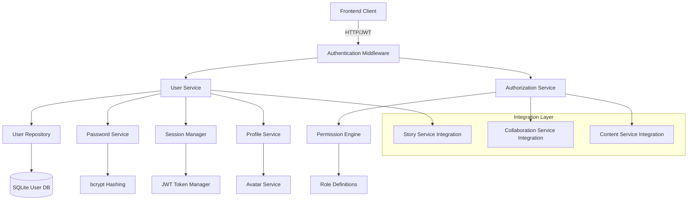

# User Management and Authentication System Design

**Document Version**: 1.0  
**Last Updated**: 2025-08-15  
**Purpose**: Design comprehensive user management and authentication system

## 🎯 Design Overview

The Novel Engine requires a robust user management system to support multi-user collaboration, content ownership, and secure access control. This design integrates JWT-based authentication with role-based access control (RBAC).

## 🏗️ Architecture Design

### User Management Architecture



### Database Schema Design

#### User Tables (`src/database/user_schema.sql`)

```sql
-- Users table - Core user information
CREATE TABLE users (
    id INTEGER PRIMARY KEY AUTOINCREMENT,
    username VARCHAR(50) UNIQUE NOT NULL,
    email VARCHAR(255) UNIQUE NOT NULL,
    password_hash VARCHAR(255) NOT NULL,
    display_name VARCHAR(100),
    avatar_url VARCHAR(500),
    bio TEXT,
    preferences JSON,
    is_active BOOLEAN DEFAULT 1,
    is_verified BOOLEAN DEFAULT 0,
    created_at DATETIME DEFAULT CURRENT_TIMESTAMP,
    updated_at DATETIME DEFAULT CURRENT_TIMESTAMP,
    last_login_at DATETIME,
    login_count INTEGER DEFAULT 0
);

-- Roles table - Define system roles
CREATE TABLE roles (
    id INTEGER PRIMARY KEY AUTOINCREMENT,
    name VARCHAR(50) UNIQUE NOT NULL,
    description TEXT,
    permissions JSON,
    is_system_role BOOLEAN DEFAULT 0,
    created_at DATETIME DEFAULT CURRENT_TIMESTAMP
);

-- User roles assignment
CREATE TABLE user_roles (
    user_id INTEGER,
    role_id INTEGER,
    assigned_at DATETIME DEFAULT CURRENT_TIMESTAMP,
    assigned_by INTEGER,
    PRIMARY KEY (user_id, role_id),
    FOREIGN KEY (user_id) REFERENCES users(id) ON DELETE CASCADE,
    FOREIGN KEY (role_id) REFERENCES roles(id) ON DELETE CASCADE,
    FOREIGN KEY (assigned_by) REFERENCES users(id)
);

-- User sessions for tracking active sessions
CREATE TABLE user_sessions (
    id VARCHAR(255) PRIMARY KEY,
    user_id INTEGER NOT NULL,
    ip_address VARCHAR(45),
    user_agent TEXT,
    expires_at DATETIME NOT NULL,
    is_active BOOLEAN DEFAULT 1,
    created_at DATETIME DEFAULT CURRENT_TIMESTAMP,
    last_activity_at DATETIME DEFAULT CURRENT_TIMESTAMP,
    FOREIGN KEY (user_id) REFERENCES users(id) ON DELETE CASCADE
);

-- Password reset tokens
CREATE TABLE password_reset_tokens (
    id INTEGER PRIMARY KEY AUTOINCREMENT,
    user_id INTEGER NOT NULL,
    token VARCHAR(255) UNIQUE NOT NULL,
    expires_at DATETIME NOT NULL,
    is_used BOOLEAN DEFAULT 0,
    created_at DATETIME DEFAULT CURRENT_TIMESTAMP,
    FOREIGN KEY (user_id) REFERENCES users(id) ON DELETE CASCADE
);

-- Email verification tokens
CREATE TABLE email_verification_tokens (
    id INTEGER PRIMARY KEY AUTOINCREMENT,
    user_id INTEGER NOT NULL,
    token VARCHAR(255) UNIQUE NOT NULL,
    expires_at DATETIME NOT NULL,
    is_used BOOLEAN DEFAULT 0,
    created_at DATETIME DEFAULT CURRENT_TIMESTAMP,
    FOREIGN KEY (user_id) REFERENCES users(id) ON DELETE CASCADE
);

-- Audit log for user actions
CREATE TABLE user_audit_log (
    id INTEGER PRIMARY KEY AUTOINCREMENT,
    user_id INTEGER,
    action VARCHAR(100) NOT NULL,
    resource_type VARCHAR(50),
    resource_id VARCHAR(100),
    details JSON,
    ip_address VARCHAR(45),
    user_agent TEXT,
    created_at DATETIME DEFAULT CURRENT_TIMESTAMP,
    FOREIGN KEY (user_id) REFERENCES users(id) ON DELETE SET NULL
);

-- Indexes for performance
CREATE INDEX idx_users_email ON users(email);
CREATE INDEX idx_users_username ON users(username);
CREATE INDEX idx_users_active ON users(is_active);
CREATE INDEX idx_user_sessions_user_id ON user_sessions(user_id);
CREATE INDEX idx_user_sessions_expires ON user_sessions(expires_at);
CREATE INDEX idx_audit_log_user_id ON user_audit_log(user_id);
CREATE INDEX idx_audit_log_created_at ON user_audit_log(created_at);
```

### Core User Management Components

#### 1. User Models (`src/auth/models.py`)

```python
from pydantic import BaseModel, EmailStr, validator
from typing import Optional, List, Dict, Any
from datetime import datetime
from enum import Enum

class UserRole(str, Enum):
    ADMIN = "admin"
    MODERATOR = "moderator"
    CREATOR = "creator"
    COLLABORATOR = "collaborator"
    VIEWER = "viewer"

class Permission(str, Enum):
    # Story permissions
    CREATE_STORY = "create_story"
    EDIT_STORY = "edit_story"
    DELETE_STORY = "delete_story"
    SHARE_STORY = "share_story"
    
    # Character permissions
    CREATE_CHARACTER = "create_character"
    EDIT_CHARACTER = "edit_character"
    DELETE_CHARACTER = "delete_character"
    
    # Collaboration permissions
    JOIN_COLLABORATION = "join_collaboration"
    INVITE_COLLABORATORS = "invite_collaborators"
    MANAGE_COLLABORATORS = "manage_collaborators"
    
    # System permissions
    MANAGE_USERS = "manage_users"
    VIEW_ANALYTICS = "view_analytics"
    SYSTEM_CONFIG = "system_config"

class UserPreferences(BaseModel):
    theme: str = "dark"
    language: str = "en"
    timezone: str = "UTC"
    email_notifications: bool = True
    collaboration_notifications: bool = True
    auto_save_interval: int = 30  # seconds
    max_story_length: int = 10000  # characters

class UserCreate(BaseModel):
    username: str
    email: EmailStr
    password: str
    display_name: Optional[str] = None
    bio: Optional[str] = None
    
    @validator('username')
    def validate_username(cls, v):
        if len(v) < 3 or len(v) > 50:
            raise ValueError('Username must be 3-50 characters')
        if not v.isalnum() and '_' not in v:
            raise ValueError('Username must contain only letters, numbers, and underscores')
        return v.lower()
    
    @validator('password')
    def validate_password(cls, v):
        if len(v) < 8:
            raise ValueError('Password must be at least 8 characters')
        return v

class UserUpdate(BaseModel):
    display_name: Optional[str] = None
    bio: Optional[str] = None
    avatar_url: Optional[str] = None
    preferences: Optional[UserPreferences] = None

class UserResponse(BaseModel):
    id: int
    username: str
    email: EmailStr
    display_name: Optional[str]
    avatar_url: Optional[str]
    bio: Optional[str]
    preferences: UserPreferences
    roles: List[UserRole]
    is_active: bool
    is_verified: bool
    created_at: datetime
    last_login_at: Optional[datetime]
    
    class Config:
        from_attributes = True

class LoginRequest(BaseModel):
    username_or_email: str
    password: str
    remember_me: bool = False

class LoginResponse(BaseModel):
    access_token: str
    refresh_token: str
    token_type: str = "bearer"
    expires_in: int
    user: UserResponse
```

#### 2. Authentication Service (`src/auth/auth_service.py`)

```python
import bcrypt
import jwt
from datetime import datetime, timedelta
from typing import Optional, Dict, Any
from fastapi import HTTPException, status
from sqlalchemy.orm import Session

from .models import UserCreate, UserResponse, LoginRequest, LoginResponse
from .password_service import PasswordService
from .token_service import TokenService
from .user_repository import UserRepository

class AuthService:
    def __init__(self, db: Session):
        self.db = db
        self.user_repo = UserRepository(db)
        self.password_service = PasswordService()
        self.token_service = TokenService()
    
    async def register_user(self, user_data: UserCreate) -> UserResponse:
        """Register a new user"""
        # Check if user already exists
        existing_user = await self.user_repo.get_by_username_or_email(
            user_data.username, user_data.email
        )
        if existing_user:
            raise HTTPException(
                status_code=status.HTTP_400_BAD_REQUEST,
                detail="Username or email already registered"
            )
        
        # Hash password
        password_hash = self.password_service.hash_password(user_data.password)
        
        # Create user
        user = await self.user_repo.create_user({
            **user_data.dict(exclude={'password'}),
            'password_hash': password_hash
        })
        
        # Assign default role
        await self.user_repo.assign_role(user.id, "collaborator")
        
        # Send verification email (if configured)
        await self._send_verification_email(user)
        
        return UserResponse.from_orm(user)
    
    async def authenticate_user(self, login_data: LoginRequest) -> LoginResponse:
        """Authenticate user and return tokens"""
        # Find user
        user = await self.user_repo.get_by_username_or_email(
            login_data.username_or_email, login_data.username_or_email
        )
        
        if not user or not user.is_active:
            raise HTTPException(
                status_code=status.HTTP_401_UNAUTHORIZED,
                detail="Invalid credentials"
            )
        
        # Verify password
        if not self.password_service.verify_password(
            login_data.password, user.password_hash
        ):
            raise HTTPException(
                status_code=status.HTTP_401_UNAUTHORIZED,
                detail="Invalid credentials"
            )
        
        # Update last login
        await self.user_repo.update_last_login(user.id)
        
        # Generate tokens
        access_token = self.token_service.create_access_token(
            subject=str(user.id),
            expires_delta=timedelta(hours=1)
        )
        
        refresh_token = self.token_service.create_refresh_token(
            subject=str(user.id),
            expires_delta=timedelta(days=30 if login_data.remember_me else 7)
        )
        
        # Create session record
        await self.user_repo.create_session(user.id, {
            'access_token': access_token,
            'refresh_token': refresh_token,
            'expires_at': datetime.utcnow() + timedelta(hours=1)
        })
        
        return LoginResponse(
            access_token=access_token,
            refresh_token=refresh_token,
            expires_in=3600,
            user=UserResponse.from_orm(user)
        )
    
    async def refresh_access_token(self, refresh_token: str) -> Dict[str, Any]:
        """Refresh access token using refresh token"""
        try:
            payload = self.token_service.decode_token(refresh_token)
            user_id = int(payload.get("sub"))
            
            # Verify user and session
            user = await self.user_repo.get_by_id(user_id)
            if not user or not user.is_active:
                raise HTTPException(
                    status_code=status.HTTP_401_UNAUTHORIZED,
                    detail="Invalid refresh token"
                )
            
            # Generate new access token
            access_token = self.token_service.create_access_token(
                subject=str(user_id),
                expires_delta=timedelta(hours=1)
            )
            
            return {
                "access_token": access_token,
                "token_type": "bearer",
                "expires_in": 3600
            }
            
        except Exception as e:
            raise HTTPException(
                status_code=status.HTTP_401_UNAUTHORIZED,
                detail="Invalid refresh token"
            )
    
    async def logout_user(self, user_id: int, access_token: str):
        """Logout user and invalidate session"""
        await self.user_repo.invalidate_session(user_id, access_token)
    
    async def get_current_user(self, token: str) -> UserResponse:
        """Get current user from token"""
        try:
            payload = self.token_service.decode_token(token)
            user_id = int(payload.get("sub"))
            
            user = await self.user_repo.get_by_id(user_id)
            if not user or not user.is_active:
                raise HTTPException(
                    status_code=status.HTTP_401_UNAUTHORIZED,
                    detail="User not found or inactive"
                )
            
            return UserResponse.from_orm(user)
            
        except Exception as e:
            raise HTTPException(
                status_code=status.HTTP_401_UNAUTHORIZED,
                detail="Invalid token"
            )
```

#### 3. Authorization Service (`src/auth/authorization_service.py`)

```python
from typing import List, Set, Dict, Any
from enum import Enum
from .models import Permission, UserRole

class AuthorizationService:
    def __init__(self):
        self.role_permissions = self._initialize_role_permissions()
    
    def _initialize_role_permissions(self) -> Dict[UserRole, Set[Permission]]:
        """Define permissions for each role"""
        return {
            UserRole.ADMIN: {
                # All permissions
                *list(Permission)
            },
            UserRole.MODERATOR: {
                Permission.CREATE_STORY,
                Permission.EDIT_STORY,
                Permission.SHARE_STORY,
                Permission.CREATE_CHARACTER,
                Permission.EDIT_CHARACTER,
                Permission.JOIN_COLLABORATION,
                Permission.INVITE_COLLABORATORS,
                Permission.MANAGE_COLLABORATORS,
                Permission.VIEW_ANALYTICS
            },
            UserRole.CREATOR: {
                Permission.CREATE_STORY,
                Permission.EDIT_STORY,
                Permission.DELETE_STORY,
                Permission.SHARE_STORY,
                Permission.CREATE_CHARACTER,
                Permission.EDIT_CHARACTER,
                Permission.DELETE_CHARACTER,
                Permission.JOIN_COLLABORATION,
                Permission.INVITE_COLLABORATORS
            },
            UserRole.COLLABORATOR: {
                Permission.CREATE_STORY,
                Permission.EDIT_STORY,
                Permission.SHARE_STORY,
                Permission.CREATE_CHARACTER,
                Permission.EDIT_CHARACTER,
                Permission.JOIN_COLLABORATION
            },
            UserRole.VIEWER: {
                Permission.JOIN_COLLABORATION
            }
        }
    
    def check_permission(self, user_roles: List[UserRole], required_permission: Permission) -> bool:
        """Check if user has required permission"""
        for role in user_roles:
            if required_permission in self.role_permissions.get(role, set()):
                return True
        return False
    
    def get_user_permissions(self, user_roles: List[UserRole]) -> Set[Permission]:
        """Get all permissions for user roles"""
        permissions = set()
        for role in user_roles:
            permissions.update(self.role_permissions.get(role, set()))
        return permissions
    
    def can_access_story(self, user_roles: List[UserRole], story_id: str, 
                        story_owner_id: int, user_id: int, 
                        action: Permission) -> bool:
        """Check if user can perform action on specific story"""
        # Owner can do anything with their story
        if story_owner_id == user_id:
            return True
        
        # Check role-based permissions
        return self.check_permission(user_roles, action)
    
    def can_manage_collaboration(self, user_roles: List[UserRole], 
                               collaboration_creator_id: int, user_id: int) -> bool:
        """Check if user can manage collaboration session"""
        # Creator can manage their collaboration
        if collaboration_creator_id == user_id:
            return True
        
        # Check role-based permissions
        return self.check_permission(user_roles, Permission.MANAGE_COLLABORATORS)
```

#### 4. FastAPI Integration (`src/auth/dependencies.py`)

```python
from fastapi import Depends, HTTPException, status
from fastapi.security import HTTPBearer, HTTPAuthorizationCredentials
from typing import Optional
from sqlalchemy.orm import Session

from .auth_service import AuthService
from .authorization_service import AuthorizationService
from .models import UserResponse, Permission

security = HTTPBearer()

async def get_current_user(
    credentials: HTTPAuthorizationCredentials = Depends(security),
    db: Session = Depends(get_db)
) -> UserResponse:
    """Dependency to get current authenticated user"""
    auth_service = AuthService(db)
    token = credentials.credentials
    return await auth_service.get_current_user(token)

async def get_current_active_user(
    current_user: UserResponse = Depends(get_current_user)
) -> UserResponse:
    """Dependency to get current active user"""
    if not current_user.is_active:
        raise HTTPException(
            status_code=status.HTTP_400_BAD_REQUEST,
            detail="Inactive user"
        )
    return current_user

def require_permission(required_permission: Permission):
    """Dependency factory for permission checking"""
    def permission_checker(
        current_user: UserResponse = Depends(get_current_active_user)
    ) -> UserResponse:
        auth_service = AuthorizationService()
        if not auth_service.check_permission(current_user.roles, required_permission):
            raise HTTPException(
                status_code=status.HTTP_403_FORBIDDEN,
                detail=f"Permission denied: {required_permission.value} required"
            )
        return current_user
    
    return permission_checker

# Specific permission dependencies
require_create_story = require_permission(Permission.CREATE_STORY)
require_edit_story = require_permission(Permission.EDIT_STORY)
require_manage_users = require_permission(Permission.MANAGE_USERS)
```

### API Endpoints (`api_server.py` additions)

```python
from fastapi import APIRouter, Depends, HTTPException, status
from src.auth.models import UserCreate, UserResponse, LoginRequest, LoginResponse
from src.auth.auth_service import AuthService
from src.auth.dependencies import get_current_user, require_create_story

auth_router = APIRouter(prefix="/auth", tags=["authentication"])

@auth_router.post("/register", response_model=UserResponse)
async def register(user_data: UserCreate, db: Session = Depends(get_db)):
    """Register new user"""
    auth_service = AuthService(db)
    return await auth_service.register_user(user_data)

@auth_router.post("/login", response_model=LoginResponse)
async def login(login_data: LoginRequest, db: Session = Depends(get_db)):
    """Authenticate user"""
    auth_service = AuthService(db)
    return await auth_service.authenticate_user(login_data)

@auth_router.post("/refresh")
async def refresh_token(refresh_token: str, db: Session = Depends(get_db)):
    """Refresh access token"""
    auth_service = AuthService(db)
    return await auth_service.refresh_access_token(refresh_token)

@auth_router.post("/logout")
async def logout(current_user: UserResponse = Depends(get_current_user)):
    """Logout current user"""
    # Implementation depends on token blacklisting strategy
    return {"message": "Successfully logged out"}

@auth_router.get("/me", response_model=UserResponse)
async def get_current_user_info(current_user: UserResponse = Depends(get_current_user)):
    """Get current user information"""
    return current_user

# Protected endpoint example
@auth_router.get("/protected")
async def protected_endpoint(current_user: UserResponse = Depends(require_create_story)):
    """Example protected endpoint requiring story creation permission"""
    return {"message": f"Hello {current_user.username}, you can create stories!"}
```

## 🔧 Implementation Strategy

### Phase 1: Core Authentication (Week 1)
1. Implement user models and database schema
2. Create authentication service with JWT
3. Add basic registration and login endpoints
4. Test authentication flow

### Phase 2: Authorization System (Week 2)
1. Implement role-based permissions
2. Create authorization service
3. Add protected endpoints
4. Test permission checks

### Phase 3: Advanced Features (Week 3)
1. Add password reset functionality
2. Implement email verification
3. Create user profile management
4. Add session management

### Phase 4: Integration (Week 4)
1. Integrate with existing story system
2. Add collaboration permissions
3. Implement audit logging
4. Performance testing

## 📊 Security Considerations

### Password Security
- bcrypt hashing with configurable rounds
- Password strength requirements
- Password history tracking
- Account lockout after failed attempts

### Token Security
- JWT with short expiration times
- Refresh token rotation
- Token blacklisting for logout
- Secure token storage guidelines

### Session Management
- Session timeout handling
- Concurrent session limits
- Device/IP tracking
- Suspicious activity detection

This comprehensive user management system provides secure authentication, fine-grained authorization, and seamless integration with the existing Novel Engine architecture.