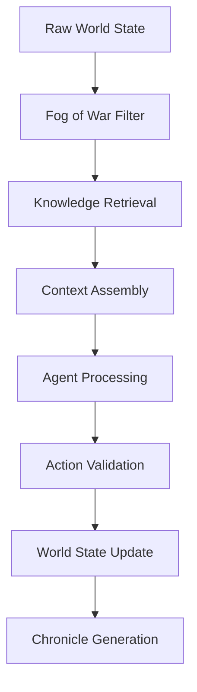

# Novel Engine Developer Guide

*Document Version: 1.0*  
*Last Updated: 2025-08-11*  
*Target Audience: New developers joining the Novel Engine project*

## Overview

This guide provides everything you need to set up, understand, and contribute to the Novel Engine project. The Novel Engine implements a "Context Supply Chain" architecture for AI-driven narrative simulation with legal compliance and performance optimization.

## 🚀 Quick Start (5-Minute Setup)

### Prerequisites
- **Python 3.11+** (required for Pydantic v2 compatibility)
- **Poetry** (dependency management)
- **Git** (version control)
- **VS Code** or **PyCharm** (recommended IDEs)

### 1. Environment Setup

```bash
# Clone the repository
git clone <repository-url>
cd novel-engine

# Install dependencies
poetry install

# Activate virtual environment
poetry shell

# Verify installation
python -m pytest tests/test_foundation.py
```

### 2. Understanding Operating Modes

The Novel Engine operates in three distinct modes, each with specific legal and technical requirements:

#### **Neutral Mode** (Default)
- **Purpose**: General-purpose narrative generation
- **Content**: Original content only
- **Legal**: No restrictions
- **Setup**: Default configuration

#### **Fan Mode** (Community Content)
- **Purpose**: Fan fiction and derivative works
- **Content**: Uses copyrighted source material
- **Legal**: Non-commercial use only, local distribution
- **Setup**: Requires `private/registry.yaml` compliance configuration

#### **Empty Mode** (Testing)
- **Purpose**: Development and testing
- **Content**: No knowledge base loaded
- **Legal**: No restrictions
- **Setup**: Minimal configuration for testing

### 3. Configuration Setup

Create your `settings.yaml` in the project root:

```yaml
# Basic Configuration
mode: "neutral"  # or "fan" or "empty"

# Policy Settings
policy:
  monetization: "disabled"
  provenance_required: true
  
# Knowledge Base Settings  
kb:
  enabled: true
  cache_size: 1000
  
# Guard Settings (for fan mode)
guard:
  compliance_check: true
  banned_terms: true
```

For **fan mode**, additionally create `private/registry.yaml`:

```yaml
sources: []  # Your source material definitions

compliance:
  non_commercial: true
  distribution: "local_only"
```

## 🏗️ Architecture Overview

### Context Supply Chain Architecture

The Novel Engine implements a sophisticated "Context Supply Chain" that processes information through multiple stages:



### Core Components

#### 1. **Director Agent** (`src/engine/director.py`)
- **Role**: Orchestrates the entire simulation
- **Key Functions**:
  - `_build_turn_brief()`: Creates personalized agent context
  - `_adjudicate_action()`: Validates actions against Iron Laws
  - `_apply_effects()`: Updates world state

#### 2. **Persona Agent** (`src/engine/persona.py`) 
- **Role**: Individual AI agent decision-making
- **Key Function**: `decision_loop()`: Converts TurnBrief to CharacterAction

#### 3. **Chronicler Agent** (`src/engine/chronicler.py`)
- **Role**: Narrative generation and documentation
- **Key Function**: `narrate()`: Converts simulation log to readable chronicle

#### 4. **Knowledge Base** (`src/engine/kb.py`)
- **Role**: Content retrieval and compliance
- **Key Function**: `retrieve()`: Finds relevant knowledge with provenance

### Data Flow Architecture

```yaml
Input: Seed Scenario
↓
WorldState (Objective Reality)
↓ 
TurnBrief (Subjective "Fog of War" Reality)
↓
CharacterAction (Agent Decision)
↓
Adjudication (Iron Laws Validation)  
↓
Updated WorldState
↓
ChronicleSpec (Narrative Output)
```

## 🛠️ Development Environment

### IDE Configuration

#### VS Code (Recommended)
Create `.vscode/settings.json`:

```json
{
    "python.defaultInterpreter": "./.venv/bin/python",
    "python.linting.enabled": true,
    "python.linting.pylintEnabled": true,
    "python.testing.pytestEnabled": true,
    "python.testing.pytestArgs": ["tests/"]
}
```

#### PyCharm
1. Open project directory
2. Configure Python interpreter to use Poetry environment
3. Enable pytest as test runner
4. Configure code style to match project standards

### Development Tools

```bash
# Code formatting
poetry run black src/ tests/

# Type checking
poetry run mypy src/

# Linting
poetry run pylint src/

# Testing
poetry run pytest tests/ -v

# Test coverage
poetry run pytest --cov=src tests/
```

## 📂 Project Structure Guide

```
novel-engine/
├── docs/                    # Documentation
│   ├── API.md              # API specifications
│   ├── DESIGN.md           # Architecture design
│   ├── SCHEMAS.md          # Data model definitions
│   └── ...
├── src/                    # Source code
│   ├── shared_types.py     # Pydantic models (THE schema source)
│   ├── engine/             # Core simulation engine
│   │   ├── director.py     # Main orchestration
│   │   ├── persona.py      # Agent decision-making  
│   │   ├── chronicler.py   # Narrative generation
│   │   └── kb.py          # Knowledge base
│   └── llm/               # LLM integration
├── tests/                  # Test suite
├── scripts/               # Utility scripts
├── evaluation/            # Performance evaluation
├── private/              # Private configuration (git-ignored)
└── settings.yaml         # Main configuration
```

### Important File Locations

- **Schema Definitions**: `src/shared_types.py` (single source of truth)
- **API Server**: `api_server.py` (FastAPI application)
- **Configuration**: `settings.yaml` (main config)
- **Legal Compliance**: `private/registry.yaml` (fan mode only)
- **Test Data**: `tests/fixtures/` (test scenarios)

## 🎯 First Development Task

### Walkthrough: Adding a New Action Type

Let's add a new action type called "investigate" to understand the development flow:

#### Step 1: Update Schema
Edit `src/shared_types.py`:

```python
class CharacterAction(BaseModel):
    action_type: Literal[
        "move", "attack", "parley", "regroup", "scan", "observe", 
        "investigate"  # Add new action type
    ]
    # ... rest of fields
```

#### Step 2: Update Validation
Edit `src/engine/director.py` in `_adjudicate_action()`:

```python
def _adjudicate_action(self, action: CharacterAction) -> bool:
    # Add validation for investigate action
    if action.action_type == "investigate":
        # Custom validation logic
        if not action.target:
            raise AdjudicationError("E002_TARGET_INVALID", 
                                  "investigate requires target")
    # ... existing validation
```

#### Step 3: Add Tests
Create `tests/test_investigate_action.py`:

```python
def test_investigate_action_valid():
    action = CharacterAction(
        action_type="investigate",
        target="mysterious_artifact",
        intent="Examine the artifact for clues",
        justification="My character is curious about strange objects",
        confidence=0.8
    )
    # Test validation passes
    assert action.action_type == "investigate"

def test_investigate_action_no_target():
    # Test that investigate without target fails validation
    # ... test implementation
```

#### Step 4: Update Documentation
Add to `docs/API.md`:

```markdown
- `investigate`: Examine an entity or location for additional information
```

#### Step 5: Run Tests
```bash
poetry run pytest tests/test_investigate_action.py -v
poetry run pytest tests/test_schemas.py -v  # Ensure schema changes work
```

This workflow demonstrates the typical development cycle in the Novel Engine.

## 🚨 Common Pitfalls & Solutions

### 1. **Fan Mode Compliance Errors**
**Problem**: `SystemExit` on startup in fan mode
**Solution**: Ensure `private/registry.yaml` exists with proper compliance settings

### 2. **Pydantic Validation Failures**
**Problem**: HTTP 422 errors on API calls
**Solution**: Check schema definitions in `src/shared_types.py` match your data

### 3. **Knowledge Base Not Loading**
**Problem**: Empty doctrine_snippets in TurnBrief
**Solution**: Verify KB files exist and `settings.yaml` has correct paths

### 4. **Iron Laws Violations**
**Problem**: Actions rejected with E001-E005 errors
**Solution**: Review action logic against the 5 Iron Laws in `docs/DESIGN.md`

### 5. **Performance Issues**
**Problem**: Slow response times (>5s)
**Solution**: Check token budget settings and caching configuration

## 🔍 Debugging Quick Reference

### Essential Log Locations
- **Application Logs**: `logs/app.log`
- **Test Output**: Console during pytest runs
- **Replay Logs**: `runs/{run_id}/turn_{n}.json`

### Debugging Commands
```bash
# Enable debug logging
export LOG_LEVEL=DEBUG

# Run with verbose output
poetry run python -m pytest tests/ -v -s

# Debug specific test
poetry run python -m pytest tests/test_director_agent.py::test_fog_of_war -v -s

# Interactive debugging
poetry run python -c "
from src.engine.director import DirectorAgent
# ... interactive testing
"
```

### Common Debug Scenarios
- **Agent Decision Issues**: Check TurnBrief content and visible_slice
- **Validation Failures**: Review Iron Laws and action structure
- **Performance Problems**: Profile token usage and caching hits
- **Compliance Issues**: Verify mode configuration and registry setup

## 📚 Next Steps

After completing this setup:

1. **Read Architecture Docs**: Review `docs/DESIGN.md` for system architecture
2. **Study Implementation Patterns**: See `docs/IMPLEMENTATION_PATTERNS.md` for coding patterns
3. **Learn Debugging**: Read `docs/DEBUGGING.md` for troubleshooting techniques
4. **Pick a Work Order**: Choose from the 8 implementation tasks in `docs/IMPLEMENTATION.md`

## 🤝 Getting Help

- **Technical Issues**: Check `docs/DEBUGGING.md`
- **Architecture Questions**: Review `docs/ADRs/` (Architecture Decision Records)
- **Performance Concerns**: See `docs/PERFORMANCE.md`
- **Security Questions**: Check `docs/SECURITY_PATTERNS.md`

Welcome to the Novel Engine project! You're now ready to contribute to the next generation of AI-driven narrative simulation.