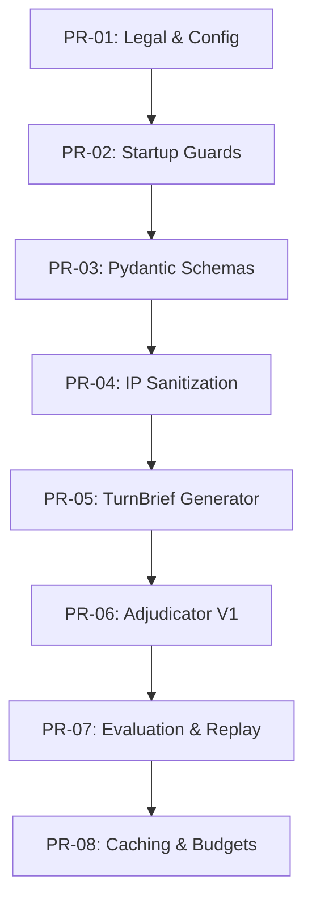

# Codex: Implementation Plan (IMPLEMENTATION.md)
*Document Version: 1.2*
*Last Updated: 2025-08-11*

This document outlines the official, phased implementation plan for the Novel Engine's "Context Supply Chain" upgrade.

## 1. Work Order (PR) Directory

The implementation is broken down into 8 discrete Work Orders, designed to be executed sequentially. Each Work Order corresponds to a single Pull Request.

-   **PR-01:** Legal & Config
-   **PR-02:** Startup Guards
-   **PR-03:** Pydantic Schemas
-   **PR-04:** IP Sanitization & Neutral Lexicon
-   **PR-05:** TurnBrief Generator
-   **PR-06:** Adjudicator V1
-   **PR-07:** Evaluation Baseline & Replay
-   **PR-08:** Caching & Budgets

## 2. Dependency Graph

The Work Orders must be executed in sequence, as each builds upon the last.

## 3. Timeline & Milestones

-   **Phase 0 (Foundation):** PR-01, PR-02, PR-03. Estimated Duration: **2-3 Days**.
-   **Milestone Alpha (Runnable & Testable):** Completion of PR-04, PR-05, PR-06, PR-07. Estimated Duration: **10-14 Days**.
-   **Milestone Beta (Optimization):** Completion of PR-08 and subsequent performance tuning. Estimated Duration: **3-5 Weeks**.

## 4. Work Order Details & Definition of Done (DoD)

### PR-01: Legal & Config
-   **Objective:** Forge foundational legal and configuration scriptures.
-   **DoD:** `LEGAL.md`, `NOTICE`, `README.md` disclaimer, and `settings.yaml` exist and pass a CI validation check.

### PR-02: Startup Guards
-   **Objective:** Empower the Engine to refuse activation under non-compliant conditions.
-   **DoD:** Unit tests prove the application exits cleanly when `fan` mode conditions are not met. The `/meta/policy` endpoint is active and returns correct data.

### PR-03: Pydantic Schemas
-   **Objective:** Bind all data structures to the holy law of Pydantic.
-   **DoD:** All core data types in `src/core/types/shared_types.py` are Pydantic models. API tests confirm HTTP 422 errors are returned for invalid payloads.

### PR-04: IP Sanitization & Neutral Lexicon
-   **Objective:** Purge all unsanctioned IP from the public codebase.
-   **DoD:** The `term_guard.py` script passes in the CI pipeline. A manual review confirms no forbidden terms remain in public-facing files.

### PR-05: TurnBrief Generator
-   **Objective:** Construct the "Fog of War" engine.
-   **DoD:** Unit tests confirm that the generator correctly masks unseen entities and injects mocked RAG snippets with correct provenance.

### PR-06: Adjudicator V1
-   **Objective:** Forge the first line of defense against LLM heresy.
-   **DoD:** Unit tests confirm that actions violating each of the 5 Iron Laws are correctly rejected with the appropriate error code.

### PR-07: Evaluation Baseline & Replay
-   **Objective:** Build the Altar of Evaluation for measurement and replay.
-   **DoD:** The `evaluate_baseline.py` script runs successfully in CI and produces a valid `baseline_report.md`. A replay log is generated and its structure is validated.

### PR-08: Caching & Budgets
-   **Objective:** Instill the virtues of efficiency into the Engine.
-   **DoD:** Unit tests confirm that the semantic cache prevents redundant RAG calls and that the token budget guard correctly prunes over-budget context.

## 5. Risk Management

| Risk | Trigger | Mitigation | Owner |
| :--- | :--- | :--- | :--- |
| IP Compliance | Accidental commit of forbidden term | `term_guard.py` in CI pipeline | Project Lead |
| LLM Vendor Lock-in | API changes by provider | `LLMClient` abstraction layer | Project Lead |
| Cost Overrun | Inefficient RAG calls or prompts | Token Budget Guard, Semantic Cache | Project Lead |
| Quality Regression | A change degrades consistency | Baseline evaluation in CI | Project Lead |

## 6. Rollback Strategy

-   All changes will be managed via feature branches corresponding to each PR.
-   The `main` branch is protected. Merging requires passing all CI checks.
-   In case of a severe regression post-merge, the PR will be reverted, and a new PR will be created to address the issue.

