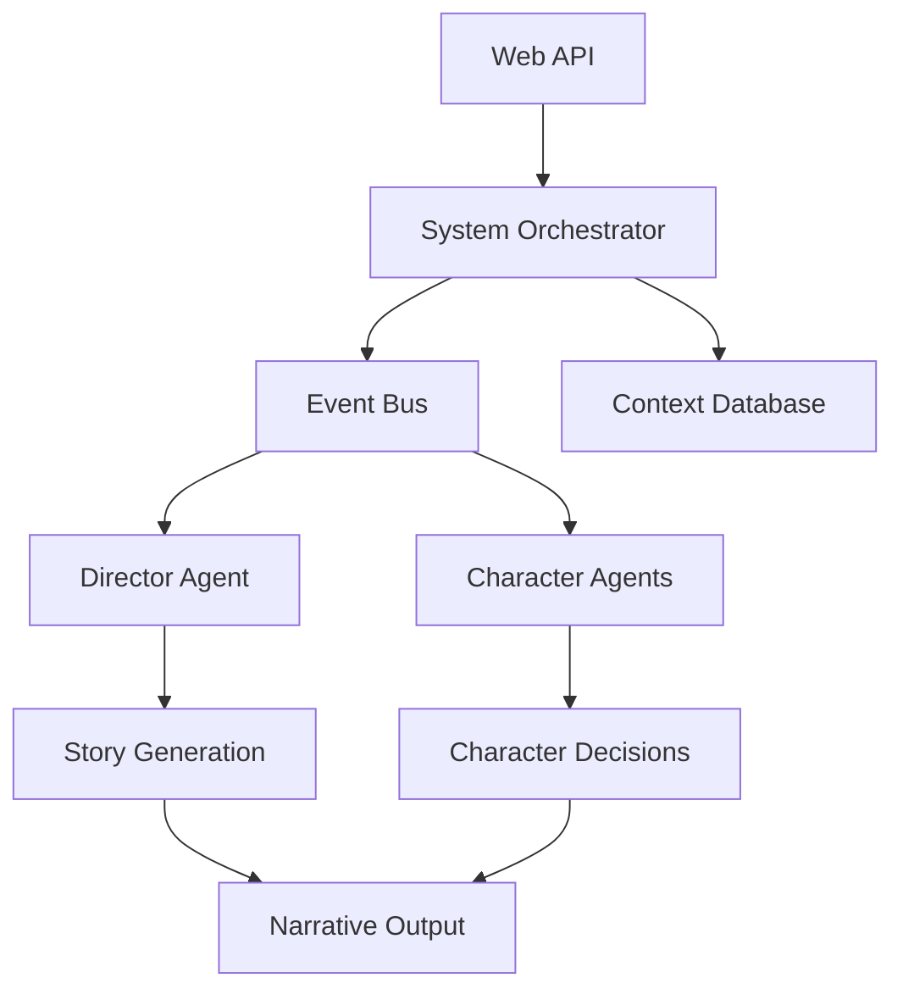

# Novel Engine Documentation

Welcome to the Novel Engine documentation! Novel Engine is an AI-enhanced interactive novel framework that combines traditional storytelling with intelligent automation and dynamic content generation.

## What is Novel Engine?

Novel Engine is a comprehensive framework for creating interactive narrative experiences with:

- **AI-Enhanced Storytelling**: Intelligent agents that respond dynamically to player actions
- **Character System**: Rich, persistent character models with personality and growth
- **Event-Driven Architecture**: Scalable, modular design for complex narratives
- **API-First Design**: RESTful APIs for integration with any frontend
- **Production Ready**: Comprehensive testing, monitoring, and deployment tools

## Key Features

### 🤖 AI-Powered Characters
- Persistent character personalities and memories
- Dynamic decision-making based on character traits
- Emergent narrative through character interactions

### 🎭 Interactive Storytelling
- Turn-based narrative progression
- Player choice impact on story direction
- Rich world state management

### 🏗️ Robust Architecture
- Event-driven, microservices-ready design
- Comprehensive test coverage (90%+)
- Production monitoring and observability

### 🔒 Enterprise Ready
- Security-first design with input validation
- Performance optimization and caching
- Comprehensive quality gates and CI/CD

## Quick Start

Get up and running with Novel Engine in minutes:

```bash
# Clone the repository
git clone https://github.com/novel-engine/novel-engine.git
cd novel-engine

# Install dependencies
pip install -r requirements.txt

# Run the API server
python src/api/main_api_server.py

# Start creating your story!
curl http://localhost:8000/docs
```

## Architecture Overview



## Use Cases

### Interactive Fiction
Create branching narratives where player choices matter and characters remember past interactions.

### Educational Content
Build educational scenarios with AI tutors that adapt to student responses.

### Game Development
Integrate rich NPC behavior and dynamic storytelling into games.

### Simulation & Training
Create realistic scenario simulations for training and assessment.

## Community & Support

- **GitHub**: [https://github.com/novel-engine/novel-engine](https://github.com/novel-engine/novel-engine)
- **Documentation**: You're reading it!
- **Issues**: Report bugs and request features on GitHub
- **Discussions**: Join the community discussions

## License

Novel Engine is released under the MIT License. See [LICENSE](LICENSE) for details.

---

Ready to start building? Check out our [Getting Started Guide](getting-started/installation.md)!