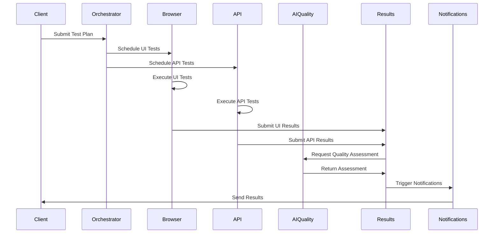

# AI Acceptance Testing Framework - Microservices Architecture

## Executive Summary

This document presents a comprehensive microservices architecture design for an AI Acceptance Testing Framework that integrates seamlessly with the existing Novel-Engine infrastructure. The framework provides intelligent, automated testing capabilities for AI-driven applications through a distributed, scalable architecture built on proven patterns and technologies.

## Table of Contents

1. [Architecture Overview](#architecture-overview)
2. [Service Specifications](#service-specifications)
3. [Integration Strategy](#integration-strategy)
4. [Data Flow Design](#data-flow-design)
5. [Communication Protocols](#communication-protocols)
6. [Data Models & Schemas](#data-models--schemas)
7. [Deployment Architecture](#deployment-architecture)
8. [Security & Monitoring](#security--monitoring)
9. [Implementation Guidance](#implementation-guidance)

## Architecture Overview

### Design Principles

- **Domain-Driven Design**: Clear service boundaries aligned with testing domain concepts
- **Event-Driven Architecture**: Asynchronous communication for scalability and resilience
- **Cloud-Native**: Kubernetes-native design with horizontal scaling capabilities
- **AI-First**: Native integration with LLM-as-Judge and intelligent test generation
- **Observability**: Comprehensive monitoring, logging, and distributed tracing
- **Integration-Ready**: Seamless integration with existing Novel-Engine ecosystem

### High-Level Architecture

```
┌─────────────────────────────────────────────────────────────────────────┐
│                        AI Acceptance Testing Platform                    │
├─────────────────────────────────────────────────────────────────────────┤
│  Frontend Layer (React)  │  API Gateway  │  Event Streaming (Kafka)     │
├─────────────────────────────────────────────────────────────────────────┤
│                         Core Microservices Layer                        │
│ ┌─────────────┐ ┌─────────────┐ ┌─────────────┐ ┌─────────────┐       │
│ │ Test        │ │ Browser     │ │ AI Quality  │ │ API Testing │       │
│ │ Orchestrator│ │ Automation  │ │ Assessment  │ │ Service     │       │
│ └─────────────┘ └─────────────┘ └─────────────┘ └─────────────┘       │
│ ┌─────────────┐ ┌─────────────┐ ┌─────────────┐                       │
│ │ Results     │ │ Notification│ │ Test Data   │                       │
│ │ Aggregation │ │ Service     │ │ Management  │                       │
│ └─────────────┘ └─────────────┘ └─────────────┘                       │
├─────────────────────────────────────────────────────────────────────────┤
│                        Infrastructure Layer                              │
│  Database (PostgreSQL)  │  Cache (Redis)  │  Message Queue (RabbitMQ)   │
│  Monitoring (Prometheus/Grafana)  │  Tracing (Jaeger)  │  Logging (ELK) │
└─────────────────────────────────────────────────────────────────────────┘
```

## Service Specifications

### 1. AI Test Orchestrator Service

**Purpose**: Central coordination service that manages test execution lifecycles, resource allocation, and cross-service communication.

**Responsibilities**:
- Test plan creation and execution coordination
- Resource allocation and load balancing
- Test workflow orchestration
- Service health monitoring and circuit breaking
- Test execution state management

**Technical Stack**:
- **Runtime**: Python 3.11 with FastAPI
- **Database**: PostgreSQL for persistence, Redis for caching
- **Messaging**: RabbitMQ for reliable messaging
- **AI Integration**: Gemini API for intelligent test planning

**API Endpoints**:
```python
# Test Management
POST   /api/v1/tests/plans          # Create test execution plan
GET    /api/v1/tests/plans/{id}     # Get test plan details
PUT    /api/v1/tests/plans/{id}     # Update test plan
DELETE /api/v1/tests/plans/{id}     # Cancel test plan

# Execution Control
POST   /api/v1/tests/execute        # Start test execution
GET    /api/v1/tests/status/{id}    # Get execution status
POST   /api/v1/tests/pause/{id}     # Pause execution
POST   /api/v1/tests/resume/{id}    # Resume execution
POST   /api/v1/tests/stop/{id}      # Stop execution

# Resource Management
GET    /api/v1/resources/capacity   # Get available capacity
POST   /api/v1/resources/allocate   # Allocate resources
DELETE /api/v1/resources/{id}       # Release resources
```

**Configuration**:
```yaml
orchestrator:
  max_concurrent_tests: 50
  resource_allocation_strategy: "fair_share"
  health_check_interval: 30s
  circuit_breaker:
    failure_threshold: 5
    recovery_timeout: 60s
  ai_integration:
    gemini_api_key: "${GEMINI_API_KEY}"
    test_planning_model: "gemini-pro"
    max_tokens: 4096
```

### 2. Browser Automation Service

**Purpose**: Playwright-based service for UI testing, visual regression testing, and cross-browser validation.

**Responsibilities**:
- Cross-browser test execution (Chrome, Firefox, Safari, Edge)
- Visual regression testing and screenshot comparison
- Performance metrics collection (Core Web Vitals)
- User interaction simulation and accessibility testing
- Mobile device emulation and responsive testing

**Technical Stack**:
- **Runtime**: Node.js 18+ with TypeScript
- **Automation**: Playwright with custom extensions
- **Image Processing**: Sharp for visual comparison
- **Storage**: S3-compatible object storage for artifacts
- **Metrics**: Custom performance collection

**API Endpoints**:
```typescript
// Browser Management
POST   /api/v1/browsers/sessions     # Create browser session
GET    /api/v1/browsers/sessions/{id} # Get session details
DELETE /api/v1/browsers/sessions/{id} # Close session

// Test Execution
POST   /api/v1/tests/ui              # Execute UI test
POST   /api/v1/tests/visual          # Run visual regression test
POST   /api/v1/tests/performance     # Collect performance metrics
POST   /api/v1/tests/accessibility   # Run accessibility audit

// Artifacts
GET    /api/v1/artifacts/screenshots/{id} # Get screenshot
GET    /api/v1/artifacts/videos/{id}      # Get test recording
GET    /api/v1/artifacts/traces/{id}      # Get execution trace
```

**Configuration**:
```yaml
browser_automation:
  browsers:
    - chrome: { headless: true, viewport: { width: 1920, height: 1080 } }
    - firefox: { headless: true, viewport: { width: 1920, height: 1080 } }
    - safari: { headless: false, viewport: { width: 1920, height: 1080 } }
  performance:
    collect_metrics: true
    trace_performance: true
    network_throttling: "3G"
  visual_testing:
    threshold: 0.2
    ignore_regions: []
    comparison_engine: "pixelmatch"
```

### 3. AI Quality Assessment Service

**Purpose**: LLM-as-Judge service that provides intelligent quality assessment and automated test result evaluation.

**Responsibilities**:
- Intelligent test result evaluation using LLM-as-Judge patterns
- Natural language test report generation
- Quality scoring and recommendation engine
- Anomaly detection in test results
- Test improvement suggestions

**Technical Stack**:
- **Runtime**: Python 3.11 with FastAPI
- **AI Models**: Multiple LLM providers (Gemini, GPT-4, Claude)
- **Vector Storage**: Chroma for embeddings and similarity search
- **Caching**: Redis for response caching
- **Processing**: Celery for async processing

**API Endpoints**:
```python
# Quality Assessment
POST   /api/v1/assess/test-results   # Assess test results
POST   /api/v1/assess/ui-quality     # Assess UI quality
POST   /api/v1/assess/performance    # Assess performance metrics
POST   /api/v1/assess/accessibility  # Assess accessibility compliance

# Intelligence Services
POST   /api/v1/generate/test-cases   # Generate test cases from requirements
POST   /api/v1/analyze/failures      # Analyze test failures
POST   /api/v1/recommend/improvements # Recommend improvements
POST   /api/v1/detect/anomalies      # Detect test result anomalies

# Reporting
GET    /api/v1/reports/quality/{id}  # Get quality report
POST   /api/v1/reports/generate      # Generate custom report
```

**Configuration**:
```yaml
ai_quality:
  llm_providers:
    primary: "gemini-pro"
    fallback: "gpt-4-turbo"
    embedding_model: "text-embedding-ada-002"
  assessment_criteria:
    ui_quality_weight: 0.3
    performance_weight: 0.25
    accessibility_weight: 0.2
    functionality_weight: 0.25
  caching:
    enabled: true
    ttl: 3600
    similarity_threshold: 0.95
```

### 4. API Testing Service

**Purpose**: Comprehensive API testing service for REST, GraphQL, and WebSocket endpoints with intelligent validation.

**Responsibilities**:
- REST API endpoint testing with schema validation
- GraphQL query and mutation testing
- WebSocket connection and message testing
- API performance and load testing
- Contract testing and API versioning validation

**Technical Stack**:
- **Runtime**: Go 1.21 with Gin framework
- **Testing**: Custom testing engine with Testify
- **Load Testing**: K6 integration for performance testing
- **Validation**: JSON Schema and OpenAPI validation
- **Storage**: PostgreSQL for test data

**API Endpoints**:
```go
// Test Management
POST   /api/v1/tests/rest            // Execute REST API tests
POST   /api/v1/tests/graphql         // Execute GraphQL tests
POST   /api/v1/tests/websocket       // Execute WebSocket tests
POST   /api/v1/tests/contract        // Execute contract tests

// Performance Testing
POST   /api/v1/load-tests/create     // Create load test
POST   /api/v1/load-tests/execute/{id} // Execute load test
GET    /api/v1/load-tests/results/{id} // Get load test results

// Validation
POST   /api/v1/validate/schema       // Validate API schema
POST   /api/v1/validate/response     // Validate API response
POST   /api/v1/validate/contract     // Validate API contract
```

**Configuration**:
```yaml
api_testing:
  timeouts:
    connection: 10s
    read: 30s
    write: 30s
  load_testing:
    max_virtual_users: 1000
    ramp_up_duration: 60s
    test_duration: 300s
  validation:
    strict_schema_validation: true
    allow_additional_properties: false
    validate_response_time: true
    max_response_time: 2000ms
```

### 5. Results Aggregation Service

**Purpose**: Centralized service for collecting, processing, and aggregating test results from all testing services.

**Responsibilities**:
- Test result collection and normalization
- Cross-service result correlation and analysis
- Historical trend analysis and reporting
- Result storage and retention management
- Real-time dashboard data provision

**Technical Stack**:
- **Runtime**: Python 3.11 with FastAPI
- **Database**: PostgreSQL with TimescaleDB for time-series data
- **Processing**: Apache Kafka for stream processing
- **Analytics**: Pandas and NumPy for data analysis
- **Caching**: Redis for dashboard caching

**API Endpoints**:
```python
# Result Management
POST   /api/v1/results/submit        # Submit test results
GET    /api/v1/results/{id}          # Get specific result
GET    /api/v1/results/search        # Search results
DELETE /api/v1/results/{id}          # Delete result

# Analytics
GET    /api/v1/analytics/trends       # Get trend analysis
GET    /api/v1/analytics/summary      # Get summary statistics
GET    /api/v1/analytics/performance  # Get performance metrics
POST   /api/v1/analytics/custom       # Custom analytics query

# Dashboard Data
GET    /api/v1/dashboard/overview     # Dashboard overview data
GET    /api/v1/dashboard/realtime     # Real-time metrics
```

**Configuration**:
```yaml
results_aggregation:
  storage:
    retention_policy: "90d"
    compression_enabled: true
    partitioning: "daily"
  processing:
    batch_size: 1000
    processing_interval: 30s
    parallel_workers: 4
  analytics:
    trend_analysis_window: "7d"
    anomaly_detection_threshold: 2.0
```

### 6. Notification Service

**Purpose**: Multi-channel notification service for test results, alerts, and system status updates.

**Responsibilities**:
- Multi-channel notification delivery (email, Slack, webhooks)
- Intelligent alert routing and escalation
- Notification templating and personalization
- Delivery status tracking and retry logic
- Notification preferences management

**Technical Stack**:
- **Runtime**: Node.js 18+ with Express
- **Messaging**: RabbitMQ for reliable delivery
- **Templates**: Handlebars for templating
- **Integrations**: Multiple provider APIs
- **Storage**: MongoDB for preferences and templates

**API Endpoints**:
```typescript
// Notification Management
POST   /api/v1/notifications/send     # Send notification
GET    /api/v1/notifications/{id}     # Get notification status
POST   /api/v1/notifications/bulk     # Send bulk notifications

// Templates
POST   /api/v1/templates/create       # Create template
GET    /api/v1/templates/{id}         # Get template
PUT    /api/v1/templates/{id}         # Update template
DELETE /api/v1/templates/{id}         # Delete template

// Preferences
GET    /api/v1/preferences/{userId}   # Get user preferences
PUT    /api/v1/preferences/{userId}   # Update preferences
```

**Configuration**:
```yaml
notification:
  channels:
    email:
      provider: "sendgrid"
      api_key: "${SENDGRID_API_KEY}"
    slack:
      webhook_url: "${SLACK_WEBHOOK_URL}"
    webhook:
      timeout: 30s
      retry_attempts: 3
  routing:
    default_channel: "email"
    escalation_delay: "15m"
    max_escalation_levels: 3
```

### 7. Test Data Management Service

**Purpose**: Centralized service for test data generation, management, and provisioning across all testing services.

**Responsibilities**:
- Dynamic test data generation using AI
- Test data versioning and lifecycle management
- Synthetic data generation for privacy compliance
- Test environment data provisioning
- Data masking and anonymization

**Technical Stack**:
- **Runtime**: Python 3.11 with FastAPI
- **Database**: PostgreSQL with advanced data types
- **Generation**: Faker and custom AI-driven generators
- **Storage**: S3-compatible storage for large datasets
- **Processing**: Celery for async data generation

**API Endpoints**:
```python
# Data Generation
POST   /api/v1/data/generate          # Generate test data
POST   /api/v1/data/synthetic         # Generate synthetic data
POST   /api/v1/data/masked            # Generate masked data

# Data Management
GET    /api/v1/data/sets              # List data sets
POST   /api/v1/data/sets              # Create data set
GET    /api/v1/data/sets/{id}         # Get data set
DELETE /api/v1/data/sets/{id}         # Delete data set

# Provisioning
POST   /api/v1/provision/environment  # Provision test environment
GET    /api/v1/provision/status/{id}  # Get provisioning status
```

## Integration Strategy

### Novel-Engine Integration Points

#### 1. FastAPI Backend Integration

```python
# Integration with existing Novel-Engine API
from novel_engine.api_server import app as novel_app
from ai_testing.orchestrator import app as testing_app

# Mount testing framework as sub-application
novel_app.mount("/testing", testing_app)

# Shared middleware and security
novel_app.add_middleware(shared_auth_middleware)
novel_app.add_middleware(shared_logging_middleware)
```

#### 2. React Frontend Integration

```typescript
// Extend existing frontend with testing dashboard
// src/components/testing/TestingDashboard.tsx
import { TestExecutionPanel } from './ai-testing/TestExecutionPanel';
import { ResultsVisualization } from './ai-testing/ResultsVisualization';

// Add routes to existing router
const routes = [
  ...existingRoutes,
  {
    path: '/testing',
    component: TestingDashboard,
    children: [
      { path: 'dashboard', component: TestingOverview },
      { path: 'execution', component: TestExecutionPanel },
      { path: 'results', component: ResultsVisualization },
    ]
  }
];
```

#### 3. Gemini AI Integration

```python
# Leverage existing Gemini integration patterns
from novel_engine.src.persona_agent import _validate_gemini_api_key, _make_gemini_api_request
from ai_testing.quality_assessment import AIQualityAssessor

class AIQualityAssessor:
    def __init__(self):
        self.api_key = _validate_gemini_api_key()
        self.session = self._create_session()
    
    async def assess_quality(self, test_results: Dict) -> QualityAssessment:
        prompt = self._build_assessment_prompt(test_results)
        response = await _make_gemini_api_request(prompt, self.api_key)
        return self._parse_assessment(response)
```

#### 4. Event Bus Integration

```python
# Integrate with existing event bus system
from novel_engine.src.event_bus import EventBus
from ai_testing.events import TestEvent, TestResultEvent

# Extend event bus with testing events
event_bus = EventBus()
event_bus.register_event_type(TestEvent)
event_bus.register_event_type(TestResultEvent)

# Testing services subscribe to relevant events
orchestrator_service.subscribe(event_bus, TestEvent)
results_service.subscribe(event_bus, TestResultEvent)
```

### Data Flow Design

#### 1. Test Execution Flow



#### 2. Event-Driven Communication

```yaml
# Event Schema Examples
test_started:
  type: "test.execution.started"
  payload:
    test_id: "uuid"
    test_type: "ui|api|performance"
    timestamp: "2024-01-01T00:00:00Z"

test_completed:
  type: "test.execution.completed"
  payload:
    test_id: "uuid"
    status: "passed|failed|error"
    results: { }
    duration_ms: 5000

quality_assessed:
  type: "test.quality.assessed"
  payload:
    test_id: "uuid"
    quality_score: 0.85
    recommendations: []
```

## Communication Protocols

### 1. Synchronous Communication (gRPC)

Used for real-time, low-latency operations requiring immediate response.

```protobuf
// orchestrator.proto
syntax = "proto3";

service TestOrchestrator {
  rpc ExecuteTest(TestRequest) returns (TestResponse);
  rpc GetTestStatus(StatusRequest) returns (StatusResponse);
  rpc CancelTest(CancelRequest) returns (CancelResponse);
}

message TestRequest {
  string test_id = 1;
  TestType type = 2;
  map<string, string> parameters = 3;
}

message TestResponse {
  string execution_id = 1;
  ExecutionStatus status = 2;
  string message = 3;
}
```

### 2. Asynchronous Communication (Events)

Used for decoupled, scalable communication between services.

```python
# Event publishing
from ai_testing.events import EventPublisher

publisher = EventPublisher()
await publisher.publish(
    topic="test.execution",
    event={
        "type": "test.started",
        "test_id": "12345",
        "timestamp": datetime.utcnow().isoformat()
    }
)

# Event subscription
from ai_testing.events import EventSubscriber

subscriber = EventSubscriber()
await subscriber.subscribe(
    topic="test.execution",
    handler=handle_test_event
)
```

### 3. REST APIs

Used for CRUD operations and external integrations.

```python
# Standard REST patterns with OpenAPI documentation
from fastapi import FastAPI
from pydantic import BaseModel

app = FastAPI(
    title="AI Testing Service",
    description="Microservice for AI-powered acceptance testing",
    version="1.0.0"
)

class TestPlan(BaseModel):
    name: str
    description: str
    test_cases: List[TestCase]
    schedule: Optional[str] = None

@app.post("/api/v1/tests/plans", response_model=TestPlanResponse)
async def create_test_plan(plan: TestPlan):
    # Implementation
    pass
```

## Data Models & Schemas

### Core Data Models

```python
from pydantic import BaseModel, Field
from typing import List, Dict, Optional, Union
from enum import Enum
from datetime import datetime

class TestType(str, Enum):
    UI = "ui"
    API = "api"
    PERFORMANCE = "performance"
    ACCESSIBILITY = "accessibility"
    VISUAL_REGRESSION = "visual_regression"

class TestStatus(str, Enum):
    PENDING = "pending"
    RUNNING = "running"
    COMPLETED = "completed"
    FAILED = "failed"
    CANCELLED = "cancelled"

class TestResult(BaseModel):
    test_id: str = Field(..., description="Unique test identifier")
    test_type: TestType
    status: TestStatus
    started_at: datetime
    completed_at: Optional[datetime] = None
    duration_ms: Optional[int] = None
    
    # Test-specific results
    ui_results: Optional[Dict] = None
    api_results: Optional[Dict] = None
    performance_results: Optional[Dict] = None
    
    # Quality assessment
    quality_score: Optional[float] = Field(None, ge=0.0, le=1.0)
    quality_assessment: Optional[Dict] = None
    
    # Artifacts
    screenshots: List[str] = Field(default_factory=list)
    videos: List[str] = Field(default_factory=list)
    logs: List[str] = Field(default_factory=list)
    
    # Metadata
    environment: str = Field(..., description="Test environment")
    browser: Optional[str] = None
    device: Optional[str] = None
    user_agent: Optional[str] = None

class QualityAssessment(BaseModel):
    overall_score: float = Field(..., ge=0.0, le=1.0)
    criteria_scores: Dict[str, float] = Field(default_factory=dict)
    recommendations: List[str] = Field(default_factory=list)
    issues_found: List[Dict] = Field(default_factory=list)
    assessment_confidence: float = Field(..., ge=0.0, le=1.0)
    
class TestPlan(BaseModel):
    id: str
    name: str
    description: Optional[str] = None
    test_cases: List[Dict]
    schedule: Optional[str] = None
    environment: str
    tags: List[str] = Field(default_factory=list)
    
    # Execution settings
    parallel_execution: bool = False
    max_parallel_tests: int = 5
    timeout_minutes: int = 60
    retry_on_failure: bool = True
    max_retries: int = 3
```

### Database Schemas

```sql
-- PostgreSQL schema for Results Aggregation Service
CREATE TABLE test_executions (
    id UUID PRIMARY KEY DEFAULT gen_random_uuid(),
    test_plan_id UUID NOT NULL,
    test_type VARCHAR(50) NOT NULL,
    status VARCHAR(20) NOT NULL,
    started_at TIMESTAMP WITH TIME ZONE NOT NULL,
    completed_at TIMESTAMP WITH TIME ZONE,
    duration_ms INTEGER,
    environment VARCHAR(100) NOT NULL,
    
    -- Results as JSONB for flexibility
    results JSONB,
    quality_assessment JSONB,
    artifacts JSONB,
    metadata JSONB,
    
    -- Indexing for performance
    created_at TIMESTAMP WITH TIME ZONE DEFAULT NOW(),
    updated_at TIMESTAMP WITH TIME ZONE DEFAULT NOW()
);

-- Indexes for efficient querying
CREATE INDEX idx_test_executions_status ON test_executions(status);
CREATE INDEX idx_test_executions_type ON test_executions(test_type);
CREATE INDEX idx_test_executions_started_at ON test_executions(started_at);
CREATE INDEX idx_test_executions_environment ON test_executions(environment);

-- Time-series table for performance metrics
CREATE TABLE performance_metrics (
    id UUID PRIMARY KEY DEFAULT gen_random_uuid(),
    test_execution_id UUID NOT NULL REFERENCES test_executions(id),
    metric_name VARCHAR(100) NOT NULL,
    metric_value FLOAT NOT NULL,
    timestamp TIMESTAMP WITH TIME ZONE NOT NULL,
    labels JSONB,
    
    -- Hypertable for TimescaleDB
    CONSTRAINT fk_performance_metrics_execution 
        FOREIGN KEY (test_execution_id) REFERENCES test_executions(id)
);

-- Convert to hypertable for time-series optimization
SELECT create_hypertable('performance_metrics', 'timestamp');
```

## Deployment Architecture

### Kubernetes Deployment Strategy

#### 1. Namespace Organization

```yaml
# namespace.yaml
apiVersion: v1
kind: Namespace
metadata:
  name: ai-testing-framework
  labels:
    app: ai-testing
    environment: production
---
apiVersion: v1
kind: Namespace
metadata:
  name: ai-testing-staging
  labels:
    app: ai-testing
    environment: staging
```

#### 2. Service Deployment Templates

```yaml
# orchestrator-deployment.yaml
apiVersion: apps/v1
kind: Deployment
metadata:
  name: ai-test-orchestrator
  namespace: ai-testing-framework
spec:
  replicas: 3
  selector:
    matchLabels:
      app: ai-test-orchestrator
  template:
    metadata:
      labels:
        app: ai-test-orchestrator
        version: v1
    spec:
      containers:
      - name: orchestrator
        image: ai-testing/orchestrator:latest
        ports:
        - containerPort: 8000
        env:
        - name: DATABASE_URL
          valueFrom:
            secretKeyRef:
              name: db-credentials
              key: url
        - name: GEMINI_API_KEY
          valueFrom:
            secretKeyRef:
              name: ai-credentials
              key: gemini-key
        resources:
          requests:
            memory: "512Mi"
            cpu: "250m"
          limits:
            memory: "1Gi"
            cpu: "500m"
        livenessProbe:
          httpGet:
            path: /health
            port: 8000
          initialDelaySeconds: 30
          periodSeconds: 10
        readinessProbe:
          httpGet:
            path: /ready
            port: 8000
          initialDelaySeconds: 5
          periodSeconds: 5
---
apiVersion: v1
kind: Service
metadata:
  name: ai-test-orchestrator-service
  namespace: ai-testing-framework
spec:
  selector:
    app: ai-test-orchestrator
  ports:
  - port: 80
    targetPort: 8000
  type: ClusterIP
```

#### 3. Browser Automation Deployment

```yaml
# browser-automation-deployment.yaml
apiVersion: apps/v1
kind: Deployment
metadata:
  name: browser-automation
  namespace: ai-testing-framework
spec:
  replicas: 5
  selector:
    matchLabels:
      app: browser-automation
  template:
    metadata:
      labels:
        app: browser-automation
        version: v1
    spec:
      containers:
      - name: browser-automation
        image: ai-testing/browser-automation:latest
        ports:
        - containerPort: 3000
        env:
        - name: PLAYWRIGHT_BROWSERS_PATH
          value: "/ms-playwright"
        - name: NODE_ENV
          value: "production"
        resources:
          requests:
            memory: "1Gi"
            cpu: "500m"
          limits:
            memory: "2Gi"
            cpu: "1000m"
        volumeMounts:
        - name: browser-cache
          mountPath: /ms-playwright
        securityContext:
          runAsNonRoot: true
          runAsUser: 1000
      volumes:
      - name: browser-cache
        emptyDir:
          sizeLimit: 1Gi
      nodeSelector:
        node-type: high-memory
```

#### 4. Horizontal Pod Autoscaler

```yaml
# hpa.yaml
apiVersion: autoscaling/v2
kind: HorizontalPodAutoscaler
metadata:
  name: ai-test-orchestrator-hpa
  namespace: ai-testing-framework
spec:
  scaleTargetRef:
    apiVersion: apps/v1
    kind: Deployment
    name: ai-test-orchestrator
  minReplicas: 3
  maxReplicas: 20
  metrics:
  - type: Resource
    resource:
      name: cpu
      target:
        type: Utilization
        averageUtilization: 70
  - type: Resource
    resource:
      name: memory
      target:
        type: Utilization
        averageUtilization: 80
  behavior:
    scaleUp:
      stabilizationWindowSeconds: 60
      policies:
      - type: Percent
        value: 100
        periodSeconds: 15
    scaleDown:
      stabilizationWindowSeconds: 300
      policies:
      - type: Percent
        value: 10
        periodSeconds: 60
```

#### 5. Persistent Storage

```yaml
# storage.yaml
apiVersion: v1
kind: PersistentVolumeClaim
metadata:
  name: test-results-storage
  namespace: ai-testing-framework
spec:
  accessModes:
    - ReadWriteMany
  storageClassName: fast-ssd
  resources:
    requests:
      storage: 100Gi
---
apiVersion: v1
kind: PersistentVolumeClaim
metadata:
  name: test-artifacts-storage
  namespace: ai-testing-framework
spec:
  accessModes:
    - ReadWriteMany
  storageClassName: object-storage
  resources:
    requests:
      storage: 1Ti
```

### Infrastructure as Code

#### 1. Terraform Configuration

```hcl
# main.tf
terraform {
  required_providers {
    kubernetes = {
      source  = "hashicorp/kubernetes"
      version = "~> 2.0"
    }
    postgresql = {
      source  = "cyrilgdn/postgresql"
      version = "~> 1.0"
    }
  }
}

# Kubernetes cluster configuration
resource "kubernetes_namespace" "ai_testing" {
  metadata {
    name = "ai-testing-framework"
    labels = {
      app         = "ai-testing"
      environment = var.environment
    }
  }
}

# PostgreSQL database
resource "postgresql_database" "ai_testing_db" {
  name  = "ai_testing"
  owner = postgresql_role.ai_testing_user.name
}

resource "postgresql_role" "ai_testing_user" {
  name     = "ai_testing_user"
  login    = true
  password = var.db_password
}

# Redis for caching
resource "kubernetes_deployment" "redis" {
  metadata {
    name      = "redis"
    namespace = kubernetes_namespace.ai_testing.metadata[0].name
  }
  
  spec {
    replicas = 1
    selector {
      match_labels = {
        app = "redis"
      }
    }
    
    template {
      metadata {
        labels = {
          app = "redis"
        }
      }
      
      spec {
        container {
          name  = "redis"
          image = "redis:7-alpine"
          port {
            container_port = 6379
          }
          
          resources {
            requests = {
              memory = "256Mi"
              cpu    = "100m"
            }
            limits = {
              memory = "512Mi"
              cpu    = "200m"
            }
          }
        }
      }
    }
  }
}
```

### Service Mesh Integration (Istio)

```yaml
# istio-gateway.yaml
apiVersion: networking.istio.io/v1beta1
kind: Gateway
metadata:
  name: ai-testing-gateway
  namespace: ai-testing-framework
spec:
  selector:
    istio: ingressgateway
  servers:
  - port:
      number: 80
      name: http
      protocol: HTTP
    hosts:
    - ai-testing.example.com
  - port:
      number: 443
      name: https
      protocol: HTTPS
    tls:
      mode: SIMPLE
      credentialName: ai-testing-tls
    hosts:
    - ai-testing.example.com
---
apiVersion: networking.istio.io/v1beta1
kind: VirtualService
metadata:
  name: ai-testing-routes
  namespace: ai-testing-framework
spec:
  hosts:
  - ai-testing.example.com
  gateways:
  - ai-testing-gateway
  http:
  - match:
    - uri:
        prefix: "/api/v1/orchestrator"
    route:
    - destination:
        host: ai-test-orchestrator-service
        port:
          number: 80
  - match:
    - uri:
        prefix: "/api/v1/browser"
    route:
    - destination:
        host: browser-automation-service
        port:
          number: 80
```

## Security & Monitoring

### Security Implementation

#### 1. Authentication & Authorization

```python
# auth.py - JWT-based authentication
from fastapi import Depends, HTTPException, status
from fastapi.security import HTTPBearer, HTTPAuthorizationCredentials
import jwt
from datetime import datetime, timedelta

security = HTTPBearer()

class AuthManager:
    def __init__(self, secret_key: str):
        self.secret_key = secret_key
        self.algorithm = "HS256"
    
    def create_access_token(self, data: dict, expires_delta: timedelta = None):
        to_encode = data.copy()
        if expires_delta:
            expire = datetime.utcnow() + expires_delta
        else:
            expire = datetime.utcnow() + timedelta(minutes=15)
        to_encode.update({"exp": expire})
        encoded_jwt = jwt.encode(to_encode, self.secret_key, algorithm=self.algorithm)
        return encoded_jwt
    
    def verify_token(self, credentials: HTTPAuthorizationCredentials = Depends(security)):
        try:
            payload = jwt.decode(credentials.credentials, self.secret_key, algorithms=[self.algorithm])
            username: str = payload.get("sub")
            if username is None:
                raise HTTPException(
                    status_code=status.HTTP_401_UNAUTHORIZED,
                    detail="Could not validate credentials"
                )
            return payload
        except jwt.PyJWTError:
            raise HTTPException(
                status_code=status.HTTP_401_UNAUTHORIZED,
                detail="Could not validate credentials"
            )

# RBAC implementation
class Permission(Enum):
    READ_TESTS = "read:tests"
    WRITE_TESTS = "write:tests"
    EXECUTE_TESTS = "execute:tests"
    ADMIN_ACCESS = "admin:access"

def require_permission(permission: Permission):
    def decorator(func):
        @wraps(func)
        async def wrapper(*args, **kwargs):
            # Token verification and permission check
            user = verify_current_user()
            if not user.has_permission(permission):
                raise HTTPException(status_code=403, detail="Insufficient permissions")
            return await func(*args, **kwargs)
        return wrapper
    return decorator
```

#### 2. Input Validation & Sanitization

```python
# validation.py
from pydantic import BaseModel, validator, Field
import re
from typing import List, Optional

class TestPlanRequest(BaseModel):
    name: str = Field(..., min_length=1, max_length=100)
    description: Optional[str] = Field(None, max_length=1000)
    test_cases: List[dict] = Field(..., min_items=1, max_items=100)
    
    @validator('name')
    def validate_name(cls, v):
        if not re.match(r'^[a-zA-Z0-9\s\-_]+$', v):
            raise ValueError('Name contains invalid characters')
        return v
    
    @validator('test_cases')
    def validate_test_cases(cls, v):
        for test_case in v:
            if 'type' not in test_case or 'parameters' not in test_case:
                raise ValueError('Invalid test case structure')
        return v

# Rate limiting
from slowapi import Limiter, _rate_limit_exceeded_handler
from slowapi.util import get_remote_address
from slowapi.errors import RateLimitExceeded

limiter = Limiter(key_func=get_remote_address)
app.state.limiter = limiter
app.add_exception_handler(RateLimitExceeded, _rate_limit_exceeded_handler)

@app.post("/api/v1/tests/execute")
@limiter.limit("10/minute")
async def execute_test(request: Request, test_plan: TestPlanRequest):
    # Implementation
    pass
```

#### 3. Secrets Management

```yaml
# secrets.yaml
apiVersion: v1
kind: Secret
metadata:
  name: ai-testing-secrets
  namespace: ai-testing-framework
type: Opaque
data:
  gemini-api-key: <base64-encoded-key>
  database-url: <base64-encoded-url>
  jwt-secret: <base64-encoded-secret>
---
apiVersion: external-secrets.io/v1beta1
kind: SecretStore
metadata:
  name: vault-backend
  namespace: ai-testing-framework
spec:
  provider:
    vault:
      server: "https://vault.example.com"
      path: "secret"
      version: "v2"
      auth:
        kubernetes:
          mountPath: "kubernetes"
          role: "ai-testing-role"
```

### Monitoring & Observability

#### 1. Prometheus Metrics

```python
# metrics.py
from prometheus_client import Counter, Histogram, Gauge, generate_latest
from fastapi import FastAPI
from fastapi.responses import Response

# Define metrics
TEST_EXECUTIONS = Counter(
    'test_executions_total',
    'Total number of test executions',
    ['test_type', 'status', 'environment']
)

TEST_DURATION = Histogram(
    'test_duration_seconds',
    'Test execution duration in seconds',
    ['test_type', 'environment'],
    buckets=[1, 5, 10, 30, 60, 300, 600, 1800, 3600]
)

ACTIVE_TESTS = Gauge(
    'active_tests_count',
    'Number of currently active tests',
    ['test_type']
)

QUALITY_SCORES = Histogram(
    'test_quality_scores',
    'Distribution of test quality scores',
    ['test_type'],
    buckets=[0.1, 0.2, 0.3, 0.4, 0.5, 0.6, 0.7, 0.8, 0.9, 1.0]
)

@app.get("/metrics")
async def get_metrics():
    return Response(generate_latest(), media_type="text/plain")

# Metric collection middleware
@app.middleware("http")
async def metrics_middleware(request, call_next):
    start_time = time.time()
    response = await call_next(request)
    
    # Record request duration
    duration = time.time() - start_time
    REQUEST_DURATION.labels(
        method=request.method,
        endpoint=request.url.path,
        status_code=response.status_code
    ).observe(duration)
    
    return response
```

#### 2. Distributed Tracing

```python
# tracing.py
from opentelemetry import trace
from opentelemetry.exporter.jaeger.thrift import JaegerExporter
from opentelemetry.sdk.trace import TracerProvider
from opentelemetry.sdk.trace.export import BatchSpanProcessor
from opentelemetry.instrumentation.fastapi import FastAPIInstrumentor
from opentelemetry.instrumentation.requests import RequestsInstrumentor

# Configure tracing
trace.set_tracer_provider(TracerProvider())
tracer = trace.get_tracer(__name__)

jaeger_exporter = JaegerExporter(
    agent_host_name="jaeger-agent",
    agent_port=6831,
)

span_processor = BatchSpanProcessor(jaeger_exporter)
trace.get_tracer_provider().add_span_processor(span_processor)

# Instrument FastAPI
FastAPIInstrumentor.instrument_app(app)
RequestsInstrumentor().instrument()

# Custom span creation
async def execute_test_with_tracing(test_plan: TestPlan):
    with tracer.start_as_current_span("execute_test") as span:
        span.set_attribute("test.type", test_plan.test_type)
        span.set_attribute("test.environment", test_plan.environment)
        
        try:
            result = await execute_test_internal(test_plan)
            span.set_attribute("test.status", result.status)
            span.set_attribute("test.duration_ms", result.duration_ms)
            return result
        except Exception as e:
            span.record_exception(e)
            span.set_status(trace.Status(trace.StatusCode.ERROR, str(e)))
            raise
```

#### 3. Logging Strategy

```python
# logging_config.py
import logging
import json
from datetime import datetime
from typing import Dict, Any

class StructuredLogger:
    def __init__(self, service_name: str):
        self.service_name = service_name
        self.logger = logging.getLogger(service_name)
        self.logger.setLevel(logging.INFO)
        
        # Create structured formatter
        handler = logging.StreamHandler()
        formatter = StructuredFormatter()
        handler.setFormatter(formatter)
        self.logger.addHandler(handler)
    
    def info(self, message: str, **kwargs):
        self._log(logging.INFO, message, **kwargs)
    
    def error(self, message: str, **kwargs):
        self._log(logging.ERROR, message, **kwargs)
    
    def _log(self, level: int, message: str, **kwargs):
        record = {
            "timestamp": datetime.utcnow().isoformat(),
            "level": logging.getLevelName(level),
            "service": self.service_name,
            "message": message,
            **kwargs
        }
        self.logger.log(level, json.dumps(record))

class StructuredFormatter(logging.Formatter):
    def format(self, record):
        log_entry = {
            "timestamp": datetime.utcnow().isoformat(),
            "level": record.levelname,
            "logger": record.name,
            "message": record.getMessage(),
        }
        
        # Add exception info if present
        if record.exc_info:
            log_entry["exception"] = self.formatException(record.exc_info)
        
        return json.dumps(log_entry)

# Usage in services
logger = StructuredLogger("ai-test-orchestrator")

async def execute_test(test_plan: TestPlan):
    logger.info(
        "Starting test execution",
        test_id=test_plan.id,
        test_type=test_plan.test_type,
        environment=test_plan.environment
    )
    
    try:
        result = await perform_test(test_plan)
        logger.info(
            "Test execution completed",
            test_id=test_plan.id,
            status=result.status,
            duration_ms=result.duration_ms
        )
        return result
    except Exception as e:
        logger.error(
            "Test execution failed",
            test_id=test_plan.id,
            error=str(e),
            error_type=type(e).__name__
        )
        raise
```

#### 4. Grafana Dashboards

```json
{
  "dashboard": {
    "id": null,
    "title": "AI Testing Framework Overview",
    "tags": ["ai-testing", "overview"],
    "timezone": "browser",
    "panels": [
      {
        "id": 1,
        "title": "Test Execution Rate",
        "type": "stat",
        "targets": [
          {
            "expr": "rate(test_executions_total[5m])",
            "legendFormat": "Tests/sec"
          }
        ],
        "fieldConfig": {
          "defaults": {
            "unit": "reqps",
            "min": 0
          }
        }
      },
      {
        "id": 2,
        "title": "Test Success Rate",
        "type": "stat",
        "targets": [
          {
            "expr": "rate(test_executions_total{status=\"passed\"}[5m]) / rate(test_executions_total[5m]) * 100",
            "legendFormat": "Success Rate %"
          }
        ],
        "fieldConfig": {
          "defaults": {
            "unit": "percent",
            "min": 0,
            "max": 100
          }
        }
      },
      {
        "id": 3,
        "title": "Test Duration Distribution",
        "type": "heatmap",
        "targets": [
          {
            "expr": "rate(test_duration_seconds_bucket[5m])",
            "legendFormat": "{{le}}"
          }
        ]
      },
      {
        "id": 4,
        "title": "Quality Score Trends",
        "type": "timeseries",
        "targets": [
          {
            "expr": "avg_over_time(test_quality_scores[1h])",
            "legendFormat": "Average Quality Score"
          }
        ]
      }
    ],
    "time": {
      "from": "now-1h",
      "to": "now"
    },
    "refresh": "30s"
  }
}
```

## Implementation Guidance

### Phase 1: Foundation Services (Weeks 1-4)

#### Week 1-2: Core Infrastructure
1. **Set up Kubernetes cluster** with necessary operators (Istio, Prometheus, etc.)
2. **Deploy shared infrastructure** (PostgreSQL, Redis, RabbitMQ)
3. **Implement API Gateway** and basic routing
4. **Set up CI/CD pipelines** for service deployment

#### Week 3-4: Core Services
1. **Develop Test Orchestrator Service** with basic functionality
2. **Implement Results Aggregation Service** with database schema
3. **Set up event streaming** with Kafka/RabbitMQ
4. **Develop basic monitoring and logging**

### Phase 2: Testing Services (Weeks 5-8)

#### Week 5-6: Browser Automation
1. **Implement Browser Automation Service** with Playwright
2. **Set up browser management** and resource pooling
3. **Develop visual regression testing** capabilities
4. **Implement artifact storage** (screenshots, videos)

#### Week 7-8: API Testing
1. **Develop API Testing Service** with comprehensive validation
2. **Implement load testing** capabilities
3. **Set up contract testing** framework
4. **Integrate with OpenAPI specifications**

### Phase 3: AI Integration (Weeks 9-12)

#### Week 9-10: AI Quality Assessment
1. **Implement AI Quality Assessment Service** with LLM integration
2. **Develop LLM-as-Judge patterns** for result evaluation
3. **Set up vector storage** for similarity matching
4. **Implement caching strategies** for AI responses

#### Week 11-12: Intelligence Features
1. **Develop Test Data Management Service** with AI generation
2. **Implement Notification Service** with intelligent routing
3. **Set up advanced analytics** and reporting
4. **Integrate all services** with event-driven communication

### Phase 4: Advanced Features (Weeks 13-16)

#### Week 13-14: Performance & Scalability
1. **Implement advanced caching** strategies
2. **Set up horizontal pod autoscaling**
3. **Optimize database performance** with indexing and partitioning
4. **Implement circuit breakers** and resilience patterns

#### Week 15-16: Security & Production Readiness
1. **Implement comprehensive security** measures
2. **Set up secrets management** with Vault
3. **Develop disaster recovery** procedures
4. **Complete security auditing** and penetration testing

### Development Best Practices

#### 1. Code Organization

```
ai-testing-framework/
├── services/
│   ├── orchestrator/
│   │   ├── src/
│   │   ├── tests/
│   │   ├── Dockerfile
│   │   └── requirements.txt
│   ├── browser-automation/
│   ├── api-testing/
│   ├── ai-quality/
│   ├── results-aggregation/
│   ├── notification/
│   └── test-data-management/
├── shared/
│   ├── proto/
│   ├── schemas/
│   └── utils/
├── infrastructure/
│   ├── k8s/
│   ├── terraform/
│   └── monitoring/
├── docs/
└── scripts/
```

#### 2. Testing Strategy

```python
# Test structure for each service
tests/
├── unit/                 # Unit tests with mocking
├── integration/          # Integration tests with real dependencies
├── contract/             # Contract tests for API compatibility
├── performance/          # Performance and load tests
└── e2e/                 # End-to-end tests across services

# Example integration test
import pytest
from httpx import AsyncClient
from orchestrator.main import app

@pytest.mark.asyncio
async def test_create_test_plan():
    async with AsyncClient(app=app, base_url="http://test") as ac:
        response = await ac.post("/api/v1/tests/plans", json={
            "name": "Test Plan 1",
            "description": "Integration test plan",
            "test_cases": [{"type": "ui", "parameters": {}}]
        })
    assert response.status_code == 201
    assert response.json()["name"] == "Test Plan 1"
```

#### 3. Documentation Standards

```python
# OpenAPI documentation with rich examples
from fastapi import FastAPI
from pydantic import BaseModel, Field

app = FastAPI(
    title="AI Test Orchestrator",
    description="Central coordination service for AI-powered testing",
    version="1.0.0",
    docs_url="/docs",
    redoc_url="/redoc"
)

class TestPlan(BaseModel):
    name: str = Field(..., example="Regression Test Suite")
    description: str = Field(..., example="Comprehensive regression testing")
    
    class Config:
        schema_extra = {
            "example": {
                "name": "API Regression Tests",
                "description": "Full API test suite for release validation",
                "test_cases": [
                    {
                        "type": "api",
                        "parameters": {
                            "endpoint": "/api/v1/users",
                            "method": "GET"
                        }
                    }
                ]
            }
        }

@app.post("/api/v1/tests/plans", 
          response_model=TestPlanResponse,
          summary="Create a new test plan",
          description="Creates a new test execution plan with specified test cases",
          tags=["Test Management"])
async def create_test_plan(plan: TestPlan):
    """
    Create a new test plan for execution.
    
    - **name**: Unique name for the test plan
    - **description**: Detailed description of the test plan
    - **test_cases**: List of test cases to execute
    """
    pass
```

### Performance Optimization Guidelines

#### 1. Database Optimization

```sql
-- Optimized queries with proper indexing
-- Use compound indexes for common query patterns
CREATE INDEX CONCURRENTLY idx_test_executions_composite 
ON test_executions(status, test_type, started_at DESC);

-- Implement query result caching
-- Use Redis for frequently accessed data
SET work_mem = '256MB';
SET shared_buffers = '2GB';
SET effective_cache_size = '8GB';

-- Partition large tables by date
CREATE TABLE test_executions_2024_01 PARTITION OF test_executions
FOR VALUES FROM ('2024-01-01') TO ('2024-02-01');
```

#### 2. Caching Strategy

```python
# Multi-level caching implementation
from functools import wraps
import redis
import pickle

redis_client = redis.Redis(host='redis', port=6379, db=0)

def cache_result(ttl: int = 3600):
    def decorator(func):
        @wraps(func)
        async def wrapper(*args, **kwargs):
            # Generate cache key
            cache_key = f"{func.__name__}:{hash(str(args) + str(kwargs))}"
            
            # Try to get from cache
            cached_result = redis_client.get(cache_key)
            if cached_result:
                return pickle.loads(cached_result)
            
            # Execute function and cache result
            result = await func(*args, **kwargs)
            redis_client.setex(cache_key, ttl, pickle.dumps(result))
            return result
        return wrapper
    return decorator

@cache_result(ttl=1800)
async def get_test_results(test_id: str):
    # Expensive database query
    pass
```

#### 3. Resource Management

```python
# Connection pooling and resource management
from sqlalchemy.pool import QueuePool
from sqlalchemy import create_engine

engine = create_engine(
    DATABASE_URL,
    poolclass=QueuePool,
    pool_size=20,
    max_overflow=30,
    pool_pre_ping=True,
    pool_recycle=3600
)

# Async HTTP client with connection pooling
import aiohttp

async def create_http_session():
    timeout = aiohttp.ClientTimeout(total=30)
    connector = aiohttp.TCPConnector(
        limit=100,
        limit_per_host=20,
        ttl_dns_cache=300,
        use_dns_cache=True,
    )
    return aiohttp.ClientSession(
        timeout=timeout,
        connector=connector
    )
```

## Conclusion

This comprehensive microservices architecture provides a robust, scalable foundation for AI-powered acceptance testing that seamlessly integrates with the existing Novel-Engine infrastructure. The design emphasizes:

- **Scalability**: Horizontal scaling capabilities with Kubernetes-native deployment
- **Reliability**: Event-driven architecture with circuit breakers and resilience patterns  
- **Intelligence**: Native AI integration for smart test generation and quality assessment
- **Observability**: Comprehensive monitoring, logging, and distributed tracing
- **Security**: Multi-layered security with authentication, authorization, and input validation
- **Integration**: Seamless integration with existing FastAPI backend and React frontend

The phased implementation approach ensures steady progress while maintaining system stability, with each phase building upon the previous foundation. The architecture supports both current testing needs and future expansion into advanced AI capabilities.

Key success factors for implementation:
1. **Team Training**: Ensure team familiarity with microservices patterns and Kubernetes
2. **Incremental Deployment**: Deploy services incrementally with feature flags
3. **Monitoring First**: Implement monitoring and observability from day one
4. **Testing Strategy**: Comprehensive testing at unit, integration, and system levels
5. **Documentation**: Maintain up-to-date documentation for all services and APIs

This architecture positions the AI Acceptance Testing Framework as a cutting-edge solution that leverages the latest in cloud-native technologies, AI capabilities, and software engineering best practices.