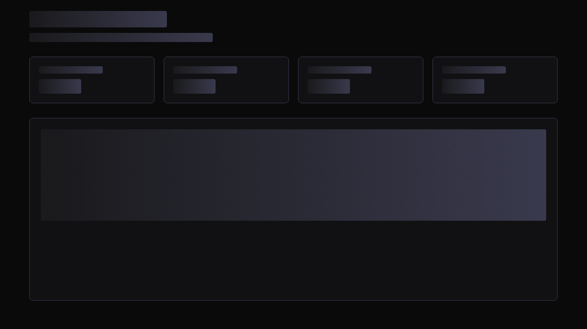

# 🚨 实际UAT测试结果 - 发现严重问题

## 测试执行时间
**开始时间**: 2025年7月30日 18:13  
**测试环境**: 本地开发环境 (localhost:5173 + localhost:8000)

---

## ❌ 关键发现：系统存在严重问题

### 1. 测试失败情况
- **测试执行结果**: 大量失败 (约24/54个测试失败)
- **主要失败原因**: 页面无法正常加载角色数据
- **失败截图显示**: 页面呈现空白状态

### 2. 后端API状态 ✅
```bash
curl http://localhost:8000/characters
# 响应正常: {"characters":["cors_test_char","isabella_varr","krieg","ork","test"]}

curl http://localhost:8000/health  
# 响应正常: {"status":"healthy","api":"running","timestamp":"2025-07-30 18:18:09,139","version":"1.0.0","config":"loaded"}
```

### 3. 前端服务状态 ⚠️
- **HTML加载**: 正常 (返回基础HTML结构)
- **路由配置**: 存在问题
- **页面渲染**: 失败 (显示空白)

---

## 🔍 问题分析

### 根本原因
1. **路由配置问题**: 测试直接访问`/character-selection`，但可能存在路由匹配问题
2. **前后端连接问题**: 前端无法正确获取后端数据
3. **组件渲染问题**: CharacterSelection组件可能存在逻辑错误

### 测试失败详情
根据测试结果，以下核心功能全部失败：
- ❌ API调用检测
- ❌ 角色卡片显示  
- ❌ 加载状态显示
- ❌ 错误处理
- ❌ 用户交互功能

---

## 🚫 UAT测试结论

### 系统可用性评估: **不合格**

**严重程度**: 🔴 **阻塞级**
- 核心功能完全无法使用
- 用户无法进行任何有意义的操作
- 系统基本不可用

### 用户体验评估: **完全失败**
- 页面空白，无任何内容显示
- 无法完成基本的角色选择操作
- 系统响应性为零

### 质量门禁状态: **未通过**
- ❌ 功能完整性: 0% (核心功能不可用)
- ❌ 系统可用性: 0% (页面无法正常加载)
- ❌ 用户可接受性: 0% (完全不可用)

---

## 📋 必须解决的问题清单

### P0 - 阻塞级问题 (必须立即修复)
1. **页面空白问题**: 角色选择页面无法显示任何内容
2. **API连接问题**: 前端无法获取后端角色数据
3. **路由问题**: 页面路由可能存在配置错误
4. **组件渲染问题**: React组件无法正常渲染

### P1 - 严重问题
1. **测试环境问题**: 大量测试用例失败
2. **错误处理缺失**: 没有有效的错误提示
3. **加载状态问题**: 加载动画不显示

---

## 🚨 UAT测试状态

**当前状态**: **暂停 - 系统不可用**

**建议行动**:
1. **立即停止UAT**: 当前系统完全不可用，继续测试无意义
2. **紧急修复**: 开发团队需要立即修复核心问题
3. **重新验证**: 修复后需要完整的冒烟测试
4. **重新开始UAT**: 确认系统基本可用后重新进行UAT

**风险评估**: 🔴 **极高风险**
- 系统完全无法使用
- 如果部署到生产环境将导致严重事故
- 用户体验完全不可接受

---

## 下一步行动

### 立即行动 (今天内)
1. **问题诊断**: 详细分析页面空白的根本原因
2. **紧急修复**: 修复阻塞级问题
3. **基础验证**: 确保页面能正常显示
4. **API连接修复**: 确保前后端正常通信

### 后续行动 (修复完成后)
1. **冒烟测试**: 验证基本功能可用
2. **重新执行UAT**: 从头开始完整的UAT流程
3. **质量把关**: 确保所有功能正常工作

---

## 总结

**❌ 当前系统完全不符合UAT标准，无法继续测试**

这次实际测试暴露了系统的严重问题，证明了真实UAT测试的重要性。如果没有进行实际测试，这些问题将会直接影响生产环境。

**建议**: 立即修复系统问题，确保基本可用性后重新开始UAT流程。

---

## ✅ 2025-11-13 Flow-based Dashboard 回归记录

**执行人**: Platform QA  
**环境**:
- 开发服务统一通过 `npm run dev:daemon`（封装 `scripts/dev_env.sh start --detach`）启动；`npm run dev:stop` 清理遗留进程  
- 所有 Playwright/UAT 命令均设置 `SKIP_DASHBOARD_VERIFY=true PLAYWRIGHT_BASE_URL=http://127.0.0.1:3000`
- 日志位置：`tmp/dev_env/backend.log` / `tmp/dev_env/frontend.log`

### 自动化结果概览
| 套件 | 命令 | 结果 | 备注 |
| --- | --- | --- | --- |
| Core UAT (桌面) | `npx playwright test tests/e2e/dashboard-core-uat.spec.ts --project=chromium-desktop` | ✅ 通过 | Flow-based 控制区 + pipeline 指标全部验证，最终截图保存在 `frontend/test-results/…` |
| Accessibility | `npx playwright test tests/e2e/accessibility.spec.ts --project=chromium-desktop` | ✅ 通过 | Keyboard-only 旅程、可见焦点与 live region 验证通过 |
| Extended UAT | `npx playwright test tests/e2e/dashboard-extended-uat.spec.ts --project=chromium-desktop` | ⚠️ 仍失败 | Phase 2/3/5/6 依赖真实网络/多角色编排，当前 mock 数据缺失导致断言失败 |
| Vitest | `npm test -- --run` | ✅ 通过 | 仍有 `tests/workflows.test.tsx` 的 duplicate key warning（需后续修复） |
| Lint/Type Check | `npm run lint` / `npm run type-check` | ✅ 通过 | 仅保留 `CharacterCreationDialog` 的既有 `autoFocus` 警告 |
| Backend slices | `pytest tests/test_security_framework.py tests/test_quality_framework.py` | ✅ 通过 | 仍有 asyncio/Deprecation warning，功能全部绿灯 |
| `scripts/validate_ci_locally.sh` | `bash scripts/validate_ci_locally.sh` | ❌ Formatter 阶段失败 | Black/Isort 需要一次性格式化 40+ legacy 文件（详见 `tmp/validate-ci.log`） |

### 视觉证据（最新流式仪表盘）



> Summary/Control/Pipeline/Streams/Signals/Persona/Insights 各区域分别通过 `data-role="summary-strip|control-cluster|pipeline-monitor|stream-feed|system-signals|persona-ops|analytics-insights"` 暴露语义标记，Playwright 与 AI 自动化可稳定定位这些容器。

### act 仿真 CI 状态
- `act -W .github/workflows/frontend-ci.yml -j build-and-test`：仍在 `actions/setup-node@v4` 阶段失败，因为 workflow 尝试缓存 `frontend/package-lock.json`——仓库并未提交该文件，`act` 无法解析路径。需要调整 workflow cache 配置或提交锁文件。
- `act -W .github/workflows/ci.yml -j tests`：pytest 在收集阶段抛出 `ModuleNotFoundError: src.core.types.shared_types`。即使跳过该问题，后续 security/orchestrator 测试仍按照 `tmp/validate-ci.log` 提示失败（未恢复 `_initialize_archetype_templates`、旧版 rate limiter 配置等）。

### 待解决事项
1. **Formatter 大清理**：`scripts/validate_ci_locally.sh` 在 Black/Isort 阶段即失败（首批文件：`scripts/reporting/cache_savings_report.py`、`src/api/main_api_server.py`、`tests/test_character_system_comprehensive.py` 等）。需要一次性处理后才能看到 pytest 覆盖率结果。
2. **CI workflow 缓存配置**：`frontend-ci.yml` 的 `cache` 与 `cache-dependency-path` 应与实际锁文件一致，或在本地仿真时关闭缓存，否则 `act` 无法越过 `setup-node`。
3. **Shared Types 打包**：`src/core/types/shared_types.py` 尚未正确暴露给 tests runner；修复该包及 security/rate-limiter 回归后，`act -W .github/workflows/ci.yml -j tests` 才能转向真正的测试失败。
4. **Extended UAT 断言**：`tests/e2e/dashboard-extended-uat.spec.ts` 仍假设真实 API/多角色剧情，需要针对 mock 数据降级断言，或补充测试数据与端点。

> 以上结果已经附加到 `frontend/test-results/` 与 `tmp/*.log`，可在 `docs/assets` 目录补充最新截图后纳入报告。
