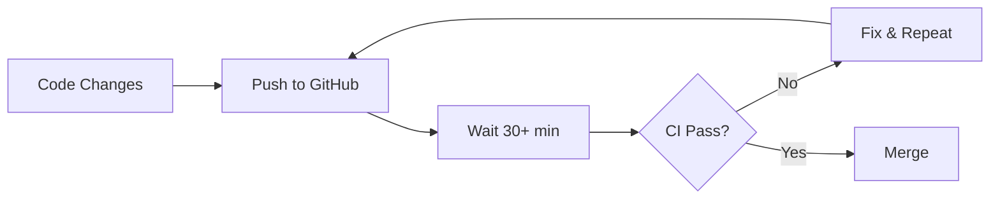
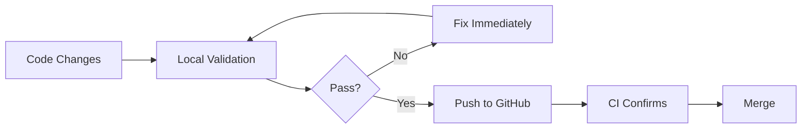

# Quick Start Guide: CI/CD Coverage Alignment

**Feature**: CI/CD Coverage Alignment and Test Configuration Synchronization  
**Branch**: `001-cicd-coverage-fix`  
**Target Audience**: Developers contributing to Novel-Engine

## Overview

This guide helps you adopt the new local validation workflow that ensures your code changes will pass GitHub Actions Quality Assurance Pipeline **before** you push.

**Key Benefits**:
- ⚡ **Fast Feedback**: 3 minutes locally vs 30+ minutes waiting for CI
- ✅ **Confidence**: 100% alignment between local validation and GitHub Actions
- 🎯 **Clear Standards**: Single source of truth for coverage threshold (30%)

## Prerequisites

### Required Software

**Python 3.11** (exact version match with CI/CD):
```bash
# Check your Python version
python --version
# Should output: Python 3.11.x

# If not installed, download from:
# https://www.python.org/downloads/
```

**Why Python 3.11?**  
GitHub Actions Quality Assurance Pipeline uses Python 3.11. Using the same version locally ensures identical behavior.

### Optional (Recommended)

**Act CLI** for local GitHub Actions simulation:
```bash
# Installation instructions: https://github.com/nektos/act
# Windows (with Chocolatey): choco install act-cli
# macOS: brew install act
# Linux: Download from releases
```

## Installation Steps

### 1. Clone and Setup Environment

```bash
# Navigate to project
cd Novel-Engine

# Create virtual environment (recommended)
python -m venv venv

# Activate virtual environment
# Windows:
venv\Scripts\activate
# macOS/Linux:
source venv/bin/activate

# Install dependencies
pip install --upgrade pip
pip install -r requirements.txt
pip install pytest pytest-cov coverage httpx pytest-timeout
```

### 2. Verify Coverage Configuration

Check that `.coveragerc` exists at project root with threshold:

```ini
# .coveragerc (single source of truth)
[run]
source = src
omit = 
    */tests/*
    */examples/*
    */demos/*
    */scripts/*

[report]
fail_under = 30
precision = 2
show_missing = true
skip_covered = false

[html]
directory = htmlcov
```

**Key Setting**: `fail_under = 30` is the coverage threshold. All environments read from this file.

## Running Local Validation

### Quick Validation (Bash)

```bash
# Run the local validation script
bash scripts/validate_ci_locally.sh
```

**Script performs**:
1. ✅ Checks Python version is 3.11
2. ✅ Installs required test dependencies
3. ✅ Runs full test suite with coverage
4. ✅ Validates coverage meets 30% threshold
5. ✅ Reports results with detailed output

### Quick Validation (PowerShell)

```powershell
# Windows PowerShell alternative
.\scripts\validate_ci_locally.ps1
```

### Manual Validation (Understanding the Commands)

If you want to run validation steps manually:

```bash
# 1. Check Python version
python --version  # Must be 3.11.x

# 2. Run tests with coverage (exact CI/CD command)
python -m pytest \
  --cov=src \
  --cov-config=.coveragerc \
  --cov-report=xml \
  --cov-report=html \
  --cov-report=term-missing \
  --junitxml=test-results.xml \
  --maxfail=10 \
  -v \
  --tb=short \
  --durations=10
```

## Understanding Test Output

### Success Output

```
======================== test session starts =========================
platform win32 -- Python 3.11.5, pytest-7.4.3
collected 189 items

tests/test_core.py::test_initialization PASSED                [ 1%]
tests/test_security.py::test_authentication PASSED            [ 2%]
...

---------- coverage: platform win32, python 3.11.5 -----------
Name                      Stmts   Miss  Cover
---------------------------------------------
src/core/__init__.py         42      8    81%
src/security/auth.py        156     35    78%
...
---------------------------------------------
TOTAL                      40347  10452   74%

Required coverage of 30.0% reached. Total coverage: 74.12%

===================== 189 passed in 45.23s ======================
```

**What this means**:
- ✅ All tests passed (189 passed, 0 failed)
- ✅ Coverage is 74.12% (exceeds 30% requirement)
- ✅ Ready to push to GitHub

### Failure Output - Test Failures

```
======================== test session starts =========================
...
FAILED tests/security/test_auth.py::test_password_validation - AttributeError: 'SecurityHeaders' object has no attribute 'get_header'
FAILED tests/test_persona_core.py::test_agent_initialization - TypeError: AgentIdentity.__init__() missing 1 required positional argument: 'capabilities'

==================== short test summary info ====================
FAILED tests/security/test_auth.py::test_password_validation
FAILED tests/test_persona_core.py::test_agent_initialization
================== 2 failed, 187 passed in 52.31s ================
```

**What to do**:
1. ❌ **DO NOT PUSH** - tests must pass first
2. 🔍 Review failure details (file location, error type)
3. 🛠️ Fix the failing tests
4. ♻️ Re-run validation until all tests pass

### Failure Output - Coverage Below Threshold

```
======================== test session starts =========================
...
---------- coverage: platform win32, python 3.11.5 -----------
Name                      Stmts   Miss  Cover
---------------------------------------------
TOTAL                      40347  29714   26%

FAIL Required coverage of 30.0% not reached. Total coverage: 26.42%
```

**What to do**:
1. ❌ **DO NOT PUSH** - coverage too low
2. 📊 Check which modules lack coverage:
   ```bash
   coverage report --show-missing
   ```
3. ✍️ Add tests for uncovered code
4. ♻️ Re-run validation until coverage ≥30%

## Coverage Reports

### Terminal Report (Quick Check)

The validation script outputs coverage to terminal with `--cov-report=term-missing`.

### HTML Report (Detailed Analysis)

```bash
# After running tests, open HTML report
# Windows:
start htmlcov/index.html
# macOS:
open htmlcov/index.html
# Linux:
xdg-open htmlcov/index.html
```

**HTML Report Shows**:
- 📂 Per-file coverage percentages
- 📍 Exact line numbers missing coverage (highlighted in red)
- 📈 Coverage trends over time

### XML Report (CI/CD Integration)

Generated automatically as `coverage.xml` for GitHub Actions and Codecov integration.

## Workflow Structure

### Before This Feature (Old Way)



**Problems**:
- ❌ Long feedback loop (30+ minutes)
- ❌ Wasted CI compute time
- ❌ Developer context switching

### After This Feature (New Way)



**Benefits**:
- ✅ Fast feedback (3 minutes locally)
- ✅ Catch issues before push
- ✅ Stay in flow state

## Common Issues & Solutions

### Issue: Python Version Mismatch

```
❌ Python 3.11 required for local validation
   Found: Python 3.9.7
   Install: https://www.python.org/downloads/
```

**Solution**: Install Python 3.11 and update PATH, or use virtual environment with Python 3.11.

### Issue: Coverage Threshold Unclear

**Question**: What coverage threshold should I meet?

**Answer**: **30%** (defined in `.coveragerc` at project root). This is the single source of truth.

### Issue: Act CLI Shows Different Results

**Question**: Act CLI passed but GitHub Actions failed?

**Solution**: This feature removes permissive error handling from act workflows. Update act CLI to latest version:
```bash
act --version  # Should be ≥0.2.60
```

### Issue: Tests Pass Locally But Fail in CI

**Potential Causes**:
1. Python version difference (ensure 3.11 locally)
2. Missing dependencies (run `pip install -r requirements.txt`)
3. Working directory differences (run validation from project root)

**Debug Steps**:
```bash
# 1. Verify environment matches CI
python --version  # Must be 3.11.x
pip list  # Compare with requirements.txt

# 2. Run exact CI command
python -m pytest --cov=src --cov-config=.coveragerc --cov-fail-under=30 -v

# 3. Check for uncommitted changes affecting tests
git status
```

## Test Failure Categorization

When tests fail, they are categorized by severity:

### Blocking Failures (Must Fix Before Push)

**Security Framework** (13 tests):
- `tests/security/test_comprehensive_security.py`
- Issues: Authentication, headers, password validation
- **Impact**: Blocks quality gates

**Persona Core** (7 tests):
- `tests/test_persona_core.py`
- Issues: Agent initialization, activation, character file reading
- **Impact**: Blocks core functionality

### Non-Blocking Failures (Can Defer)

**Quality Framework** (6 tests):
- `tests/test_quality_framework.py`
- Issues: Character name setters, orchestrator startup

**Error Handler** (3 tests):
- `tests/test_error_handler.py`
- Issues: Category detection, recovery strategies

**Data Models** (2 tests):
- `tests/test_data_models.py`
- Issues: Sacred validation assertions

## Best Practices

### 1. Run Validation Before Every Push

```bash
# Add to your workflow
git add .
bash scripts/validate_ci_locally.sh  # <-- Run this
git commit -m "Your message"
git push origin your-branch
```

### 2. Check Coverage Before Adding Features

```bash
# Before starting new feature
coverage report
# Understand baseline coverage

# After implementing feature
coverage report --show-missing
# Ensure your code has tests
```

### 3. Use Act CLI for Workflow Testing

```bash
# Test specific workflow locally
act -W .github/workflows/quality_assurance.yml

# Test only the test-suite job
act -j test-suite
```

## Next Steps

1. ✅ **Verify Setup**: Run `bash scripts/validate_ci_locally.sh` once
2. 📖 **Bookmark This Guide**: Keep for reference during development
3. 🔄 **Integrate Into Workflow**: Make local validation a habit before pushing
4. 📊 **Monitor Coverage**: Track coverage improvements over time (target: monthly +5%)

## Additional Resources

- **Specification**: [spec.md](./spec.md) - Full feature requirements
- **Implementation Plan**: [plan.md](./plan.md) - Technical decisions and research
- **Coverage.py Docs**: https://coverage.readthedocs.io/
- **Pytest Docs**: https://docs.pytest.org/
- **Act CLI Docs**: https://github.com/nektos/act

## Support

**Questions or Issues?**  
- Check [GitHub Issues](https://github.com/your-org/Novel-Engine/issues) for known problems
- Review test failure logs in `htmlcov/` directory
- Consult `plan.md` research section for technical decisions

---

**Version**: 1.0.0 | **Last Updated**: 2025-10-28 | **Feature Branch**: `001-cicd-coverage-fix`
